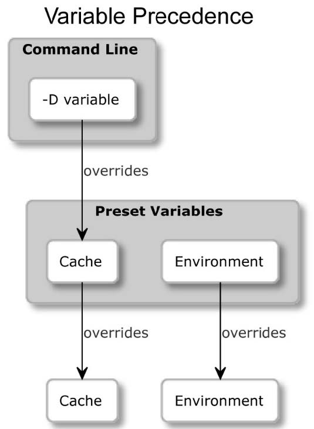

<title>This is a CMake note.</title>
<style type="text/css">
    body {
        font-family: "cascadia code", 幼圆, 宋体;
    }
    code {
        color: burlywood;
    }
    .red_font {
        color: crimson;
    }
    .yellow_font {
        color: orange;
    }
</style>

# 目录

- [目录](#目录)
- [初识CMake](#初识cmake)
  - [命令行参数](#命令行参数)
    - [CMake](#cmake)
    - [CTest](#ctest)
    - [CPack](#cpack)
    - [CMake GUI](#cmake-gui)
    - [ccmake](#ccmake)
  - [项目结构](#项目结构)
    - [源代码目录](#源代码目录)
    - [构建目录](#构建目录)
    - [列表文件](#列表文件)
      - [项目文件](#项目文件)
      - [缓存文件](#缓存文件)
      - [包定义文件](#包定义文件)
      - [生成的文件](#生成的文件)
    - [JSON和YAML文件](#json和yaml文件)
      - [预设文件](#预设文件)
      - [基于文件的API](#基于文件的api)
    - [Git中应忽略的文件](#git中应忽略的文件)
  - [脚本和模块](#脚本和模块)
    - [脚本](#脚本)
    - [工具模块](#工具模块)
    - [Find-模块](#find-模块)
- [CMake语言](#cmake语言)
  - [语法基础](#语法基础)
    - [注释](#注释)
    - [命令](#命令)
    - [参数](#参数)
      - [括号参数](#括号参数)
      - [引号参数](#引号参数)
      - [非引号参数](#非引号参数)
  - [变量](#变量)
    - [变量引用](#变量引用)
    - [环境变量](#环境变量)
    - [缓存变量](#缓存变量)
    - [变量作用域](#变量作用域)
  - [列表](#列表)
  - [流程控制](#流程控制)
    - [条件块](#条件块)
    - [逻辑运算符](#逻辑运算符)
    - [比较值](#比较值)
    - [简单检查](#简单检查)
    - [检查文件系统](#检查文件系统)
    - [循环](#循环)
    - [自定义命令](#自定义命令)
  - [命名约定](#命名约定)
  - [常用命令](#常用命令)
    - [message()](#message)
    - [include()](#include)
    - [include\_guard()](#include_guard)
    - [file()](#file)
    - [execute\_process()](#execute_process)
- [CMake项目](#cmake项目)
  - [基本指令和命令](#基本指令和命令)
    - [指定最低CMake版本](#指定最低cmake版本)
    - [定义语言和元数据](#定义语言和元数据)
  - [划分项目](#划分项目)
    - [使用子目录管理作用域](#使用子目录管理作用域)
    - [嵌套项目](#嵌套项目)
  - [设置环境范围](#设置环境范围)
    - [检测操作系统](#检测操作系统)
    - [交叉编译](#交叉编译)
    - [简写变量](#简写变量)
    - [主机系统信息](#主机系统信息)
    - [32位与64位](#32位与64位)
    - [字节序](#字节序)
  - [配置工具链](#配置工具链)
    - [设置C++标准](#设置c标准)
    - [坚持标准支持](#坚持标准支持)
    - [C++扩展](#c扩展)
    - [过程间优化](#过程间优化)
    - [检查支持的编译器特性](#检查支持的编译器特性)
    - [编译测试文件](#编译测试文件)
  - [禁用源内构建](#禁用源内构建)
- [CMake目标](#cmake目标)
  - [目标的概念](#目标的概念)
    - [定义可执行目标](#定义可执行目标)
    - [定义库目标](#定义库目标)
    - [自定义目标](#自定义目标)
    - [依赖关系图](#依赖关系图)
    - [可视化依赖关系](#可视化依赖关系)
    - [设置目标的属性](#设置目标的属性)
      - [传递目标的使用](#传递目标的使用)
      - [处理冲突的传播属性](#处理冲突的传播属性)
    - [伪目标](#伪目标)
      - [导入的目标](#导入的目标)
      - [别名目标](#别名目标)
      - [接口库](#接口库)
      - [对象库](#对象库)
    - [构建目标](#构建目标)
  - [自定义命令](#自定义命令-1)
- [生成器表达式](#生成器表达式)


# 初识CMake

[CMake官网](https://cmake.org)

## 命令行参数

### CMake

**使用`cmake --help`来获取帮助以及可用的编译器,工具集等信息.**

- `-S <path-to-source>`: 设置cmake从哪里构建项目(源目录).`<path-to-source>`指示到源的路径.

- `-B <path-to-build>`: 设置cmake将构建系统存储在哪里(构建目录).`<path-to-build>`指示到构建目录的路径.

    例如:
    ````SHELL
    cmake -S ./project -B ./build
    ````

    **注意:强烈建议源目录和构建目录不要在同一个目录下,否则会导致污染版本控制系统或者源代码.**

- ` -G <generator-name>`: 选择生成器和构建工具.也可以使用`CMAKE_GENERATOR`环境变量来覆盖默认生成器.

- `-T <toolset-spec>`: 设置工具集(编译器).也可以使用`CMAKE_GENERATOR_TOOLSET`环境变量来覆盖默认值.

- `-A <platform-name>`: 设置平台(编译器或SDK).也可以使用`CMAKE_GENERATOR_PLATFORM`环境变量来覆盖默认值.

- `-C <initial-cache-script>`:

    CMake在配置阶段向系统查询各种信息,这些信息缓存在构建树目录中的`CMakeCache.txt`中.可以通过上述命令行参数提供预填充缓存信息.

- `-D <var>[:<type>]=<value>`:

    除了使用`set()`指定构建树的变量,还可以通过上述命令行来初始化和修改缓存变量.`:<type>`部分是可选的,可以使用`BOOL`,`FILEPATH`,`PATH`,`STRING`或`INTERNAL`.若省略了类型,将设置为一个已经存在的变量的类型;否则,将设置为`UNINITIALIZED`.

    例如,对于单配置生成器(如`GNU Make`或`Ninja`),需要在配置阶段使用`CMAKE_BUILD_TYPE`变量指定构建类型,并为每种类型的配置生成单独的构建树:`Debug`,`Release`,`MinSizeRel`或`RelWithDebInfo`:

    ````SHELL
    cmake -S . -B build -D CMAKE_BUILD_TYPE=Release
    ````

    **注意,多配置生成器需要在构建阶段配置的,即对于MSVC来说,CMAKE_BUILD_TYPE无效.**

- `-L[A][H]`: 列出缓存变量.

    这样的列表将包含未标记为`ADVANCED`的缓存变量,可以通过参数`A`进行改变.要打印带有变量的帮助消息,需要添加`H`参数.

    使用`-D`选项手动添加的自定义变量将不可见,除非指定为受支持的类型.

- `-U <globbing_expr>`: 删除一个或多个变量.`<globbing_expr>`是通配表达式,支持`*`(通配符)和`?`(任何字符).

- `--system-information [file]`: 在运行CMake时,获取关于变量,命令,宏和其他设置的通用信息.可选的`file`参数允许将输出存储在文件中.

- `--log-level=<level>`:

    对于`message()`报告构建过程的细节,可以通过上述命令行过滤这些日志的输出.仅当报告的级别大于等于所给级别(默认情况下是`STATUS`)时,才会显示出来.此处的`<level>`可以为`ERROR`,`WARNIN`,`NOTICE`,`STATUS`,`VERBOSE`,`DEBUG`或`TRACE`.也可以在`CMAKE_MESSAGE_LOG_LEVEL`变量中永久地保留这个设置.

- `--log-context`: 启用对消息使用当前的`CMAKE_MESSAGE_CONTEXT`变量装饰.

- `--trace`: 打印每个命令的文件名和调用的确切行号及其参数.不建议日常使用,因为输出非常长.

**除了在项目中指定环境变量和选项等设置,还可以通过提供`CMakePresets.json`文件,来提供预定义值以覆盖默认值.**

- `--list-presets`: 列出所有可用的预设.

- `--preset=<preset>`: 使用预设.

    变量的覆盖层次:
    

- `--fresh`:

    删除构建树目录.执行后,cmake将以系统无关的方式删除`CMakeCache.txt`和`CMakeFiles/`文件夹,并从头开始重新生成构建系统.

**在生成阶段之后直接运行GNU Make: make的做法对于Linux和macOS可以正常工作,因为这是这两个平台的默认生成器,但更推荐使用CMake来运行构建器工具,因为这在所有平台上都有相同的操作,且与每个用户的确切环境无关.**

- `cmake --build <dir> [<options>] [-- <build-tool-options>]`: 构建模式的语法.

- `cmake --build <dir>`: 构建项目至指定目录.

- `cmake --build <dir> --parallel [<number-of-jobs>] `或`cmake --build <dir> -j [<number-of-jobs>]`: 使用指定线程数并行编译源代码.**默认就是多线程,因此一般不用设置.**

    也可以使用`CMAKE_BUILD_PARALLEL_LEVEL`环境变量来设置.

- `cmake --build <build tree> --target <target1> -t <target2> ...`: 显示地指定构建的目标(而不是所有).通过重复`-t`参数来指定多个目标.

- `cmake --build <build tree> -t clean`: 特殊目标`clean`可以从构建目录中移除所有产物,以便稍后可以从头开始构建.

- `cmake --build <build tree> --clean-first`: 上面的别名,先清理再执行正常的构建.所谓的清理,只是清理编译的结果,不会对配置产生影响.

- `cmake --build <build tree> --config <cfg>`:
    
    对于多配置生成器,需要在构建阶段指定构建类型,其构建树中同时包含了`Debug`和`Release`等构建类型.为此,需要使用`--config <cfg>`参数.其中,`<cfg>`可以选择`Debug`(默认),`Release`,`MinSizeRel`或`RelWithDebInfo`.

- `cmake --build <build tree> --verbose`或`cmake --build <build tree> -v`: 构建过程中打印更详细的日志.也可以通过设置`CMAKE_VERBOSE_MAKEFILE`缓存变量实现. 

- `cmake --install <build tree> [<options>]`: 将编译后的结果安装到系统中(将文件复制到正确的目录).`<build tree>`表示生成树的路径.

- `cmake --install <build tree> --install-prefix <prefix>`: 使用自选的前缀来预置安装路径.对于`CMake 3.21`或之前的版本,命令为:`cmake --install <build tree> --prefix <prefix>`.

- `cmake --install <build tree> --config <cfg>`: 对多配置生成器指定用于安装的构建类型.可用类型包括`Debug`,`Release`,`MinSizeRel`和`RelWithDebInfo`.

- `cmake --install <build tree> --component <component>`: 安装单个组件.

- `cmake --install <build tree> --default-directory-permissions <permissions>`: 对安装在类Unix平台上的构建结果,可以使用以下选项指定安装目录的默认权限,格式为`u=rwx,g=rx,o=rx`.

- `cmake --install <build tree> --verbose`或`cmake --install <build tree> -v`: 查看安装阶段的详细输出.设置`VERBOSE`环境变量,可以达到同样的效果.

- `cmake [{-D <var>=<value>}...] -P <cmake script file> [-- <unparsed options>...]`: 运行独立的脚本,运行此类脚本不会进行配置或生成,也不会影响缓存.可以通过`-D`选项定义变量,可以在`--`符号后传递参数.CMake将为传递给脚本的所有参数(包括`--`)创建`CMAKE_ARGV<n>`变量.

- `cmake -E <command> [<options>]`: 跨平台的执行命令行功能.可以通过运行`cmake -E`来列出所有可用的命令.如果缺少想要使用的命令,或需要更复杂的行为,可以考虑将它封装在脚本中,使用`-P`运行.

**CMake可以预设工作流,将多个步骤捆绑成单一动作,只需要执行一个命令即可,详见下文.**

- `cmake --workflow --list-presets`: 获取可用预设的列表.

- `cmake --workflow --preset <name>`: 以执行一个工作流预设.

### CTest

命令行工具CTest旨在标准化测试的执行和报告方式.其提供了一个方便的接口来列出,过滤,随机化,重试和限制测试运行的时间.

要为已构建的项目运行测试,只需在生成的构建树中调用`ctest`.

**详见下文.**

### CPack

构建并测试完毕后,需要分发预编译的二进制文件.`CMake`自带了一系列工具.`CPack`是一个工具,可以为各种平台创建可重分配的包:压缩归档文件,可执行安装程序,向导,`NuGet`包,`macOS`应用程序包,`DMG`包,`RPM`包等.

**详见下文.**

### CMake GUI

Windows版本的CMake配备了一个图形用户界面,用于配置先前准备好的项目的构建过程.对于类`Unix`平台,有一个使用Qt库构建的版本.`Ubuntu`通过`cmake-qt-gui`包获取.

### ccmake

`ccmake`可执行文件是在类Unix平台上的CMake的交互式文本用户界面(在`Windows`上不可用,除非显式构建),像GUI一样.

## 项目结构

CMake项目由大量的文件和目录组成.这些文件和目录可以分为几个类别:

- 项目文件,作为开发者会随着项目的成长修改这些文件.
- `CMake`生成的文件,包含`CMake`语言命令,但并不供开发者编辑.
- 高级用户(即非项目开发者)使用的文件,以便根据个人需求自定义`CMake`构建项目的方式.
- 一些临时文件,在特定上下文中提供有价值的信息.

### 源代码目录

源代码目录包含项目的存放目录(也称项目根目录),包含了所有的C++源文件和CMake项目文件:

- 需要一个`CMakeLists.txt`配置文件.
- 此目录的路径是用户在生成构建系统时,传递给`cmake`命令的`-S`参数.
- 应当避免在`CMake`代码中,硬编码源码目录的绝对路径

可以在该目录下面初始化一个仓库.

### 构建目录

CMake根据用户的指定,在此目录中创建构建系统,以及构建过程中产生的一切:项目制品,临时配置,缓存,构建日志和原生构建工具(如`GNU Make`)的输出.这个目录的其他名称包括构建根目录和二进制目录.

- 构建配置(构建系统)和构建制品(如二进制文件,可执行文件和库,以及用于最终链接的对象文件和归档文件)将在此处创建.
- CMake推荐将此目录置于源代码目录之外(即外源构建),可以避免污染项目.
- 通过`-B`参数传递给cmake命令来指定.
- 这个目录不是生成文件的最终目的地.相反,建议项目包含一个安装阶段,将最终制品复制到系统中的适当位置,并移除所有用于构建的临时文件.

不要将此目录加入版本控制系统中,如果在内源构建,请确保将此目录加入到版本控制系统的忽略文件中(如`.gitignore`).

### 列表文件

包含CMake语言的文件称为列表文件(listfiles),可以通过调用`include()`和`find_package()`或间接地通过`add_subdirectory()`来互相包含.`CMake`对这些文件的命名没有强制规定,但按照惯例通常使用`.cmake`扩展名.

#### 项目文件

`CMake`项目通过一个`CMakeLists.txt`列表文件进行配置(注意,由于历史原因,该文件具有非常规的扩展名).此文件位于每个项目的源代码树的顶部,并且是在配置阶段首先执行.

顶层的`CMakeLists.txt`文件应至少包含以下两个命令:

- `cmake_minimum_required(VERSION <x.xx>)`: 设置期望的CMake版本,并告诉CMake如何处理遗留行为.
- `project(<name> <OPTIONS>)`: 命名项目(提供的名称将存储在`PROJECT_NAME`变量中),并指定配置项目的选项.

随着软件的增长,可能希望将其划分为较小的单元,这些单元可以单独配置和管理.CMake支持通过子目录及其各自的`CMakeLists.txt`文件来实现这一点.

项目的主要方面都在顶级文件中覆盖:管理依赖项,声明要求和检测环境.我们还可以使用`add_subdirectory(<dir>)`命令来包含来自`<dir>`子目录的另一个`CMakeLists.txt`.

#### 缓存文件

从列表文件中生成的缓存变量,将在首次运行配置阶段时被存储在`CMakeCache.txt`文件中.此文件位于构建树的根目录,并具有相当简单的格式.该文件中,`EXTERNAL`部分的缓存条目是供用户修改的,而`INTERNAL`部分则由CMake管理.

- 可以手动管理此文件,也可以通过调用cmake,或通过ccmake或cmake-gui来管理.
- 通过删除此文件可以将项目重置为其默认配置;文件将从泪飙文件中重新生成.

可以从列表中读取和写入缓存变量,变量引用的计算会有些复杂.

#### 包定义文件

CMake生态系统的一大部分是项目可以依赖的外部包,以无缝,跨平台的方式提供库和工具.希望提供CMake支持的包作者会将CMake包配置文件一起发布.

- 配置文件(原始拼写)包含有关如何使用库的二进制文件,头文件和辅助工具的信息.有时,会暴露在项目中使用的CMake宏和函数.
- 配置文件命名为`<PackageName>-config.cmake`或`<PackageName>Config.cmake`.
- 使用`find_package()`命令来包含包.

需要特定版本的包,`CMake`会将检查相关的`<PackageName>-config-version.cmake`或`<PackageName>ConfigVersion.cmake`.

如果供应商没有为包提供配置文件,配置会与`CMake`本身捆绑,或者可以在项目中通过Find-模块提供.

#### 生成的文件

在生成阶段,许多文件由`cmake`可执行文件在构建树中生成.`CMake`将它们用作`cmake`安装动作,`CTest`和`CPack`的配置.

可能会看到:

- `cmake_install.cmake`
- `CTestTestfile.cmake`
- `CPackConfig.cmake`

如果正在实现源内构建,将它们添加到版本控制系统的忽略文件中吧.

### JSON和YAML文件

`CMake`使用`JSON`和`YAML`标记语言作为与外部工具(如IDE)通信的接口,或者提供易用于生成和解析的配置.

#### 预设文件

当需要具体指定缓存变量,选择的生成器,构建树路径等时,项目的高级配置可能会成为一个相对繁忙的任务.这时预设就派上用场了,不需要通过命令行手动配置这些值,只需提供一个存储所有细节的文件,并与项目一起发布.自从`CMake 3.25`版本以来,预设还允许配置工作流程,将阶段(配置,构建,测试和打包)绑定到一个命名步骤列表中执行.

用户可以通过GUI选择预设,或者使用命令`--list-presets`并使用`--preset=<preset>`选项为构建系统选择预设.

预设存储在两个文件中:

- `CMakePresets.json`: 这是供项目作者提供官方预设的文件.
- `CMakeUserPresets.json`: 这是专供想要根据个人喜好自定义项目配置的用户使用的文件(可以将其添加到版本控制系统忽略文件中).

预设不是项目必需的,只在高级场景中变得有用.

#### 基于文件的API
`CMake 3.14`引入了一个API,允许外部工具查询构建系统信息:生成文件的路径,缓存条目,工具链等.这个名字表明了它的工作方式:一个包含查询的`JSON`文件,该文件必须放置在构建树内的一个特殊路径中.CMake在生成构建系统时,会读取这个文件,并将响应写入另一个文件,以便外部应用程序解析.

### Git中应忽略的文件

一个`.gitignore`示例:

```
CMakeUserPresets.json
# If in-source builds are used, exclude their output like so:
build_debug/
build_release/

# Generated and user files
**/CMakeCache.txt
**/CMakeUserPresets.json
**/CTestTestfile.cmake
**/CPackConfig.cmake
**/cmake_install.cmake
**/install_manifest.txt
**/compile_commands.json
```

## 脚本和模块

`CMake`主要是用于构建项目以产生其他系统.然而CMake也可以使用脚本和模块.

### 脚本

CMake提供了一种与平台无关的编程语言,并附带了许多有用的命令.用这种语言编写的脚本可以与更大的项目捆绑在一起,也可以完全独立.将其视为一种一致的跨平台工作方式.

通常,为了执行任务,需要为`Linux`创建一个单独的`Bash`脚本,为`Windows`创建单独的批处理文件或`PowerShell`脚本等.`CMake`抽象了这些,可以使用一个文件在所有平台上正常工作.

可以使用`-P`选项执行脚本:`cmake -P 脚本.cmake`.

例:`script.cmake`文件
````CMAKE
# An example of a script
cmake_minimum_required(VERSION 3.26)
message("Hello world")
file(WRITE Hello.txt "I am writing to a file")
````

### 工具模块
`CMake`项目可以使用外部模块来增强其功能.模块是用`CMake`语言编写的,包含宏定义,变量和执行各种功能的命令.它们从相当复杂的脚本(如`CPack`和`CTest`提供的脚本)到相对简单的脚本,如`AddFileDependencies`或`TestBigEndian`.

`CMake`发行版打包了超过80个不同的实用模块.也可以自己在网上下载更多或者自己编写模块.

要使用工具模块,需要`include()`命令.

示例(文件为`CMakeLists.txt`):
````CMAKE
cmake_minimum_required(VERSION 3.26)
project(ModuleExample)
include (TestBigEndian)
test_big_endian(IS_BIG_ENDIAN)
if(IS_BIG_ENDIAN)
 message("BIG_ENDIAN")
else()
 message("LITTLE_ENDIAN")
endif()
````

在CMake官网上可以找到[更多信息](https://cmake.org/cmake/help/latest/manual/cmake-modules.7.html).

### Find-模块

`Find-模块`用来查找不支持`CMake`,且不提供`CMake`包配置文件的外部依赖项的文件.CMake提供了超过150个`Find-模块`,能够定位在系统上安装的这些包.

可以通过调用`find_package()`命令,并提供相关包的名称进行使用.如果找到了文件,将定义包含其路径的变量,此时,CMake可以针对该依赖项进行构建.

# CMake语言

## 语法基础

CMake执行的起点可以是源代码的根文件(CMakeLists.txt)开始,也可以是从作为cmake命令参数提供的`.cmake`脚本文件开始.

### 注释

CMake支持单行注释和括号(多行)注释.

单行注释以`#`开始:
````CMAKE
# comment
````

多行注释以`#`开始,后跟方括号`[`,任意数量的`=`(可以是0个),以及另一个`[`.要关闭多行注释,需要使用相同数量的等号并反转方括号`]`:
````CMAKE
#[=[
    bracket comment
    #[[
        nested bracket comment
    ]]
]=]
````

可以通过在括号注释的初始行,添加另一个`#`来快速禁用多行注释:
````CMAKE
##[=[ this is a single-line comment now
no longer commented
#[[
    still a comment
#]]
#]=] this is a single-line comment now
````

### 命令

为了运行一个命令,必须指定它的名字,然后是括号,在括号内可以包含由空格分隔的命令参数列表.例如:`message("hello" world)`

命令名称不区分大小写,但CMake社区约定使用`snake_case`(即用下划线连接的小写单词).还可以定义自己的命令.

CMake的命令调用不是表达式,所以不能将另一个命令作为参数传递给调用的命令.

CMake命令后面不需要加分号.源代码的每一行只能包含一个命令.

命令后面可以(可选的)跟一个注释,但不能反着来:
````CMAKE
# 正确
command(argument1 "argument2" argument3) # comment
command2() #[[ multiline comment ]]

# 错误
#[[ bracket
]] command()
````

CMake列表文件中的所有内容要么是注释,要么是命令调用.

CMake 提供了操作变量,控制执行流程,修改文件等的命令.这些命令可以分为两组:

- 脚本命令:这些命令始终可用,改变命令处理器的状态,访问变量,并影响其他命令和环境.
- 项目命令:这些命令在项目中可用,操纵项目状态和构建目标.

### 参数

CMake中的许多命令,需要以空格分隔的参数来配置行为.参数周围的引号使用方式相当奇特.虽然某些参数需要引号,但其他参数则不需要.

在底层,CMake唯一识别的数据类型是字符串,这就是为什么每个命令都期望其参数为零个或多个字符串.CMake将评估每个参数为一个静态字符串,然后将他们传递给命令.评估意味着字符串插值,或者用另一个值替换字符串的一部分.这可能包括替换转义序列,展开变量引用(也称为变量插值),以及解包列表.

根据上下文,需要按需启用这种评估.为此,CMake提供了三种类型的参数:

- 括号参数
- 引号参数
- 非引号参数

CMake中的每种参数类型都有其独特性,并提供不同级别的评估.

#### 括号参数
括号参数不会计算,用于将多行字符串**原封不动地作为单个参数**传递给命令,所以这样的参数,将包括以制表符和换行符形式的空白.括号参数的格式与注释相同,以`[=[`开始,以`]=]`(`=`可以是任意个)结束,并且开头和结尾标记中的等号数量必须匹配.与注释的唯一区别是括号参数不能嵌套.

````CMAKE
message([==[
  because we used two equal-signs "=="
  this command receives only a single argument
  even if it includes two square brackets in a row
  { "petsArray" = [["mouse","cat"],["dog"]] }
]==])
````
运行结果:
```
  because we used two equal-signs "=="
  this command receives only a single argument
  even if it includes two square brackets in a row
  { "petsArray" = [["mouse","cat"],["dog"]] }
```

#### 引号参数

引号参数就类似于常规的字符串,其中的转义字符会被转义而非原样输出.但引号参数可以跨越多行,写换行的地方会视作为一个`\n`.使用`${}`将变量插入到参数字符串中.例如`${name}`将名为`name`的变量插入到字符串中.

````CMAKE
message("mu\tltiline...
  and a variable reference: ${CMAKE_VERSION}")
````
输出结果:
```
mu      ltiline...
  and a variable reference: 3.29.2
```

#### 非引号参数
非引号参数在CMake中也视为字符串,空白符或者`;`被视作为分割符,分割成多个参数.如果需要使用`;`,则需要使用`\;`.非引号参数不能包含未转义的`"`,`#`和`\`.对于`()`,`(`和`)`必须配对.

例如: `argum\ ent\;1`视为一个参数,`arg;ume nts`视为三个参数.

````CMAKE
message(a\ single\ argument)
message(two arguments)
message(three;separated;arguments)
message(${CMAKE_VERSION})  # a variable reference
message(()()())            # matching parentheses
````
输出结果
```
a single argument
twoarguments
threeseparatedarguments
3.29.2
()()()
```

一些CMAKE命令允许可选参数,这些参数前面有一个关键字,表示将提供的可选参数.这种情况下,使用非引号参数作为关键字可以使代码更加易读,例如:`project(myProject VERSION 1.2.3)`

## 变量

变量分为普通变量,缓存变量和环境变量

- 变量名是区分大小写的,并且几乎可以包含任何字符.
- 所有变量在内部都存储为字符串,某些命令可以将他们解释为其他数据类型的值.

基本的变量操作命令是`set()`和`unset()`,还有其他可以改变变量值的命令,如`string()`和`list()`.

可以使用`set()`声明一个普通变量:

````CMAKE
set(MyString1 "Text1")
set([[My String2]] "Text2") # OK
set("My_String_3" "Text3")  # OK
message(${MyString1})
# message(${My\ String2})     # Fail to use
message(${My_String_3})     # OK
````

虽然命名变量时,可以使用空白符等字符,但是在使用的时候,就容易出现问题,因此,建议在变量名中只使用字母,数字,`-`和`_`.由于CMake中任何参数都是字符串,因此,`set()`中的第一个参数使用括号参数,引号参数,非引号参数都是合法的.

避免使用以下保留名称(大写,小写或混合大小写): `CMAKE_`开头,`_CMAKE_`开头,或`_`且后跟`CMake`命令的名称.

要取消设置变量,可以使用`unset()`.

### 变量引用

当要使用变量的值时,需要使用`${}`语法.CMake将按照从内到外的顺序遍历遍历作用域,并用一个值替换`${<var>}`,如果没有找到变量,则用空字符串替换(不会报错).这个过程称为变量求值(变量扩展或变量插值).

插值是从内到外进行的,从最内层的花括号对开始,向外移动.例如:`${MyOuter${MyInner}}`,会先评估`MyInner`,并将其值(假设为`<val>`)替换`${MyInner}`,如果成功插值,则向外评估`${MyOuter<val>}`.*但不建议嵌套变量引用.*

- `${}`语法用于引用普通变量或缓存变量
- `$ENV{}`语法用于引用环境变量.
- `$CACHE{}`语法用于引用缓存变量.

当使用`${}`时,如果当前作用域中存在该名称的普通变量,则使用普通变量,否则使用同名的缓存变量.如果都不存在,则引用将计算为空字符串.

CMake预定义了许多内置的普通变量,用于不同的目的.使用`--`标记后用命令行传递的参数,将存储在CMAKE_ARGV变量中(CMAKE_ARGC变量将包含计数).

### 环境变量

CMake会复制启动cmake进程时环境中存在的变量(*指的是系统的环境变量以及命令行中存储的环境变量(仅在当前命令行中生效)*),并在CMake全局范围内使它们可用.要引用这些变量,要使用`$ENV{}`语法.

CMake可以更改这些环境变量,但这些更改不会影响系统(外界)环境.此外,这些更改对后续构建或测试和运行不可见,因此不推荐这样做.

完整的环境变量列表详见:[CMake官方文档](https://cmake.org/cmake/help/latest/manual/cmake-env-variables.7.html)

例如:
````SH
export myenv=first
````
上面给SHELL添加了`myenv`环境变量,这使得可以在CMake中使用`$ENV{myenv}`且求值为`first`.

### 缓存变量
缓存变量是存储在构建树的`CMakeCache.txt`文件中的持久变量.它们包含项目配置阶段收集的信息.这些信息来源于系统(编译器,链接器,工具等的路径)和用户通过GUI或`-D`选项的输入.缓存变量在脚本中不可用,它们只存在于项目中.

如果`${<name>}`引用找不到当前作用域中定义的普通变量,但存在同名的缓存变量,则使用缓存变量,也可以通过`$CACHE{<name>}`语法显式引用.

可以使用`set()`命令定义缓存变量:`set(<variable> <value> CACHE <type> <docstring> [FORCE])`.与普通变量不同,缓存变量需要额外的`<type>`和`<docstring>`参数.

`<type>`接受以下值:

- `BOOL`:布尔值,GUI将显式一个复选框.
- `FILEPATH`:文件的路径.GUI将打开一个文件对话框.
- `STRING`:文本.GUI提供了一个要填充的文本字段,可以通过调用`set_property(CACHE <variable> STRINGS <values>)`来替换为下拉控件.
- `INTERNAL`:文本.GUI将跳过此条目.内部条目可以用来在运行之间持久存储变量,使用此类型隐式添加`FORCE`关键字.

`<docstring>`值只是一个标签,GUI将在字段旁边显式它,以便向用户提供此设置的更多细节.对于`INTERNAL`类型也是必须的.

缓存变量只在当前CMake执行中覆盖环境变量,但如果指定了可选的`FORCE`参数,该值将持久化.  

### 变量作用域

作用域以树状的方式相互嵌套,最外层的作用域(根作用域)称为全局作用域.所谓局部作用域,指代当前执行或讨论的作用域.嵌套作用域可以访问外层作用域的定义的变量,反之则不行.

CMake有两种变量作用域:

- 文件:在文件内执行块和自定义函数时使用.
- 目录:在调用`add_subdirectory()`命令以在嵌套目录中执行另一个`CMakeLists.txt`列表文件时使用.

*条件块,循环块和宏不会创建独立的作用域*

CMake中,当进入新的作用域时,所有使用的父作用域的变量实际上是副本,当内部作用域执行完成后,这些副本都会删除,因此,内部作用域对变量的修改不会影响外部作用域的变量.

使用`unset()`也不会影响外部作用域中的变量,但内部作用域不会查找到该名字的(普通)变量.

文件变量作用域通过`block()`(CMake 3.25)和`function()`命令开始新的子作用域,使用`endblock()`和`endfunction()`命令结束.

示例:
````CMAKE
set(V 1)
message("> Global: ${V}")
block() # outer block
  message(" > Outer: ${V}")
  set(V 2)
  block() # inner block
    message("  > Inner: ${V}")
    set(V 3)
    message("  < Inner: ${V}")
  endblock()
  message(" < Outer: ${V}")
endblock()
message("< Global: ${V}")
````
输出:
```
> Global: 1
 > Outer: 1
  > Inner: 2
  < Inner: 3
 < Outer: 2
< Global: 1
```

使用`block(PROPAGATE V)`将会把内部作用域中对变量`V`的改动传播至其**直接**父作用域:
```
> Global: 1
 > Outer: 1
  > Inner: 2
  < Inner: 3
 < Outer: 3
< Global: 1
```

使用`PARENT_SCOPE`标志也可以使修改影响外部作用域.例如:`set(MyVariable "New Value" PARENT_SCOPE)`和`unset(MyVariable PARENT_SCOPE)`.注意:这种方法只能修改其直接父作用域的变量,并且不会改变当前作用域中的变量.

## 列表

CMake使用`;`(不会显示)将元素分隔来以字符串的形式存储一个列表,比如:`a;list;of;5;elements`.如果要在字符串中使用(且显示)`;`,可以使用`\`转义.例如:`a\;single\;element`.

使用`set()`创建一个列表:
````CMAKE
set(myList a list of five elements)
set(myList "a;list;of;five;elements")
set(myList a list "of;five;elements")
# 上面三种创建变量的写法是等价的
````

CMake会自动在未加引号的参数中解包列表:
````CMAKE
set(myList "a;list;of;five;elements")
message("the list is:" ${myList})
````
此处,`message()`命令接收了六个参数,输出:
```
the list is:alistoffiveelements
```

CMake提供了一个`list()`命令,该命令提供了多种子命令来读取,搜索,修改和排序列表.该命令简短的摘要:
````CMAKE
list(LENGTH <list> <out-var>)
list(GET <list> <element index> [<index> ...] <out-var>)
list(JOIN <list> <glue> <out-var>)
list(SUBLIST <list> <begin> <length> <out-var>)
list(FIND <list> <value> <out-var>)
list(APPEND <list> [<element>...])
list(FILTER <list> {INCLUDE | EXCLUDE} REGEX <regex>)
list(INSERT <list> <index> [<element>...])
list(POP_BACK <list> [<out-var>...])
list(POP_FRONT <list> [<out-var>...])
list(PREPEND <list> [<element>...])
list(REMOVE_ITEM <list> <value>...)
list(REMOVE_AT <list> <index>...)
list(REMOVE_DUPLICATES <list>)
list(TRANSFORM <list> <ACTION> [...])
list(REVERSE <list>)
list(SORT <list> [...])
````

大多数时候,我们的项目中并不真正需要使用列表.然而,如果发现自己处于那种罕见的情况,这个概念会很方便.

## 流程控制

### 条件块

CMake支持的条件块是`if()`命令,所有的条件块都必须使用`endif()`命令关闭,并且可以使用任意数量的`elseif()`命令和一个可选的`else()`命令:
````CMAKE
if(<condition>)
  <commands>
elseif(<condition>) # optional block, can be repeated
  <commands>
else()  # optional block
  <commands>
endif()
````

*条件块中不存在局部作用域*

### 逻辑运算符

- `NOT <condition>`
- `<condition> AND <condition>`
- `<condition> OR <condition>`

由于历史原因,上面的`<condition>`都会尝试**计算其引用**,即使未被`${}`包裹,对于被`${}`包裹的参数,会计算引用值后再次对值计算引用.

CMAKE会在以下条件下认为一个字符串值为**假**:
- `OFF`,`NO`,`FALSE`,`N`,`IGNORE`或`NOTFOUND`
- 以`-NOTFOUND`结尾的字符串
- 空字符串
- 数字零

其余情况视为**真**.

````CMAKE
if(TRUE)  # 变量TRUE计算为空字符串,因此结果为假
  message(ABC)  # 不执行
endif()

set(FALSE ABCNOTFOUND)
if(FALSE) # 变量FALSE计算值为真
  message(DEF)  # 执行
endif()
````

如果要检查变量是否已定义(忽略其值),可以使用:
````CMAKE
if(DEFINED <name>)
if(DEFINED CACHE{<name>})
if(DEFINED ENV{<name>})
````

### 比较值

支持以下操作符进行比较操作:`EQUAL`,`LESS`,`LESS_EQUAL`,`GREATER`和`GREATER_EQUAL`

其他语言中常见的比较操作符,在CMake中不起作用.

它们可以用来比较数值:`if (1 LESS 2)`

可以通过在操作符前加上`VERSION_`前缀来按照`[major[.minor[.patch[.tweak]]]]`的格式比较软件版本:`if (1.3.4 VERSION_LESS_EQUAL 1.4)`.省略则视为0,非整数的版本(例如字母)将在此点截断比较字符串.

对于字典序字符串比较,需要在操作符前加上`STR`前缀(没有下划线):`if ("A" STREQUAL "${B}")`

CMake支持`POSIX`正则表达式匹配.可以按以下方式使用`MATCHES`操作符:`<VARIABLE|STRING> MATCHES <regex>`.匹配组会被捕获到`CMAKE_MATCH_<n>`变量中.

### 简单检查

除了使用`DEFINED`.还有其他的检查,如果满足条件则返回真.

- `<VARIABLE|STRING> IN_LIST <VARIABLE>`:值是否在列表中.
- `COMMAND <command-name>`:此版本的CMake是否可以调用某个命令.
- `POLICY <policy-id>`:是否存在一个CMake策略.
- `TEST <test-name>`:是否使用`add_test()`添加了CTest测试.
- `TARGET <target-name>`:是否定义了一个构建目标

### 检查文件系统

- `EXISTS <path-to-file-or-directory>`:检查文件或目录是否存在.也会符号链接进行解析.
- `<file1> IS_NEWER_THAN <file2>`:检查哪个文件修改时间更晚.如果文件1比文件2修改时间更晚(或等于)或者两个文件中有一个不存在,则返回真.
- `IS_DIRECTORY <path-to-directory>`:检查路径是否为目录.
- `IS_SYMLINK <file-name>`:检查路径是否为符号链接.
- `IS_ABSOLUTE <path>`:检查路径是否为绝对路径.

CMake(3.24)支持简单的路径比较检查,这将折叠多个路径分隔符,但不会进行其他标准化:`if ("/a////b/c" PATH_EQUAL "/a/b/c") # returns true`

### 循环

CMake中,可以使用`while()`循环或`foreach()`循环来重复执行同一组命令.

- `break()`:循环将终止执行剩余的块,并跳出包围的循环.
- `continue()`:循环将停止当前迭代的执行,并从下一个迭代的开头开始.

注意:循环块中不会创建局部作用域.

`while()`使用`endwhile()`命令关闭.只要`while()`中提供的`<condition>`表达式为真,封闭的命令都将会执行.条件部分的语法与`if()`命令相同.

````CMAKE
while(<condition>)
  <commands>
endwhile()
````

`foreach()`块有几种变体,为给定列表中的每个值执行封闭的命令.该命令需要用`endforeach()`命令封闭.

````CMAKE
foreach(<loop_var> RANGE [<min>] <max> [<step>])
  <commands>
endforeach()
````
上面的代码将从`<min>`迭代到`<max>`(包括),步长为`<step>`.省略`<min>`将默认从0开始,省略`<step>`则步长为1

````CMAKE
foreach(<loop_variable> IN [LISTS <lists>] [ITEMS <items>])
  <commands>
endforeach()
````
上面的代码将从一个或多个指定的`<lists>`列表变量中遍历元素,或遍历`<items>`值,将其放入`<loop variable>`中,例如:
````CMAKE
set(MyList 1 2 3)
foreach(VAR IN LISTS MyList ITEMS e f)
  message(${VAR})
endforeach()
````
输出结果:
```
1
2
3
e
f
```

使用`foreach(VAR 1 2 3 e f)`也可以得到上面的效果.

CMake 3.17后`foreach()`支持压缩列表(ZIP_LISTS):
````CMAKE
set(L1 "one;two;three;four")
set(L2 "1;2;3;4;5")
foreach(num IN ZIP_LISTS L1 L2)
  message("word=${num_0}, num=${num_1}")
endforeach()
````
CMake将为提供的每个列表创建一个`num_<N>`变量,将用每个列表中的项填充这些变量.

可以传递多个变量名(每个列表一个),每个列表将使用单独的变量来存储其项:
````CMAKE
foreach(word num IN ZIP_LISTS L1 L2)
  message("word=${word}, num=${num}")
endforeach()
````
输出的结果:
```
word=one, num=1
word=two, num=2
word=three, num=3
word=four, num=4
```
如果列表之间的项数不同,较短的列表的变量将为空.

自从3.21版本以来,`foreach()`中的循环变量会限制在循环的局部作用域内使用.

### 自定义命令

有两种方法可以自定义命令:`macro()`命令或`function()`命令.

`macro()`命令更像是宏定义,而`function()`则是函数调用.`function()`命令会为变量创建局部作用域,而`macro()`不会.

CMake提供如下变量来访问与调用相关的参数:

- `${ARGC}`:参数的计数
- `${ARGV}`:参数列表(所有参数)
- `${ARGV<index>}`:特定索引(从0开始)处的参数值
- `${ARGN}`:调用者在最后一个参数后传递的匿名参数列表

使用超出`ARGC`范围的索引访问数字参数,会导致未定义行为.要处理高级场景(通常参数数量未知),可以去阅读官方文档中,关于`cmake_parse_arguments()`的内容.如果决定使用带有命名参数的命令,每次调用都必须传递这些参数,否则调用将无效.

`macro()`(宏)的定义方式如下:
````CMAKE
macro(<name> [<argument>...])
  <command>
endmacro()
````
此声明之后,可以通过调用其名称来执行宏(函数调用不区分宏).

宏不会修改调用堆栈信息或为变量添加新的作用域.它类似于命令的替换.

````CMAKE
macro(Test myVar)
  set(myVar "new value")
  message("argument: ${myVar}")
endmacro()

set(myVar "first value")
message("myVar is now: ${myVar}")
Test("called value")
message("myVar is now: ${myVar}")
````
输出:
```
myVar is now: first value
argument: called value
myVar is now: new value
```
`myVar`设置为`"new value"`,但它并没有影响到`message("argument:${myVar}")`的输出.因为传递给宏的参数不是作为真正的变量处理,而是作为常量的查找替换指令.此外,由于宏不会创建自己的作用域,所以其中的变量设置会影响到外部作用域,这是一种不良实践.

要声明`function()`,需要使用如下语法:
````CMAKE
function(<name> [<argument>...])
  <command>
endfunction()
````

函数会创建变量作用域,可以使用`set()`命令而不会影响外部作用域(除非指定了`PARENT_SCOPE`).

函数遵循调用堆栈的规则,允许使用`return()`命令返回调用作用域.CMake 3.25后允许给`return()`命令传递可选的`PROPAGATE`关键字,后跟一系列变量名称,用于将变量的值从局部作用域传递到调用作用域.

CMake为每个函数设置了以下变量(这些变量自3.17版本起可用):
- CMAKE_CURRENT_FUNCTION
- CMAKE_CURRENT_FUNCTION_LIST_DIR
- CMAKE_CURRENT_FUNCTION_LIST_FILE
- CMAKE_CURRENT_FUNCTION_LIST_LINE

示例:
````CMAKE
function(MyFunction FirstArg)
  message("Function: ${CMAKE_CURRENT_FUNCTION}")
  message("File: ${CMAKE_CURRENT_FUNCTION_LIST_FILE}")
  message("FirstArg: ${FirstArg}")
  set(FirstArg "new value")
  message("FirstArg again: ${FirstArg}")
  message("ARGV0: ${ARGV0} ARGV1: ${ARGV1} ARGC: ${ARGC}")
endfunction()

set(FirstArg "first value")
MyFunction("Value1" "Value2")
message("FirstArg in global scope: ${FirstArg}")
````
输出:
```
Function: MyFunction
File: <PATH-TO-FILE>/function.cmake
FirstArg: Value1
FirstArg again: new value
ARGV0: Value1 ARGV1: Value2 ARGC: 2
FirstArg in global scope: first value
```

## 命名约定

- 遵循一致的命名风格(CMake社区使用`snake_case`标准).
- 使用简短但有意义的名称(避免使用`func()`,`f()`等).

## 常用命令

### message()

`message()`将文本输出到标准输出.

可以使用`MODE`参数:`message([<MODE>] <text>)`.

可用的`<MODE>`如下:
- `FATAL_ERROR`:停止处理和生成.
- `SEND_ERROR`:继续处理,但跳过生成.
- `WARNING`:继续处理.
- `AUTHOR_WARNING`:输出警告,但继续处理.
- `DEPRECATION`:如果启用了`CMAKE_ERROR_DEPRECATED`或`CMAKE_WARN_DEPRECATED`,则输出相应地信息.
- `NOTICE`或省略模式(默认):输出消息到`stderr`,以吸引使用者的注意.
- `STATUS`:继续处理,推荐用于向用户显示的主要消息.
- `VERBOSE`:继续处理,应用于更详细的信息,通常不是非常必要.
- `DEBUG`:继续处理,应包含项目出现问题时,对处理问题有帮助的详细信息.
- `TRACE`:继续处理,建议在项目开发期间输出消息.通常,这类消息会在发布项目之前移除.

启用`--log-context`并设置列表`CMAKE_MESSAGE_CONTEXT`来打印更加详细的日志.其效果类似于`[top.foo] bar`

设置列表`CMAKE_MESSAGE_INDENT`来给输出文本的前面添加文字(例如缩进).

### include()

使用`include()`命令引用其他CMAKE文件:`include(<file|module> [OPTIONAL] [RESULT_VARIABLE <var>])`

`<file|module>`应当是一个存在的文件的路径.如果不存在,除非启用了`OPTIONAL`关键字,否则会报错.可以提供`RESULT_VARIABLE`关键字以及变量的名称来判断是否成功.成功时,变量内容为文件的完整路径;失败时,则为`NOTFOUND`.

使用脚本模式下运行时,相对路径都将以当前工作目录解析相对路径.要强制相对于脚本本身进行搜索,请提供绝对路径:`include("${CMAKE_CURRENT_LIST_DIR}/<filename>.cmake")`

如果不提供路径,但提供了模块的名称(不带`.cmake`或其他),CMake将尝试找到一个模块并包含它.顺序为`CMAKE_MODULE_PATH`目录,然后是`CMake`模块目录.

在包含文件后,CMake会设置以下变量:
- CMAKE_CURRENT_LIST_DIR
- CMAKE_CURRENT_LIST_FILE
- CMAKE_PARENT_LIST_FILE
- CMAKE_CURRENT_LIST_LINE

### include_guard()

`include_guard([DIRECTORY|GLOBAL])`只会在文件第一次被包含时,才会执行,如果文件再次包含,CMAKE就不会对该文件进行处理了.

`DIRECTORY`关键字将在当前目录及其子目录应用保护,而`GLOBAL`关键字将把保护应用于整个构建.

### file()

`file()`命令可以以系统无关的方式读取,写入和传输文件,以及与文件系统,文件锁,路径和存档等交互.

````CMAKE
file(READ <filename> <out-var> [...])
file({WRITE | APPEND} <filename> <content>...)
file(DOWNLOAD <url> [<file>] [...])
````

### execute_process()

可以使用`execute_process()`来运行其他进程,并收集输出:`execute_process(COMMAND <cmd1> [<arguments>]... [OPTIONS])`

可以通过多次提供`COMMAND`参数来链接命令.可选的`TIMEOUT`参数,用来在进程未在所需限制内完成任务时终止该进程,并且可以根据需要设置`WORKING_DIRECTORY`.

所有任务的退出代码可以通过提供`RESULTS_VARIABLE`参数来收集到一个列表中.如果只对最后执行的命令的结果感兴趣,请使用单数形式:`RESULT_VARIABLE`.

为了收集输出,CMake提供了两个参数:`OUTPUT_VARIABLE`和`ERROR_VARIABLE`如果想合并`stdout`和`stderr`,请为这两个参数使用相同的变量.

# CMake项目

## 基本指令和命令

一个简单的CMake项目带有一个`CMakeLists.txt`文件.详见[本笔记-项目文件](#项目文件).

### 指定最低CMake版本

项目文件和脚本的顶部使用`cmake_minimum_required()`命令,这个命令不仅验证系统是否具有正确的CMake版本,还会隐式触发另一个命令`cmake_policy(VERSION)`,后者指定项目要使用的策略.这些策略定义了命令在CMake中的行为,它们随着CMake的发展,以及对支持的语言和CMake本身的改进而引入.当CMake出现向后不兼容的情况时会引入新策略,确保CMake升级时,不会破坏旧项目,因为它会和新项目使用不同的策略.

没有必要对策略进行深入的了解.更多信息见[CMake官网](https://cmake.org/cmake/help/latest/manual/cmake-policies.7.html)

### 定义语言和元数据

建议在`cmake_minimum_required()`之后立即放置`project()`命令,这样做将确保在配置项目时使用正确的策略.

可以使用以下两种形式之一:
````CMAKE
project(<PROJECT-NAME> [<language-name>...])
````
或者:
````CMAKE
project(<PROJECT-NAME>
        [VERSION <major>[.<minor>[.<patch>[.<tweak>]]]]
        [DESCRIPTION <project-description-string>]
        [HOMEPAGE_URL <url-string>]
        [LANGUAGES <language-name>...])
````

上述命令将隐式设置以下变量:

- `PROJECT_NAME`
- `CMAKE_PROJECT_NAME`(only in the top-level CMakeLists.txt)
- `PROJECT_IS_TOP_LEVEL`,`<PROJECT-NAME>_IS_TOP_LEVEL`
- `PROJECT_SOURCE_DIR`,`<PROJECT-NAME>_SOURCE_DIR`
- `PROJECT_BINARY_DIR`,`<PROJECT-NAME>_BINARY_DIR`

`<language-name>`可选值包括:

- `ASM, ASM_NASM, ASM_MASM, ASMMARMASM, ASM-ATT`: 汇编语言
- `C`: C
- `CXX`: C++
- `CUDA`: Nvidia 的统一计算设备架构
- `OBJC`: Objective-C
- `OBJCXX`: Objective-C++
- `Fortran`: Fortran
- `HIP`: 用于 Nvidia 和 AMD 平台的异构 (计算) 接口便携性
- `ISPC`: 隐式 SPMD 程序编译器的语言
- `CSharp`: C#
- `Java`: Java (需要额外步骤,请参阅官方文档)

CMake默认启用`C`和`C++`,如果只想用`C++`,则可以明确指定`CXX`.因为指明多个语言会让CMake检查每个语言的可用编译器,这会浪费一部分时间.

指定`VERSION`将设置以下变量:

- `PROJECT_VERSION`,`<PROJECT-NAME>_VERSION`
- `CMAKE_PROJECT_VERSION`(only in the top-level CMakeLists.txt)
- `PROJECT_VERSION_MAJOR`,`<PROJECT-NAME>_VERSION_MAJOR`
- `PROJECT_VERSION_MINOR`,`<PROJECT-NAME>_VERSION_MINOR`
- `PROJECT_VERSION_PATCH`,`<PROJECT-NAME>_VERSION_PATCH`
- `PROJECT_VERSION_TWEAK`,`<PROJECT-NAME>_VERSION_TWEAK`

`DESCRIPTION`将设置以下变量:`PROJECT_DESCRIPTION`,`<PROJECT-NAME>_DESCRIPTION`.

`HOMEPAGE_URL`将设置以下变量:`PROJECT_HOMEPAGE_URL`,`<PROJECT-NAME>_HOMEPAGE_URL`.

## 划分项目

针对大型的项目而言,可能需要在子文件夹中增设新的CMake文件.此时,**不建议**使用`include()`命令,因为这种命令不会创建新的作用域,就好像在父文件中执行子文件的命令.这会导致嵌套目录中的变量污染顶层作用域,并且子文件的相对路径仍保持与父文件相同.例如:
````CMAKE
# <PATH-TO-PROJECT>/CMakeLists.txt
include(cars/cars.camke)
add_executable(Rental
  main.cpp
  ${sources}  # for cars/
)
````
````CMAKE
# <PATH-TO-PROJECT>/cars/cars.cmake
set(sources
  cars/car.cpp  # 注意,这里需要写上cars/,因为使用include()命令的情况下相对路径仍然是以<PATH-TO-PROJECT>/为起始的.
  # more files in other directories
)
````

此外,这种情况下,一旦有一个CMake文件修改,其他文件都要重新配置.

### 使用子目录管理作用域

`add_subdirectory(source_dir [binary_dir] [EXCLUDE_FROM_ALL])`能够添加一个源目录到构建当中.可选的`[binary_dir]`用于指定构建的文件写入的目录.`EXCLUDE_FROM_ALL`关键字将禁用子目录中定义的目标的自动构建(即使用该关键字后,编译器将不会将该目录下的文件编译,详见[下文](#定义可执行目标)).

`add_subdirectory()`将计算`source_dir`相对于当前目录的路径,并解析其中的`CMakeLists.txt`文件.这个文件在目录作用域内解析,消除了此前提到的问题.其:

- 将变量隔离到嵌套作用域内
- 嵌套的输出结果可以独立配置
- 修改嵌套的`CMakeLists.txt`文件不需要重新构建不相关的目标.
- 路径定位到新的目录,而不是像`include()`一样仍然是父CMake文件的路径.

### 嵌套项目

在使用`add_subdirectory()`包含其他目录时,其`CMakeLists.txt`文件允许使用自己的`project()`,这会生成一个嵌套项目,该项目有自己独立的构建系统,且可以独立构建.这种情况下,可以考虑给`add_subdirectory()`添加`EXCLUDE_FROM_ALL`参数,以使嵌套项目可以独立编译.

## 设置环境范围

### 检测操作系统

检查`CMAKE_SYSTEM_NAME`变量以检查目标操作系统: `if(CMAKE_SYSTEM_NAME STREQUAL "Linux")`.

### 交叉编译

交叉编译是指再一个机器上编译代码以在另一个目标平台上执行的过程.为了实现交叉编译,需要将`CMAKE_SYSTEM_NAME`和`CMAKE_SYSTEM_VERSION`设置为目标操作系统的适当值.执行构建的操作系统称为主机系统.

无论配置如何,主机系统的信息总是可以在带有`HOST`关键字的变量名称中访问:`CMAKE_HOST_SYSTEM`,`CMAKE_HOST_SYSTEM_NAME`,`CMAKE_HOST_SYSTEM_PROCESSOR`和`CMAKE_HOST_SYSTEM_VERSION`等.

详见[CMAKE官方文档](https://cmake.org/cmake/help/latest/manual/cmake-toolchains.7.html).

### 简写变量

CMake将预定义一些变量,提供关于主机和目标系统的信息.如果使用了特定的系统,相应的变量将设置为非假值.

- `ANDROID`,`APPLE`,`CYGWIN`,`UNIX`,`IOS`,`WIN32`,`WINCE`,`WINDOWS_PHONE`
- `CMAKE_HOST_APPLE`,`CMAKE_HOST_SOLARIS`,`CMAKE_HOST_UNIX`,`CMAKE_HOST_WIN32`

`WIN32`和`CMAKE_HOST_WIN32`变量对于32位和64位版本的Windows,以及MSYS都将为真.`UNIX`对于Linux,macOS和Cygwin也将为真.

### 主机系统信息

`cmake_host_system_information(RESULT <VARIABLE> QUERY <KEY>...)`用于查询有关环境和操作系统的许多信息:

- `<KEY>`:描述
- `HOSTNAME`:主机名
- `FQDN`:完全限定域名
- `TOTAL_VIRTUAL_MEMORY`:以MiB为单位的虚拟内存总量
- `AVAILABLE_VIRTUAL_MEMORY`:以MiB为单位的可用虚拟内存
- `TOTAL_PHYSICAL_MEMORY`:以MiB为单位的总物理内存
- `AVAILABLE_PHYSICAL_MEMORY`:以MiB为单位的可用物理内存
- `OS_NAME`:如果存在,则输出`uname -s`;无论是Windows,Linux还是Darwin
- `OS_RELEASE`:操作系统子类型,如Windows Professional
- `OS_VERSION`:操作系统构建ID
- `OS_PLATFORM`:在Windows上和`$ENV{PROCESSOR_ARCHITECTURE}`的值一样.在Unix/macOS上和`uname -m`一样
- `NUMBER_OF_LOGICAL_CORES`:逻辑核数
- `NUMBER_OF_PHYSICAL_CORES`:物理核数
- `HAS_SERIAL_NUMBER`:如果处理器有序列号,则为 1
- `PROCESSOR_SERIAL_NUMBER`:处理器序列号
- `PROCESSOR_NAME`:可读的处理器名称
- `PROCESSOR_DESCRIPTION`:可读的完整处理器描述
- `IS_64BIT`:如果处理器是 64 位的为1
- `HAS_FPU`:如果处理器有浮点单元为1
- `HAS_MMX`:如果处理器支持MMX指令为1
- `HAS_MMX_PLUS`:如果处理器支持Ext. MMX指令为1
- `HAS_SSE`:如果处理器支持SSE指令为1
- `HAS_SSE2`:如果处理器支持SSE2指令为1
- `HAS_SSE_FP`:如果处理器支持SSE FP指令为1
- `HAS_SSE_MMX`:如果处理器支持SSE MMX指令为1
- `HAS_AMD_3DNOW`:如果处理器支持3DNow指令为1
- `HAS_AMD_3DNOW_PLUS`:如果处理器支持3DNow+指令为1
- `HAS_IA64`:如果IA64处理器模拟x86,则为1

### 32位与64位

可以使用`CMAKE_SIZEOF_VOID_P`获取`void*`的大小,进而机器是多少位的.对于64位机器,该值为8;对于32位机器,该值为4.

### 字节序

大端序:最高有效字节存储在最低的内存地址,而最低有效地址存储在最高的内存地址.

小端序:最低有效字节存储在最低的内存地址,而最高有效字节存储在最高的内存地址.

`CMAKE_<LANG>_BYTE_ORDER`中的值为`BIG_ENDIAN`或`LITTLE_ENDIAN`,分别表示大端序和小端序.其中`<LANG>`是`C`,`CXX`,`OBJC`或`CUDA`.

## 配置工具链

CMake有办法可以在构建开始之前检查编译器是否支持所有必需的功能.如果工具链不支持所有必需的功能,CMake将提前停止并显示清晰的错误消息,要求用户介入.

### 设置C++标准

CMake支持按目标逐一设置标准,但最好在整个项目中统一标准.可以通过将`CMAKE_CXX_STANDARD`变量设置为一下值来实现:`98`,`11`,`14`,`17`,`20`,`23`,`26`.

例如:`set(CMAKE_CXX_STANDARD 23)`.

随后所有定义的目标都以该定义为默认值.

如果需要,可以对每个目标进行重写:`set_property(TARGET <target> PROPERTY CXX_STANDARD <version>)`或者`set_target_properties(<targets> PROPERTIES CXX_STANDARD <version>)`.后者允许在需要时指定多个目标.

### 坚持标准支持

使用`CMAKE_CXX_STANDARD`属性,即使编译器不支持该标准,CMake也**不会**阻止构建.

可以使用`set(CMAKE_CXX_STANDARD_REQUIRED ON)`让编译器在不支持所需的标准的时候终止构建.

可以使用和上面一样的方法在每个目标上覆写该属性`CXX_STANDARD_REQUIRED`.

### C++扩展

C++编译器厂商可能会添加自己的扩展.这可以允许一些方便的功能,但也会导致切换到不同的编译器可能无法构建.

将变量`CMAKE_CXX_EXTENSIONS`设置为`OFF`将不允许扩展,默认为`ON`(允许扩展):`set(CMAKE_CXX_EXTENSIONS OFF)`

也可以使用`set_property()`在每个目标上更改`CXX_EXTENSIONS`的属性.

### 过程间优化

所谓过程间优化,就是编译器除了在编译过程中执行优化,在链接的过程中也能够执行跨过程优化,也称为链接时优化.

设置`CMAKE_INTERPROCEDURAL_OPTIMIZATION`来设置编译器启用过程间优化.但在设置之前,需要确保编译器支持它.

````CMAKE
include(CheckIPOSupported)
check_ipo_supported(RESULT ipo_supported) # 检查编译器是非支持过程间优化
set(CMAKE_INTERPROCEDURAL_OPTIMIZATION ${ipo_supported})
````

### 检查支持的编译器特性

如果特别关心哪些C++特性支持(哪些不支持),CMake将在配置阶段询问编译器,并将可用特性列表存储在`CMAKE_CXX_COMPILE_FEATURES`变量中.

````CMAKE
list(FIND CMAKE_CXX_COMPILE_FEATURES cxx_variable_templates result)
if(result EQUAL -1)
  message(FATAL_ERROR "Variable templates are required for compilation.")
endif()
````

一般来说,只是检查`cxx_std_98`,`cxx_std_11`,`cxx_std_14`,`cxx_std_17`,`cxx_std_20`,`cxx_std_23`和`cxx_std_26`这几个特性.

所有特性列表,详见:[CMAKE官方文档](https://cmake.org/cmake/help/latest/prop_gbl/CMAKE_CXX_KNOWN_FEATURES.html)

### 编译测试文件

编译器的某个版本可能会存在bug,导致某些特性无法使用.如果要测试某些特性,但又不知道编译器是否支持,可以通过创建一个使用这些特性的测试文件来测试项目是否能够工作,这个文件可以快速编译和执行.

使用`try_compile()`和`try_run()`可以实现上述快速编译和快速执行的功能.但在交叉编译场景当中不会工作.

例如:
````CPP
#include <iostream>
int main()
{
    std::cout << "Quick check if things work." << std::endl;
}
````
````CMAKE
cmake_minimum_required(VERSION 3.26)
project(TestRun CXX)

set(CMAKE_CXX_STANDARD 20)
set(CMAKE_CXX_STANDARD_REQUIRED ON)
set(CMAKE_CXX_EXTENSIONS OFF)

try_run(run_result compile_result
        ${CMAKE_BINARY_DIR}/test_output ${CMAKE_SOURCE_DIR}/main.cpp
        RUN_OUTPUT_VARIABLE output)

message("run_result: ${run_result}")
message("compile_result: ${compile_result}")
message("output:\n\n${output}")
````

可以将测试运行的输出,作为CMAKE条件判断的一部分.

允许在出现问题时,打印`message(SEND_ERROR)`.`SEND_ERROR`关键字将允许CMake继续配置阶段,但将阻止生成构建系统.这在显示所有遇到的错误后才终止构建之前非常有用.

## 禁用源内构建

可以使用以下方法,在源内构建时,提前终止:
````CMAKE
cmake_minimum_required(VERSION 3.26)
project(NoInSource CXX)

if(PROJECT_SOURCE_DIR STREQUAL PROJECT_BINARY_DIR)
  message(FATAL_ERROR "In-source builds are not allowed")
endif()
message("Build successful!")
````

但无论如何,都会创建一个`CMakeFiles/`目录和一个`CMakeCache.txt`文件.

# CMake目标

所谓CMake目标(target)就是指一个专注于特定目的的逻辑单元.目标可以依赖于其他目标.当一个目标构建时,会生成一个工件,该工件可以作为其他目标使用,或作为构建过程的最终输出.

所谓工件,不只是可执行程序或库,还可以指额外的源文件,头文件,目标文件,存档,配置文件等.唯一的要求时一个命令行工具(如编译器),可选的输入文件,以及指定的输出路径.

## 目标的概念

目标(target)是一个构建系统遵循的方式,用于将一组文件编译成另一个文件.可以是一个`.cpp`实现文件编译成一个`.o`对象文件,或者是一组`.o`文件打包成一个`.a`静态库.在构建系统中,目标有着众多的组合和可能性.

但对于CMake来说,它理解大多数语言将源程序构建为可执行文件的过程,因此可以直接跳过定义中间目标的过程.

在CMake中,可以使用以下三个命令创建目标:

- `add_executable()`
- `add_library()`
- `add_custom_target()`

构建可执行文件或库之前,CMake会进行一次检查,以确定生成的输出是否比源文件旧,这种机制帮助CMake避免重新创建已经是最新的工件.通过比较时间戳,CMake有效地识别出哪些目标需要重新构建,从而减少了不必要的编译.

所有定义目标的命令都需要将目标名称作为第一个参数提供,这样就可以在其他命令中引用它,这些命令与目标进行交互,如`target_link_libraries()`,`target_sources()`或`target_include_directories()`

### 定义可执行目标

使用`add_executable()`定义可执行目标:
````CMAKE
add_executable(<name> [WIN32] [MACOSX_BUNDLE]
                [EXCLUDE_FROM_ALL]
                [source1] [source2 ...])
````

如果为Windows编译,通过添加可选参数`WIN32`关键字,将生成一个不会显示默认控制台窗口的可执行文件.

`MACOSX_BUNDLE`使得为macOS/iOS生成的应用程序可以在`Finder`中打开,作为GUI应用程序启动.

当使用`EXCLUDE_FROM_ALL`关键字时,将防止在常规默认构建中构建可执行目标.要构建这样的目标必须在构建命令中明确提及:`cmake --build -t <target>`.

对于`[source]`,即编译目标,需要提供其扩展名.

支持以下扩展名:
- 对于`C`语言:`c`,`m`
- 对于`C++`语言:`C`,`M`,`c++`,`cc`,`cpp`,`cxx`,`m`,`mm`,`mpp`,`CPP`,`ixx`,`cppm`,`ccm`,`cxxm`,`c++m`.

头文件并不需要添加到源文件列表中.这可以通过提高包含这些文件的目录路径和`target_include_directories()`命令隐式完成,或者使用`target_sources()`命令的`FILE_SET`功能(在CMake 3.23中添加).详见下文.

### 定义库目标

定义库与定义可执行文件非常类似,但不需要定义GUI方面的关键字:
````CMAKE
add_library(<name> [STATIC | SHARED | MODULE]
            [EXCLUDE_FROM_ALL]
            [<source>...])
````

详见下文.

### 自定义目标

自定义目标与可执行文件或库略有不同,通过执行明确给出的命令行来扩展构建功能,可用于:

- 计算其他二进制文件的校验和
- 运行代码sanitizer(分析器)并收集结果
- 将编译报告发送到指标通道

要定义一个自定义目标,需要使用以下语法:`add_custom_target(Name [ALL] [COMMAND command2 [args2...] ...])`

自定义目标由于涉及SHELL命令,可能是系统特定的,会限制可移植性.此外,自定义目标可能没有为CMake提供直接的方式,来确定生成的具体输出.

自定义目标也不会像可执行文件和库一样会执行时戳检查(来验证源文件是否比二进制文件更新),因为默认情况下它们不会添加到依赖关系图中(所以`ALL`关键词与`EXCLUDE_FROM_ALL`相反).

### 依赖关系图

对于下例:
````CMAKE
cmake_minimum_required(VERSION 3.26)
project(BankApp CXX)

add_executable(terminal_app terminal_app.cpp)
add_executable(gui_app gui_app.cpp)

target_link_libraries(terminal_app calculations)
target_link_libraries(gui_app calculations drawing)

add_library(calculations calculations.cpp)
add_library(drawing drawing.cpp)

add_custom_target(checksum ALL
                  COMMAND sh -c "cksum terminal_app>terminal.ck"
                  COMMAND sh -c "cksum gui_app>gui.ck"
                  BYPRODUCTS terminal.ck gui.ck 
                  COMMENT "Checking the sums..."
)

add_dependencies(checksum terminal_app gui_app)
````

此处,在声明`calculations`和`drawing`库之前,就已经使用了这两个名称,这是合法的.

当CMake配置项目时,会收集关于目标和属性的信息(名称,依赖关系,源文件和其他信息).解析了所有文件之后,CMake将尝试构建一个依赖关系图,它们是有向无环图(DAG).但由于CMake不知道自定义目标,也就是上例的`checksum`的依赖,因此会认为其没有依赖关系.需要使用`add_dependencies()`命令显示指明其依赖.

### 可视化依赖关系

为了可视化依赖关系,CMake可以生成`dot/graphviz`格式的依赖关系图,支持内部和外部依赖.

要使用它,可以执行以下命令:`cmake --graphviz=test.dot .`

该模块将生成一个文本文件,可以将其导入到`Graphviz`可视化软件中,该软件可以渲染图像或生成PDF或SVG文件,可以作为软件文档的一部分存储.自定义目标默认情况下是不可见的,使用`set(GRAPHVIZ_CUSTOM_TARGETS TRUE)`命令在图表中启用自定义目标.

更多选项,详见[CMake官方文档](https://cmake.org/cmake/help/latest/module/CMakeGraphVizOptions.html)

### 设置目标的属性

CMake定义了大量属性,其中有些是只读的.也可以添加自己的属性.

使用以下命令来操作目标的属性:
````CMAKE
get_target_property(<var> <target> <property-name>)
set_target_properties(<target1> <target2> ...
                      PROPERTIES <prop1-name> <value1>
                      <prop2-name> <value2> ...)
````

`<var>`表示读取的属性将存储到的变量.`<target>`表述要存储或读取的目标.

CMake支持为其他范围设置属性:`GLOBAL`,`DIRECTORY`,`SOURCE`,`INSTALL`,`TEST`和`CACHE`.为了操作所有类型的属性,有通用的`get_property()`和`set_property()`命令:`set_property(TARGET <target> PROPERTY <name> <value>)`.

通常很多命令都是设置属性的简写形式,例如`add_dependencies()`是向`MANUALLY_ADDED_DEPENDENCIES`目标属性追加依赖关系的简写.但`MANUALLY_ADDED_DEPENDENCIES`属性本身是只读或只可追加的,只能通过`add_dependencies()`来追加.

#### 传递目标的使用

所谓`使用`,就是一个目标依赖于(使用)另一个目标.某些情况下,使用的目标会为自己设置特定的属性或依赖项,这反过来构成了使用它的其他目标的属性或依赖项.

所谓`传递`,就是一些属性可以隐式地在目标之间传播.

例如:`target_compile_definitions(<source> <INTERFACE|PUBLIC|PRIVATE> [items1...])`命令将设置`<source>`目标的`COMPILE_DEFINITIONS`属性,该属性会将设置内容以`-Dname=definition`的形式传递给编译器.

对于第二个参数,需要指定三个值的一个`INTERFACE`,`PUBLIC`或`PRIVATE`,以确定属性的传播方式,传播关键字的工作方式如下:

- `PRIVATE`:仅设置源目标的属性.
- `INTERFACE`:设置使用目标的目标属性.
- `PUBLIC`:设置源目标和使用目标的目标属性.

其工作方式如下:`target_compile_definitions()`在指定`PRIVATE`或`PUBLIC`时,将在目标的属性`COMPILE_DEFINITIONS`中存储提供的值.此外,关键字是`INTERFACE`或`PUBLIC`时,将在具有`INTERFACE_`前缀的属性`INTERFACE_COMPILE_DEFINITIONS`中存储值.**配置阶段**,CMake将读取源目标的接口属性,并将其内容附加到目标的目标.

以下是可传递属性中比较重要的几个:

- `COMPILE_DEFINITIONS`
- `COMPILE_FEATURES`
- `COMPILE_OPTIONS`
- `INCLUDE_DIRECTORIES`
- `LINK_DEPENDS`
- `LINK_DIRECTORIES`
- `LINK_LIBRARIES`
- `LINK_OPTIONS`
- `POSITION_INDEPENDENT_CODE`
- `PRECOMPILE_HEADERS`
- `SOURCES`

对于允许使用传播关键字的属性来说,目标的`PROP`(代表这些属性本身)不会对使用其的目标的对于属性产生影响,但是对于`INTERFACE_PROP`(带`INTERFACE_`前缀的属性),则会对使用其的目标的`PROP`和`INTERFACE_PROP`都产生影响,也就是说传播关键字在不指定的情况下默认为`PUBLIC`.这表明默认情况下,`INTERFACE_PROP`能够多级传播.

但在多级传播的过程中,如果指定了`PRIVATE`,则传播终止.如果指定了`INTERFACE`,则不中断传播,但自身的`PROP`不会被设置.

`target_link_libraries()`也需要一个传播关键字,这个命令能够在目标之间创建依赖关系:
````CMAKE
target_link_libraries(<target>
                      <PRIVATE|PUBLIC|INTERFACE> <item>...
                      [<PRIVATE|PUBLIC|INTERFACE> <item>...]...)
````

#### 处理冲突的传播属性

当一个目标依赖于多个其他目标时,可能会出现传播属性之间直接冲突的情况.例如,一个使用的目标将`POSITION_INDEPENDENT_CODE`属性设置为`true`,而另一个设置为`false`.CMAKE将这种冲突理解为错误,并打印出错误信息.

此时,必须要手动处理这些问题.

有时候也需要自定义接口属性,并在其中存储版本,这样的话,就可以在其他目标使用该目标,但使用的版本不一致的时候报错.CMake默认不会传播自定义属性,必须明确地将自定义属性添加到兼容属性列表中.

每个目标都有以下列表:

- `COMPATIBLE_INTERFACE_BOOL`
- `COMPATIBLE_INTERFACE_STRING`
- `COMPATIBLE_INTERFACE_NUMBER_MAX`
- `COMPATIBLE_INTERFACE_NUMBER_MIN`

将属性添加到它们中的任何一个,都会触发传播和兼容性检查.`BOOL`列表将检查所有传递到目标目标(使用目标的目标)的属性是否评估为相同的布尔值.类似地,`STRING`将评估为字符串.`NUMBER_MAX`和`NUMBER_MIN`略有不同,传递的值不必匹配,但目标目标(使用目标的目标)将只接收最高或最低值.

例如:
````CMAKE
cmake_minimum_required(VERSION 3.26)
project(PropagatedProperties CXX)

add_library(source1 empty.cpp)
set_property(TARGET source1 PROPERTY INTERFACE_LIB_VERSION 4)
set_property(TARGET source1 APPEND PROPERTY
 COMPATIBLE_INTERFACE_STRING LIB_VERSION
)

add_library(source2 empty.cpp)
set_property(TARGET source2 PROPERTY INTERFACE_LIB_VERSION 4)

add_library(destination empty.cpp)
target_link_libraries(destination source1 source2)
````

### 伪目标

目标的概念会借用到其他事物上,但它们不是构建系统的输出,而是输入(外部依赖项,别名等),这些称为伪目标:

- 导入的目标
- 别名目标
- 接口库

#### 导入的目标

导入的目标一般是外部依赖项,可以调整这类目标的属性:编译定义,编译选项,包含目录等,也支持目标传递的使用要求.然而,应该将它们视为不可变的目标,不要修改它们的源文件或依赖关系.

#### 别名目标

别名目标就是为目标创建另一个不同的名称引用.可以为可执行文件和库创建别名目标:
````CMAKE
add_executable(<name> ALIAS <target>)
add_library(<name> ALIAS <target>)
````

#### 接口库

接口库是一个不编译东西的库,它作为一个目标用于传递属性.

接口库主要有两个用途:代表仅包含头文件的库,以及将一堆传播属性打包成一个逻辑单元.

使用`add_library(INTERFACE)`可以创建一个仅包含头文件的库:
````CMAKE
add_library(Eigen INTERFACE
  src/eigen.h src/vector.h src/matrix.h
)
target_include_directories(Eigen INTERFACE
  $<BUILD_INTERFACE:${CMAKE_CURRENT_SOURCE_DIR}/src>
  $<INSTALL_INTERFACE:include/Eigen>
)
target_link_libraries(executable Eigen)
````

上面创建了一个`Eigen`的接口库,然后让`executable`使用`Eigen`库.但这不会发生实际的链接,而是向可执行目标传播所有`INTERFACE`属性.

对于逻辑目标(作为传播属性的占位符)使用以下方式实现,并将其作为其他目标的依赖以传播属性:
````CMAKE
add_library(warning_properties INTERFACE)
target_compile_options(warning_properties INTERFACE
  -Wall -Wextra -Wpedantic
)
target_link_libraries(executable warning_properties)
````

使用接口库可以提高代码的可读性和可重用性.此外,建议明确地为接口库添加一个后缀,如`_properties`,以便轻松区分接口库和常规库.

#### 对象库

对象库用于将多个源文件,组合成一个单一的逻辑目标,并在构建过程中将它们编译成`.o`对象文件.要创建一个对象库,遵循与创建其他库相同的方法,但使用`OBJECT`关键字.

构建过程中产生的对象文件可以作为其他目标的编译元素,这需要用到`$<TARGET_OBJECTS:objlib>`生成器表达式:
````CMAKE
add_library(... $<TARGET_OBJECTS:objlib> ...)
add_executable(... $<TARGET_OBJECTS:objlib> ...)
````

或者,可以使用`target_link_libraries()`命令将它们作为依赖项进行添加.

使用对象库可以避免为静态库和动态库同时编译的冗余.对于动态库(共享库),需要明确地编译启用`POSITION_INDEPENDENT_CODE`的对象文件.

```
地址无关代码 (Position Independent Code)
地址无关代码（PIC）是一种编程技术，使得生成的代码可以在内存中的任何位置执行，而无需进行重定位。它广泛应用于动态链接库（DLL）和共享库中，以提高代码的可重用性和内存利用率。
```

### 构建目标

不同构建系统中的目标有不同的含义,CMake将CMake列表文件"编译"成所选构建工具的语言(例如GNU Make的Makefile)时,所使用的构建系统目标称为`ALL`.当运行`cmake --build <build tree>`时,`ALL`将构建所有顶级列表文件目标(注意是`--build`,此时已生成构建树).

`add_executable(<name> EXCLUDE_FROM_ALL [<source>...])`和`add_library(<name> EXCLUDE_FROM_ALL [<source>...])`中的`EXCLUDE_FROM_ALL`代表排除在ALL目标之外(显式使用`ALL`关键字添加它们例外).

使用`clean`构建目标将会从构建树中删除产生的工件,自定义目标不会被认为是所谓的工件,除非手动指定自定义目标为`BYPRODUCTS`.


## 自定义命令

为了避免`add_custom_target()`每次都会执行构建,而只要求其在必要的时候(例如文件改动时)构建,可以使用自定义命令.

自定义命令有两个签名.第一个是`add_custom_target()`的扩展版本:
````CMAKE
add_custom_command(OUTPUT output1 [output2 ...]
                   COMMAND command1 [ARGS] [args1...]
                   [COMMAND command2 [ARGS] [args2...] ...]
                   [MAIN_DEPENDENCY depend]
                   [DEPENDS [depends...]]
                   [BYPRODUCTS [files...]]
                   [IMPLICIT_DEPENDS <lang1> depend1
                                    [<lang2> depend2] ...]
                   [WORKING_DIRECTORY dir]
                   [COMMENT comment]
                   [DEPFILE depfile]
                   [JOB_POOL job_pool]
                   [VERBATIM] [APPEND] [USES_TERMINAL]
                   [COMMAND_EXPAND_LISTS])
````

自定义命令并不创建逻辑目标,但与自定义目标一样,必须添加到依赖关系图中.有两种方法可以实现——将其输出工件作为可执行文件(或库)的源,或者显式地将其添加到自定义目标的`DEPENDS`列表中.

例如:
````CMAKE
add_custom_command(OUTPUT person.pb.h person.pb.cc
  COMMAND protoc ARGS person.proto
  DEPENDS person.proto
)
add_executable(serializer serializer.cpp person.pb.cc)
````

`add_custom_command()`命令的第二个版本引入了一种机制,用于在构建目标之前或之后执行命令:
````CMAKE
add_custom_command(TARGET <target>
                   PRE_BUILD | PRE_LINK | POST_BUILD
                   COMMAND command1 [ARGS] [args1...]
                   [COMMAND command2 [ARGS] [args2...] ...]
                   [BYPRODUCTS [files...]]
                   [WORKING_DIRECTORY dir]
                   [COMMENT comment]
                   [VERBATIM] [USES_TERMINAL]
                   [COMMAND_EXPAND_LISTS])
````

- `PRE_BUILD`将在此目标的所有其他规则之前运行(仅限Visual Studio生成器,对于其他生成器,行为类似于`PRE_LINK`).
- `PRE_LINK`将命令绑定在所有源代码编译完成后,但在链接(或归档)目标之前运行.不适用于自定义目标.
- `POST_BUILD`将在此目标的所有其他规则执行完毕后运行.

# 生成器表达式

会遇到这样的情况,一个目标需要知道另一个二进制文件的路径,但这个信息只有在所有文件列表解析且配置阶段完成后才能获得.

为了解决这一问题,需要有一个保存该信息的占位符,并将其计算推迟到下一个阶段,这便是**生成器表达式**.


