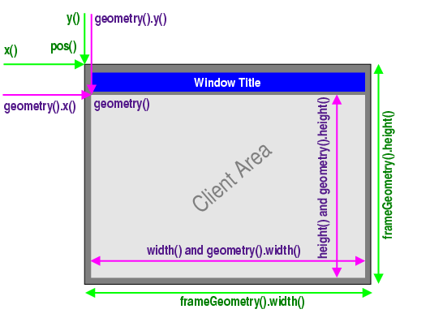
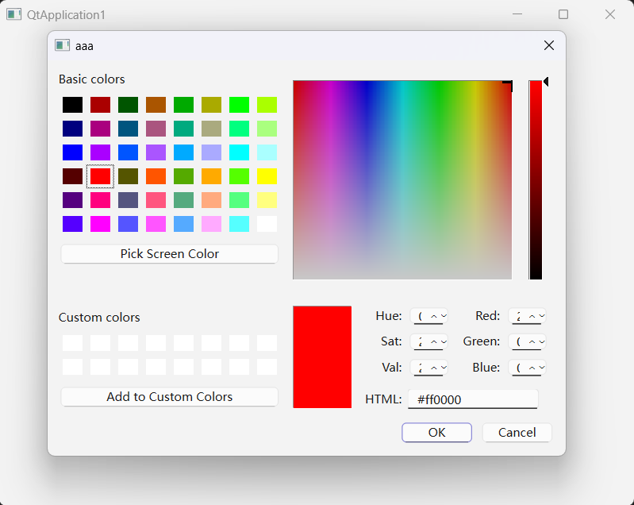
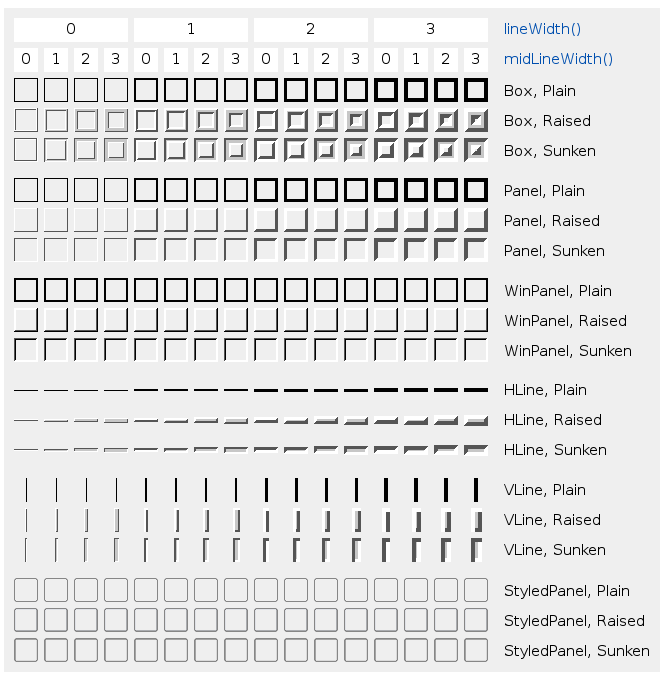
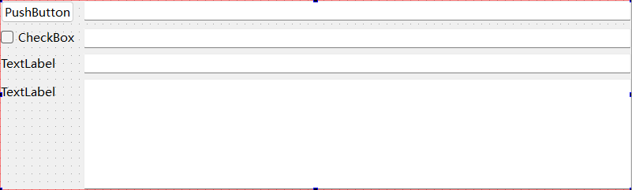
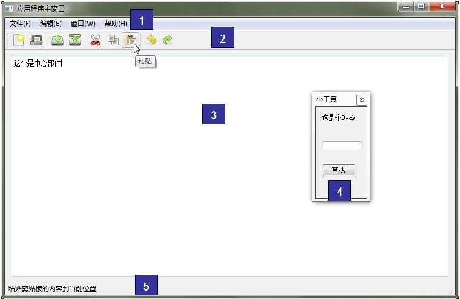
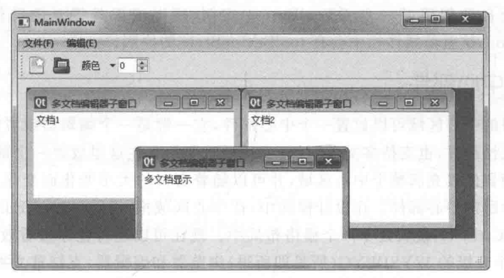
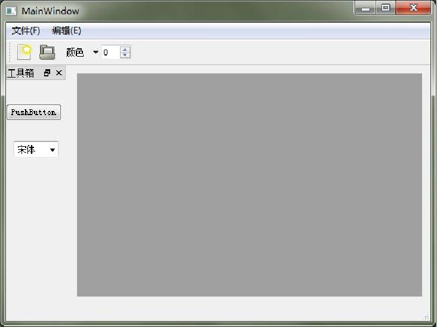
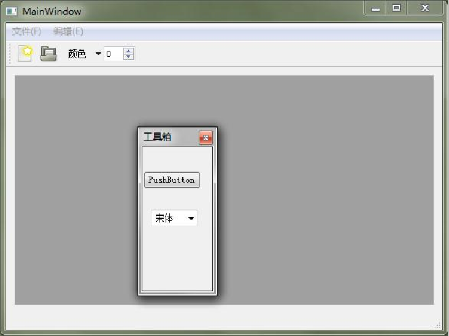
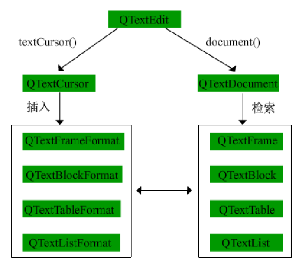

- [窗口部件](#窗口部件)
	- [基础窗口部件 QWidget](#基础窗口部件-qwidget)
		- [窗口与子窗口](#窗口与子窗口)
		- [WindowFlags与WindowType](#windowflags与windowtype)
		- [WindowStates和WindowState](#windowstates和windowstate)
		- [窗口的几何布局](#窗口的几何布局)
	- [对话框 QDialog](#对话框-qdialog)
		- [模态和非模态对话框](#模态和非模态对话框)
		- [多窗口切换](#多窗口切换)
			- [信号和槽初步](#信号和槽初步)
		- [标准对话框](#标准对话框)
	- [其他窗口部件](#其他窗口部件)
		- [QFrame族](#qframe族)
			- [QLabel](#qlabel)
			- [QLCDNumber](#qlcdnumber)
			- [QStackedWidget](#qstackedwidget)
			- [QToolBox](#qtoolbox)
		- [按钮部件](#按钮部件)
		- [QLineEdit](#qlineedit)
		- [QAbstractSpinBox](#qabstractspinbox)
		- [QAbstractSlider](#qabstractslider)
- [布局管理](#布局管理)
	- [布局管理系统](#布局管理系统)
		- [布局管理器](#布局管理器)
			- [QBoxLayout](#qboxlayout)
			- [QGridLayout](#qgridlayout)
			- [QFormLayout](#qformlayout)
			- [综合使用布局管理器](#综合使用布局管理器)
		- [设置部件大小](#设置部件大小)
			- [大小提示(sizeHint)和最小大小提示(minimumSizeHint)](#大小提示sizehint和最小大小提示minimumsizehint)
			- [伸缩因子(stretch factor)](#伸缩因子stretch-factor)
			- [窗体布局管理器其他属性](#窗体布局管理器其他属性)
			- [QWidget及其子类的相关属性](#qwidget及其子类的相关属性)
		- [可扩展窗口](#可扩展窗口)
		- [分裂器(QSplitter)](#分裂器qsplitter)
	- [设置伙伴(buddy)](#设置伙伴buddy)
	- [设置Tab顺序](#设置tab顺序)
- [应用程序主窗口](#应用程序主窗口)
	- [主窗口框架](#主窗口框架)
		- [Qt资源系统](#qt资源系统)
		- [菜单栏(QMenuBar)](#菜单栏qmenubar)
		- [工具栏(QToolBar)](#工具栏qtoolbar)
		- [中心部件](#中心部件)
		- [Dock部件(QDockWidget)](#dock部件qdockwidget)
		- [状态栏(QStatusBar)](#状态栏qstatusbar)
		- [自定义菜单(QWidgetAction)](#自定义菜单qwidgetaction)
	- [富文本处理](#富文本处理)
		- [文档结构](#文档结构)
		- [文本块](#文本块)
		- [表格,列表,图片](#表格列表图片)
		- [查找](#查找)
		- [语法高亮与HTML](#语法高亮与html)
	- [拖放](#拖放)
	- [打印文档](#打印文档)
- [事件系统](#事件系统)
	- [事件处理](#事件处理)
	- [事件传递](#事件传递)
	- [鼠标事件(QMouseEvent)和滚轮事件(QWheelEvent)](#鼠标事件qmouseevent和滚轮事件qwheelevent)
	- [键盘事件(QKeyEvent)](#键盘事件qkeyevent)
	- [定时器事件与随机数](#定时器事件与随机数)
	- [事件过滤器与事件的发送](#事件过滤器与事件的发送)
- [对象模型与容器类](#对象模型与容器类)
	- [对象模型](#对象模型)
		- [信号和槽](#信号和槽)
			- [使用](#使用)
			- [更多关联](#更多关联)
			- [断开关联](#断开关联)
			- [发送者信息](#发送者信息)
		- [属性系统](#属性系统)
		- [对象树与拥有权](#对象树与拥有权)
	- [元对象系统](#元对象系统)
		- [关于VS中Q\_OBJECT无法使用Meta-Object Compiler生成代码](#关于vs中q_object无法使用meta-object-compiler生成代码)
	- [容器类](#容器类)
		- [容器类介绍](#容器类介绍)
		- [通用算法](#通用算法)
		- [QString](#qstring)
			- [隐式共享](#隐式共享)


# 窗口部件
## 基础窗口部件 QWidget
QObject类是所有支持Qt对象模型的对象的基类。
QPaintDevice类是所有可以绘制对象的基类。

QWidget继承自QObject和QPaintDevice

### 窗口与子窗口
````C++
#include<QtWidgets/qapplication.h>
#include<QtWidgets/qdialog.h>
#include<QtWidgets/qlabel.h>
int main(int argc, char* argv[]) {
	QApplication a(argc, argv);		// QApplication用于管理应用程序的资源
	QDialog w;						// 对话框界面，默认构造其父窗口指针为nullptr，表示其不存在父窗口
	w.resize(400, 300);				// 调整窗口大小
	QLabel label(&w);				// 创建QLabel，父窗口为w，表示它为w的一个子配件
	label.move(120, 120);			// 移动label到(120,120)位置，以父窗口左上角为基准
	label.setText("Hello Qt");		// 设置label的文字
	QLabel label2;					// 创建另一个QLabel，是一个独立的窗口
	label2.move(240, 240);			// 移动到(120,120)位置，以屏幕左上角为基准
	label2.setText("Hello World");
	label2.show();					// 窗口需要执行函数show才可以显示
	w.show();						// label是w的子部件，因此只需要w执行show就可以了
	return a.exec();				// 进入消息循环
}
````

````C++
#include<QtWidgets/qapplication.h>
#include<QtWidgets/qdialog.h>
#include<QtWidgets/qlabel.h>
int main(int argc, char* argv[]) {
	QApplication a(argc, argv);
	QWidget* widget = new QWidget();
	widget->setWindowTitle("Widget");		// 设置窗口标题
	QLabel* label = new QLabel(widget);
	label->setText("label");
	widget->show();
	int ret = a.exec();
	delete widget;							// Qt父对象调用delete会自动销毁子对象
	return ret;
}
````

### WindowFlags与WindowType

QWidget的构造函数是`QWidget(QWidget* parent = (QWidget*)nullptr, Qt::WindowFlags f = {0})`，前者是父窗口的指针，Qt::WindowFlags是Qt::WindowType枚举类型值的或。

```
Qt::WindowType属性：
Qt::Widget                          //是一个窗口或部件，有父窗口就是部件，没有就是窗口
Qt::Window                          //是一个窗口，有窗口边框和标题
Qt::Dialog                          //是一个对话框窗口
Qt::Sheet                           //是一个窗口或部件Macintosh表单
Qt::Drawer                          //是一个窗口或部件Macintosh抽屉，去掉窗口左上角的图标
Qt::Popup                           //是一个弹出式顶层窗口
Qt::Tool                            //是一个工具窗口
Qt::ToolTip                         //是一个提示窗口，没有标题栏和窗口边框
Qt::SplashScreen                    //是一个欢迎窗口，是QSplashScreen构造函数的默认值
Qt::Desktop                         //是一个桌面窗口或部件
Qt::SubWindow                       //是一个子窗口
Qt::ForeignWindow                   //该窗口是另一个进程或人为创建的窗口句柄
Qt::CoverWindow                     //是一个Cover window，仅在程序最小化时显示该窗口
Qt::MSWindowsFixedSizeDialogHint    //显示对话框边框，常用于固定大小的对话框
Qt::BypassWindowManagerHint
Qt::X11BypassWindowManagerHint
Qt::FramelessWindowHint             //无边框窗口
Qt::NoDropShadowWindowHint          //禁用窗口阴影
Qt::CustomizeWindowHint             //关闭默认窗口标题提示
Qt::WindowTitleHint                 //为窗口修饰一个标题栏
Qt::WindowSystemMenuHint            //为窗口修饰一个窗口菜单系统
Qt::WindowMinimizeButtonHint        //为窗口添加最小化按钮
Qt::WindowMaximizeButtonHint        //为窗口添加最大化按钮
Qt::WindowMinMaxButtonsHint         //为窗口添加最大化和最小化按钮
Qt::WindowCloseButtonHint			//窗口只有一个关闭按钮
Qt::WindowContextHelpButtonHint     //为窗口添加帮助按钮
Qt::MacWindowToolBarButtonHint      //在macOS上添加工具栏按钮
Qt::WindowFullscreenButtonHint      //在macOS上添加最大化按钮
Qt::BypassGraphicsProxyWidget       //防止窗口嵌入QGraphicsProxyWidget
Qt::WindowShadeButtonHint           //在最小化按钮出添加shade按钮
Qt::WindowStaysOnTopHint	        //总在最上面的窗口,置前
Qt::WindowStaysOnBottomHint         //总在最下面的窗口
Qt::WindowTransparentForInput
Qt::WindowOverridesSystemGestures
Qt::WindowDoesNotAcceptFocus
Qt::MaximizeUsingFullscreenGeometryHint
Qt::WindowType_Mask
Qt::WindowOkButtonHint              
Qt::WindowCancelButtonHint          
Qt::WindowTransparentForInput       
```

使用`setWindowFlags(Qt::WindowFlags type)`把窗口的WindowFlags修改为指定值。`setWindowFlag(Qt::WindowFlags type, bool on = true)`，当后者为true时，把指定WindowFlags的位设置；当后者为false时，把指定WindowFlags的位取消设置。

### WindowStates和WindowState

使用`setWindowState()`函数用来设置窗口状态，其参数由`Qt::WindowStates`指定，是`Qt::WindowState`枚举值的或，默认为Qt::WindowNoState。

```
Qt::WindowState属性：
Qt::WindowNoState
Qt::WindowMinimized
Qt::WindowMaximized
Qt::WindowFullScreen
Qt::WindowActive
```

### 窗口的几何布局


有两类函数：
- 包含框架：x(), y(), frameGeometry(), pos(), move()
- 不包含框架：geometry(), width(), height(), rect(), size()

示例：
````C++
#include<iostream>
#include<QtCore/qdebug.h>
#include<QtWidgets/qapplication.h>
#include<QtWidgets/qdialog.h>
#include<QtWidgets/qlabel.h>
    int main(int argc, char* argv[]) {
    QApplication a(argc, argv);
    QWidget w;
    w.show();		// 获取位置信息需要写在show函数后面
    int x = w.x();	// 获取x
    int y = w.y();	// 获取y
    QRect geometry = w.geometry();		// 返回QRect，其形式为(x,y,width,height)(不带边框)
    QRect frame = w.frameGeometry();	// (带边框)
    std::cout << x << ' ' << y << std::endl;	// 可能的输出：448 138
    qDebug() << "geometry: " << geometry << "frame: " << frame << Qt::endl;	// 此处使用qDebug可以方便显示QRect，可能的输出：geometry: QRect(448,168 640x480) frame: QRect(448,138 640x510)
    return a.exec();
}
````
此外, pos()返回窗口的位置QPoint; rect()返回不包含边框窗口的内部矩阵QRect, 由于窗口内部的左上角为(0,0), 所以其返回值的x和y必为0; size()返回不包含边框的窗口大小信息QSize; width()和height()返回窗口内部的宽和高. resize()函数调整的不包含边框的窗口的大小.


## 对话框 QDialog
QDialog类是所有对话框窗口类的基类.

### 模态和非模态对话框
模态对话框指的是,在没有关闭它之前,不能再与同一个应用程序的其他窗口进行交互. 而对于非模态对话框,既可以与它交互,也可以与同一程序中的其他窗口交互.

要建立一个模态对话框,可以使用exec()函数阻塞程序进一步执行.也可以在使用show()函数之前,使用函数setModal()来将对话框设置为模态.
```C++
#include<QtWidgets/qapplication.h>
#include<QtWidgets/qdialog.h>
int main(int argc, char* argv[]) {
	QApplication a(argc, argv);
	QWidget w;
	QDialog d(&w);
	d.setModal(true);
	d.show();		// 对话框窗口无论是否是模态，都要用show函数
	w.show();
	return a.exec();
}
```
也可以使用函数`setWindowModality(Qt::WindowModality)`,其中的参数用于设置要阻塞的窗口类型,可以是:
```
Qt::NonModal			// 非模态
Qt::WindowModal			// 阻塞其父窗口、所有祖先窗口以及它们的子窗口
Qt::ApplicationModal	// 阻塞整个应用程序的所有窗口
```
`setModal()`函数默认设置的是`Qt::ApplicationModal`

### 多窗口切换
#### 信号和槽初步
一个对象通过发出信号,可以执行与之关联的槽.

一种手动建立信号和槽的方法是:
首先定义一个类,继承自QDialog(或QWidget),通过界面设计可以生成UI.包括一个按钮QPushButton,点击时可以产生一个子QDialog.
设计槽时,在定义的类(假定名为`Dialog`)中,写入:
````C++
public slots:		// public表示公有成员函数,slot是槽的标识(宏)
    void showChildDialog();

void Dialog::showChildDialog() {	// 函数的定义
    QDialog* dialog = new QDialog(this);
    dialog->show();
}
````
在构造函数中,将按钮QPushButton(假定名为button)点击的信号与槽连接:
````C++
Dialog(QWidget *parent) : QDialog(parent) {
    setupUi(this);		// 假定该函数设定好了button
    connect(&button, &QPushButton::clicked, this, &Dialog::showChildDialog);
}
````
connect是QObject的静态成员函数,其一个声明为`static inline QMetaObject::Connection connect<Func1, Func2>(const QObject* sender, const QMetaMethod& signal, const QObject* receiver, const QMetaMethod& method, Qt::ConnectionType type = Qt::AutoConnection)`.简单来说,第一个变量是发送信号的对象的地址(上述示例是一个按钮),第二个变量是发送信号的函数(上述示例是按钮按下),第三个参数是接受信号(槽)的对象的地址(上述示例是父窗口),第四个变量是槽(上述示例是Dialog的成员函数showChildDialog)

**注意,此处的slots允许省略.详见[信号和槽](#信号和槽).**


若button使用setObjectName设置了标识名,则可以使用自动连接槽,此时宏slots不可忽略:
````C++
public:
    void showChildDialog();		// 需要手动连接

public slots:					// slots不可忽略
    void on_showChildButton_clicked() {		// 自动连接时需要特定的名称,格式为on_发射信号部件的对象名_信号名
	// 此处所说的对象名不是变量名,而是使用setObjectName设置的名称
        QDialog* dialog = new QDialog(this);
        dialog->show();
    }
````

QDialog中,accept()函数是槽,执行后会隐藏模态对话框,并返回QDialog::Accepted值.与其对应的是rejected()槽,返回QDialog::Rejected值.

close()槽被调用时,若没有其他父窗口时,程序会退出,若有其他父窗口时,调用该槽只会将自身隐藏,而非销毁,因此可以用show()重新显示.

### 标准对话框
QColorDialog(位于<QtWidgets/QColorDialog>)提供一个可以获取指定颜色的对话框部件.
如对于代码:
````C++
int main(int argc, char* argv[]) {
	QApplication a(argc, argv);
	QWidget w;
	w.show();
	QColor color = QColorDialog::getColor(Qt::red, &w, "aaa");
	return a.exec();
}
````
其运行结果为:


getColor是静态成员函数,可以实现无变量产生对话框,其中,第一个参数是颜色选框的默认值,是一个QColor对象,包含(alpha,R,G,B),第二个参数为其父窗口,第三个参数为其窗口名称.返回选择的颜色QColor.

为了更灵活的设置,也可以用标准方法创建对象.

**以下其他标准对话框为了防止冗余,仅仅提一下**

文件对话框QFileDialog类提供了一个允许用户选择文件或文件夹的对话框.

字体对话框QFontDialog类提供了一个可以选择字体的对话框.

输入对话框QInputDialog类用来提供一个对话框,可以让用户输入一个单一的数值或字符串.

消息对话框QMessageBox类提供了一个模态对话框来通知用户一些消息,或者向用户提出一个问题并且获取答案.

进度对话框QProgressDialog对一个耗时较长操作的进度提供了反馈.

错误信息对话框QErrorMessage类提供了一个显示错误信息的对话框.

向导对话框QWizard类提供了一个设计向导界面的框架.

## 其他窗口部件
### QFrame族
QFrame类是带有边框的部件的基类.它的子类包括QLabel,QLCDNumber,QSplitter,QStackedWidget,QToolBox,QAbstractScrollArea类.其中QAbstractScrollArea类是所有带有滚动区域的部件类的抽象基类.

QFrame类定义的主要边框形状:
```
QFrame::NoFrame			// QFrame不进行绘制
QFrame::Box				// QFrame在它的内容四周绘制一个边框
QFrame::Panel			// QFrame绘制一个面板,使得内容表现为凸起或者凹陷
QFrame::StyledPanel		// 绘制一个矩形面板,它的效果依赖于当前的GUI样式,可以凸起或凹陷
QFrame::HLine			// QFrame绘制一条水平线,没有任何框架(可以作为分离器)
QFrame::VLine			// QFrame绘制一条垂直线,没有任何框架(可以作为分离器)
QFrame::WinPanel		// 绘制一个类似于Windows2000中的矩形面板,可以凸起或者凹陷
```
使用`setFrameShape()`可以设置边框形状

QFrame类定义的主要边框阴影:
```
QFrame::Plain		// 边框和内容没有3D效果,与四周界面在同一水平面上
QFrame::Raised		// 边框和内容表现为凸起,具有3D效果
QFrame::Sunken		// 边框和内容表现为凹陷,具有3D效果
```
使用`setFrameShadow()`可以设置边框阴影

使用`setFrameStyle()`既可以设置边框形状,也可以设置边框阴影,用或连接

lineWidth()返回边框边界线的宽度,midLineWidth()返回边框中额外插入的一条线的宽度(为了形成3D效果).

使用`setLineWidth()`可以设置边框边界线的宽度,使用`setMidLineWidth()`可以设置边框中额外插入的一条线的宽度.



#### QLabel
标签QLabel部件用来显示文本或者图片.

使用setAlignment()函数可以设置文本对其方式.使用setFont()可以设置其字体.
````C++
#include<QtWidgets/qlabel.h>
#include<QtWidgets/qapplication.h>
int main(int argc, char* argv[]) {
	QApplication a(argc, argv);
	QWidget w;
	w.resize(400, 300);
	QLabel l(&w);
	l.setAlignment(Qt::AlignHCenter | Qt::AlignVCenter);	// 文本居中显示(相对于QLabel)
	QFont font;
	font.setFamily("Cascadia Code");	// 字体族
	font.setPointSize(20);				// 大小20
	font.setBold(true);			// 加粗
	font.setItalic(true);				// 斜体
	l.setFont(font);
	l.setText("abcdefg");
	w.show();
	return a.exec();
}
````
QLabel属性栏中的wordWrap属性可以实现文本的自动换行.

使用QFontMetrics类可以实现在文本过长时省略后面的字.通过QWidget::fontMetrics()可以返回当前部件字体的QFontMetrics对象.
````C++
#include<QtWidgets/qlabel.h>
#include<QtWidgets/qapplication.h>
int main(int argc, char* argv[]) {
	QApplication a(argc, argv);
	QWidget w;
	w.resize(400, 300);
	QLabel l(&w);
	QString str = l.fontMetrics().elidedText("Very very very very very long text", Qt::ElideRight, 180);
	// 第一个参数指定省略的文本,第二个参数指定省略模式(即省略号出现的位置),第三个参数指定文本的长度(单位:像素)
	// Qt::ElideLeft文本开头
	// Qt::ElideMiddle文本中间
	// Qt::ElideRight文本末尾
	l.setText(str);
	w.show();
	return a.exec();
}
````

用属性栏中的scaledContents属性可以实现缩放标签中的内容.

使用setPixmap()可以让其显示图片,如:`label.setPixmap(QPixmap("img.png"))`.注意要引入头文件`<QPixmap>`

使用setMovie可以显示gif,如`QMovie* movie = new QMovie("movie.gif"); label.setMovie(movie)`.注意要引入头文件`<QMovie>`

#### QLCDNumber
让数码字符显示类似液晶数字的效果.

属性:
- smallDecimalPoint -> 显示小数点
- digitCount -> 显示数字的个数
- mode -> 进制
- segmentStyle -> 数码的显示样式
- value -> 值

也可以使用display()设置显示的值

#### QStackedWidget
QStackedWidget类提供了一个部件栈,可以有多个界面(页面),每个界面可以拥有自己的部件,不过每次只能显示一个界面.这个部件需要使用QComboBox或者QListWidget来选择它的各个页面.

#### QToolBox
QToolBox类提供了一列层叠窗口部件.

### 按钮部件
QAbstractButton类是按钮部件的抽象基类,提供了按钮的通用功能.它的子类包括复选框QCheckBox,标准按钮QPushButton,单选框按钮QRadioButton和工具按钮QToolButton.

### QLineEdit
行编辑器QLineEdit部件是一个单行的文本编辑器,它允许用户输入和编辑单行的纯文本内容,并且提供了一系列有用的功能,包括撤销与恢复、剪切和拖放等操作.

### QAbstractSpinBox
QAbstractSpinBox是一个抽象的基类,提供了一个数值设定框和一个行编辑其来显示设定值.它有3个子类QDateTimeEdit,QSpinBox和QDoubleSpinBox,分别用来完成时间、整数和浮点数的设定.

### QAbstractSlider
QAbstractSlider类用于提供区间内的一个整数值,它有一个滑块,它有一个滑块,可以定位到一个整数区间的任意值.该类是一个抽象基类,它有3个子类QScrollBar,QSlider和QDial.

# 布局管理

## 布局管理系统
Qt的布局管理系统能够自动排列窗口中的所有部件,确保它们有效地使用空间.

布局管理类可以对UI中的部件进行布局,其主要任务为:
- 定位子部件
- 感知窗口默认大小
- 感知窗口最小大小
- 窗口大小变化时进行处理
- 当内容改变时自动更新
  - 字体大小、文本或子部件的其他内容随之改变
  - 隐藏或显示子部件
  - 移除一个子部件

### 布局管理器
QLayout类是布局管理器的基类,是一个抽象基类,继承自QObject和QLayoutItem类,QLayout类提供了一个供QLayout操作的抽象项目.

QLayout的子类为QBoxLayout(基本布局管理器),QGridLayout(栅格布局管理器),QFormLayout(窗体布局管理器)和QStackedLayout(栈布局管理器).

#### QBoxLayout
QBoxLayout可以是子部件在水平方向或者垂直方向排成一列,他将所有空间分成一行盒子,然后将每个部件放入一个盒子中.它有两个子类QHBoxLayout水平布局管理器和QVBoxLayout垂直布局管理器.

QBoxLayout常用属性:
layoutName -> 布局管理器名称
layoutLeftMargin -> 设置布局管理器到界面左边界的距离
layoutTopMargin -> 设置布局管理器到界面上边界的距离
layoutRightMargin -> 设置布局管理器到界面右边界的距离
layoutBottomMargin -> 设置布局管理器到界面下边界的距离
layoutSpacing -> 布局管理器中各个子部件间的距离
layoutStretch -> 伸缩因子
layoutSizeConstraint -> 设置大小约束条件

使用例:
````C++
#include<QtWidgets/qlabel.h>
#include<QtWidgets/qapplication.h>
#include<QtWidgets/qboxlayout.h>
int main(int argc, char* argv[]) {
	QApplication a(argc, argv);
	QWidget w;
	w.resize(400, 300);
	QLabel l1(&w);
	l1.setText("label1");
	l1.setFrameShape(QFrame::Box);
	QLabel l2(&w);
	l2.setText("label2");
	l2.setFrameShape(QFrame::Box);
	QHBoxLayout* layout = new QHBoxLayout;		// 新建水平布局管理器
	layout->addWidget(&l1);						// 向布局管理器中添加部件
	layout->addWidget(&l2);
	layout->setSpacing(50);						// 设置部件间的间隔
	layout->setContentsMargins(0, 0, 50, 100);	// 设置布局管理器到边界的距离(左,上,右,下)
	w.setLayout(layout);						// 将这个布局设置为w的布局
	w.show();
	return a.exec();
}
````
addWidget()函数向布局管理器的末尾添加部件,还要一个insertWidget()函数可以实现向指定位置添加部件.

#### QGridLayout
QGridLayout类使部件在网格中进行布局,它将所有的空间分隔成一些行和列,行和列的交叉处形成了单元格,然后将部件放入一个确定的单元格中.
````C++
#include<QtWidgets/qlabel.h>
#include<QtWidgets/qapplication.h>
#include<QtWidgets/qboxlayout.h>
int main(int argc, char* argv[]) {
	QApplication a(argc, argv);
	QWidget w;
	w.resize(400, 300);
	QLabel l1;
	// 此处无需指定父窗口，原因是加入布局管理器后，布局管理器绑定父窗口，所有布局管理器内的部件会重新绑定到父对象
	l1.setText("label1");
	l1.setFrameShape(QFrame::Box);
	QLabel l2;
	l2.setText("label2");
	l2.setFrameShape(QFrame::Box);
	QLabel l3;
	l3.setText("label3");
	l3.setFrameShape(QFrame::Box);
	QGridLayout* layout = new QGridLayout;
	layout->addWidget(&l1, 0, 0, 1, 2);		// 添加部件，从0行0列开始，占据1行2列
	layout->addWidget(&l2, 0, 2, 1, 1);		// 添加部件，从0行2列开始，占据1行1列
	layout->addWidget(&l3, 1, 0, 1, 3);		// 添加部件，从1行0列开始，占据1行3列
	w.setLayout(layout);
	w.show();
	return a.exec();
}
````

#### QFormLayout
QFormLayout类用来管理表单的输入部件以及与它们相关的标签.
效果如下:


#### 综合使用布局管理器
可以向父布局管理器使用`addLayout`方法添加子布局管理器.

### 设置部件大小
#### 大小提示(sizeHint)和最小大小提示(minimumSizeHint)
QWidget及其子类拥有`sizeHint(大小提示)`和`minimumSizeHint(最小大小提示)`两个属性.不同部件拥有不同的`sizeHint`和`minimumSizeHint`.*注意,使用`setMinimumSize()`函数设置部件的最小大小,则`minimumSizeHint`会被忽略.*

QWidget及其子类拥有`sizePolicy`属性.该属性保存部件的默认布局行为.控制着部件在布局管理器中的大小变化行为.

`sizePolicy`属性的所有取值为:
- `QSizePolicy::Fixed`: 只能使用`sizeHint`提供的值,无法伸缩
- `QSizePolicy::Minimum`: `sizeHint`提供的大小是最小的,部件可以被伸缩
- `QSizePolicy::Maximum`: `sizeHint`提供的是最大大小,部件可以被压缩
- `QSizePolicy::Preferred`: `sizeHint`提供的是最佳大小,部件可以被压缩或拉伸
- `QSizePolicy::Expanding`: `sizeHint`提供的是合适的大小,部件可以被压缩,不过它更倾向于被拉伸来获得更多的空间.
- `QSizePolicy::MinimumExpanding`: `sizeHint`提供的大小是最小的,部件倾向于被拉伸来获取更多的空间.
- `QSizePolicy::Ignored`: `sizeHint`的值被忽略,部件将尽可能的被拉伸来获取更多的空间.

#### 伸缩因子(stretch factor)
`stretch factor`表示部件之间的比例.例如想让两个label水平`1:2`布局,可以在Designer中将水平布局管理器的`LayoutStretch`属性设置为`1,2`.或者可以在代码中`addWidget()`参数指定伸缩因子.

例如:
````C++
#include<QtWidgets>
#include<qdebug.h>
#include<iostream>
#include<utility>

int main(int argc, char* argv[]) {
	QApplication a(argc, argv);
	QWidget w;
	QLabel l1;
	l1.setFrameShape(QFrame::Box);
	QLabel l2;
	l2.setFrameShape(QFrame::Box);
	QBoxLayout layout(QBoxLayout::LeftToRight);
	layout.addWidget(&l1, 1);
	layout.addWidget(&l2, 2);
	w.setLayout(&layout);
	w.resize(400, 300);
	w.show();
	a.exec();
}
````

#### 窗体布局管理器其他属性

`layoutFieldGrowthPolicy`: 指定部件的大小变化方式.  
可选值:
- `AllNonFixedFieldsGrow`: 默认值,所有的部件都被拉伸,这是默认值.
- `FieldsStayAtSizeHint`: 所有的部件都使用`sizeHint`提供的大小.
- `ExpandingFieldsGrow`: 大小策略为`Expanding`的部件会被拉伸.

`layoutRowWrapPolicy`: 设置是否换行,如果需要换行,则将输入部件放到相应的标签下面.  
可选值:
- `DontWrapRows`: 默认值,不换行.
- `WrapLongRows`: 将较长的行进行换行.
- `WrapAllRows`: 将所有行都换行,这样所有的输入部件都会放置在相应的标签下面.

`layoutLabelAlignment`: 设置标签的对齐方式,分为水平方向和垂直方向.  
可选值:
- `AlignLeft`: 左对齐.
- `AlignRight`: 右对齐.
- `AlignHCenter`: 水平居中对齐.
- `AlignJustify`: 两端对齐.
- `AlignTop`: 向上对齐.
- `AlignBottom`: 向下对齐.
- `AlignVCenter`: 垂直居中对齐.

`layoutFormAlignment`: 设置部件在表单中的对齐方式.  
可选值: *同`layoutLabelAlignment`*

`layoutSizeConstraint`: 约束窗口大小,仅对顶级布局管理器有用,因为它只对窗口有效.  
可选值:
- `QLayout::SetDefaultConstraint`: 默认值,主窗口大小设置为`minimumSize`的值,除非该部件已经有一个最小大小.
- `QLayout::SetFixedSize`: 主窗口大小设置为`sizeHint`的值,它无法改变大小.
- `QLayout::SetMinimumSize`: 主窗口的最小大小设置为`minimumSize`的值,它无法再缩小.
- `QLayout::SetMaximumSize`: 主窗口的最大大小设置为`maximumSize`的值,它无法再放大.
- `QLayout::SetMinAndMaxSize`: 主窗口的最小大小设置为`minimumSize`的值,最大大小设置为`maximumSize`的值.
- `QLayout::SetNoConstraint`: 部件不被约束.


#### QWidget及其子类的相关属性
- `minimumSize`: 设置窗口最小值.
- `maximumSize`: 设置窗口最大值.
- `sizeIncrement`和`baseSize`: 设置窗口改变大小.


### 可扩展窗口
一个窗口可能有很多选项是扩充的,只有在必要时候才显示出来,这时候可以使用一个按钮来隐藏或者显示多余的内容,这就是可扩展窗口. 布局管理器可以在子部件隐藏时,布局管理器自动缩小,当子部件重新显示时,布局管理器再次放大.

*下面的示例暂时无法做到自动收起*
````C++
#include<QtCore>
#include<QtWidgets>
#include<qdebug.h>
#include<iostream>
#include<utility>

class Win : public QWidget {
private:
	QPushButton b;
	QGridLayout layout;
	QLabel l1;
	QLabel l2;
	QFormLayout fl;

public slots:
	void click_button(bool on) {
		l2.setVisible(on);
		if (on) b.setText("Hide");
		else b.setText("Show");
	}

public:
	void setUp() {
		l1.setFrameStyle(QFrame::Box);
		l2.setFrameStyle(QFrame::Box);
		l1.setText("Label1");
		l2.setText("Label2");
		l1.resize(300, 100);
		l2.resize(300, 100);
		l1.setSizePolicy(QSizePolicy::Ignored, QSizePolicy::Fixed);
		l1.setAlignment(Qt::AlignCenter);
		l2.setAlignment(Qt::AlignCenter);
		l2.setVisible(false);
		b.setText("Show");
		b.setCheckable(true);
		layout.addWidget(&b, 0, 0, 1, 1);
		layout.addWidget(&l1, 1, 0, 1, 1);
		layout.addWidget(&l2, 2, 0, 1, 1);
		setLayout(&layout);
		connect(&b, &QPushButton::toggled, this, &Win::click_button);
	}

	Win(QWidget* parent = nullptr) : QWidget(parent) {
		setUp();
	}

	~Win() {}
};

int main(int argc, char* argv[]) {
	QApplication a(argc, argv);
	Win w;
	w.show();
	return a.exec();
}
````

### 分裂器(QSplitter)
`分裂器(QSplitter)`类提供了一个分裂器部件.和`QBoxLayout`类似,可以完成布局管理器的功能,但是包含在它里面的部件,默认是随着分裂器大小的变化而变化的.此外`QSplitter`继承自`QFrame`类,可以使用`QFrame`的功能.

## 设置伙伴(buddy)
QLabel允许使用伙伴机制,即通过键盘的加速键`Alt+字母`的形式(*加速键与快捷键的区别在于,按下`Alt`键,这些字母会显示下滑线,表明只要按下该键盘上对应的字母,就可以获得焦点,再次按下`Alt`键,下划线消失,按下字母不起作用*),将焦点定位到`QLabel`关联的表单(伙伴)上.在`QtDesigner`中,将`QLabel`修改为例如`C&heckBox`,则实际会显示`CheckBox`,`&`不会显示,且`&`其后的字母`h`会被认为设置为伙伴焦点的快捷键`Alt+H`(注意焦点是其伙伴,即表单获得的).

在代码中使用`QLabel`的`setBuddy()`可以设置伙伴.

## 设置Tab顺序
有时想要使用`Tab`键将焦点从一个部件移动到下一个部件.

`QtDesigner`允许使用`编辑Tab顺序`按钮来编辑Tab键顺序.当程序启动时,焦点会在Tab键顺序为`1`的部件上.

也可以使用代码:
````C++
setTabOrder(ui->lineEdit, ui->spinBox);		// lineEdit在spinBox前面
setTabOrder(ui->spinBox, ui->pushButton);	// spinBox在pushButton前面
setTabOrder(ui->pushButton, ui->checkBox);	// pushButton在checkBox前面
````

# 应用程序主窗口
## 主窗口框架
Qt提供`QtMainWindow`和其他一些相关的类共同完成主窗口的管理.

`QMainWindow`类包含以下组件:
1. `菜单栏(QMenuBar)`: 菜单栏包含了一个下拉菜单栏的列表,这些菜单项由`QAction`动作类实现.菜单栏位于主窗口的顶部,一个主窗口只能有一个菜单栏.
2. `工具栏(QToolBar)`: 工具栏一般用于显示一些常用的菜单项目,也可以插入其他窗口部件,并且时可以移动的.一个主窗口可以拥有多个工具栏.
3. `中心部件(Central Widget)`: 在主窗口的中心区域可以放入一个窗口部件作为中心部件,它是应用程序的主要功能实现区域.一个主窗口只能拥有一个中心部件.
4. `Dock部件(QDockWidget)`: Dock部件常被称为停靠窗口,因为它可以停靠在中心部件的四周.它用来放置一些部件来实现一些功能,就像个工具箱一样.一个主窗口可以拥有多个Dock部件.
5. `状态栏(QStatusBar)`: 状态栏用于显示程序的一些状态信息,它在主窗口的最底部.一个主窗口只能拥有一个状态栏.



### Qt资源系统
使用资源文件的优势在于,资源无需与程序分离,分散在文件夹中,而是集成到可执行文件或者动态链接库当中.

建立Qt资源需要`.qrc`后缀的文件.建立后,需要`新建前缀`,类似于建立一个文件夹,用于管理.建立前缀后,就可以在前缀中添加文件.例如,向`/icon`前缀中添加`app_icon.ico`.`qrc`是一个XML格式的文本文件.可以同时路径`:/icon/app_icon.ico`来使用上述资源文件.

### 菜单栏(QMenuBar)
可以用`QtDesigner`快捷构建菜单栏.

也可以使用代码的方式编写菜单栏:
````C++
QMenu* editMenu = ui->menuBar->addMenu(tr("编辑(&E)"));	// 添加编辑菜单
QAction* action_Open = editMenu->addAction(QIcon(":/image/images/open.png"),tr("打开文件(&O)"));	// 添加打开菜单动作(注意:路径中的":"表示Qt资源文件的路径)
action_Open->setShortcut(QKeySequence("Ctrl+O"));	// 设置快捷键
ui->mainToolBar->addAction(action_Open);	// 在工具栏中添加动作
````

`QMenuBar`类提供了一个水平的菜单栏,可以向其中添加`QMenu`类型的菜单对象,可以向菜单中添加`QAction`类的动作对象作为菜单项.

使用`addSeparator()`函数来向菜单中添加间隔器,这是一条水平线,可以将菜单进行分组,使布局很整齐.

`QAction`是一种命令动作,可以放置在菜单和工具栏中.一个`QAction`动作可以包含图标,菜单显示文本,快捷键,状态栏显示文本, "What's This?"显示文本和工具提示文本. 可在其构造函数中指定. 设置其`checkable`属性为`true`,则在选中菜单时前面会显示`√`等符号,如果是图标,则会用线框围住.

`QActionGroup`类,可以包含一组动作`QAction`,用于设置这组动作中是否只能有一个动作处于选中状态.

如:
````C++
QActionGroup* group = new QActionGroup(this);	// 建立动作组
QAction* action_L = group->addAction(tr("左对齐(&L)"));	// 向动作组中添加动作
action_L->setCheckable(true);					// 设置checkable为true
QAction* action_R = group->addAction(tr("右对齐(&R)"));
action_R->setCheckable(true);
QAction* action_C = group->addAction(tr("居中(&C)"));
action_C->setCheckable(true);
action_L->setChecked(true);						// 指定action_L为选中状态
editMenu->addSeparator();						// 向菜单中添加间隔器
editMenu->addAction(action_L);					// 向菜单中添加动作
editMenu->addAction(action_R);
editMenu->addAction(action_C);
````

### 工具栏(QToolBar)
`QToolBar`类提供了一个包含了一组控件的,可以移动的面板.

可以将`QAction`对象添加到`QToolBar`.

`QToolBar`中,`toolButtonStyle`属性可以设置图标和相应文本的显示及其相对位置.`movable`属性用来设置状态栏是否可以移动,`allowedArea`用来设置允许停靠的位置,`iconsize`属性用来设置图标的大小.`floatable`属性用来设置是否可以悬浮.

工具栏中还可以添加其他窗口部件.

````C++
#include<QToolButton>
#include<QSpinBox>
QToolButton* toolBtn = new QToolButton(this);	// 创建QToolButton
toolBtn->setText(tr("颜色"));
QMenu* colorMenu = new QMenu(this);				// 创建一个菜单
colorMenu->addAction(tr("红色"));
colorMenu->addAction(tr("绿色"));
toolBtn->setMenu(colorMenu);					// 添加菜单
toolBtn->setPopupMode(QToolButton::MenuButtonPopup);	// 设置弹出模式
mainToolBar->addWidget(toolBtn);				// 向工具栏添加QToolButton按钮
QSpinBox* spinBox = new QSpinBox(this);			// 创建QSpinBox
mainToolBar->addWidget(spinBox);				// 向工具栏添加QSpinBox部件
````
上面设置的弹出模式是按钮旁边会有一个向下的小箭头,可以按下这个箭头弹出菜单.

向工具栏中添加一个`QAction`类对象会自动创建一个`QToolButton`示例,所以工具栏上的动作就是一个`QToolButton`

### 中心部件
主窗口的中心可以放置一个中心部件,它一般是一个编辑器或者浏览器.

一些中心部件:
- `QTextEdit`: 一个高级的WYSIWYG(所见即所得)浏览器和编辑器,支持富文本处理.
- `QPlainTextEdit`: 纯文本编辑器,但无法处理富文本.
- `QTextBrowser`: 富文本浏览器,一个只读的`QTextEdit`.
- `QMdiArea`: 可以显示MDI多文档界面的区域,从而有效地管理多个窗口.`QMdiArea`中的子窗口由`QMdiSubWindow`类提供.  


### Dock部件(QDockWidget)
`QDockWidget`类提供了一个部件,可以停靠在`QMainWindow`中,也可以悬浮起来作为桌面顶级窗口,称为Dock部件或者停靠窗口.Dock部件一般用于存放其他一些部件来实现一些特殊功能,就像一个工具箱一样.它在主窗口中可以停靠在中心部件的四周,也可以悬浮起来,被拖动到任意的地方,还可以被关闭或隐藏起来.一个Dock部件包含一个标题栏和一个内容区域,可以向Dock部件中放入任何部件. 




### 状态栏(QStatusBar)
`QStatusBar`类提供了一个水平条部件,用来显示状态信息.

状态信息分为三类:
- `临时信息`: 例如提示信息.使用`showMessage()`显示,出现在状态栏的最左边.
- `正常信息`: 例如显示页数.用`addWidget()`函数添加`QLabel`到状态栏上.
- `永久信息`: 例如版本号.使用`addPermanentWidget()`函数来添加一个显示信息的部件.它会生成在状态栏的最右端.

状态栏的最右端有一个`QSizeGrip`部件,用来调整窗口的大小.可以使用`setSizeGripEnabled()`来禁用它.

### 自定义菜单(QWidgetAction)
使用`QWidgetAction`及其继承类,可以在菜单中添加该部件.

## 富文本处理
富文本或富文本格式就是在文档中可以使用多种格式,比如字体颜色,图片和表格等.它与纯文本是相对而言的.

### 文档结构
文档的光标主要基于QTextCursor类. 文档的框架主要基于QTextDocument类. 一个富文本文档的结构被分为了几种元素来表示,分别是框架(QTextFrame),文本块(QTextBlock),表格(QTextTable)和列表(QTextList). 每种元素的格式又使用相应的format类来表示,它们分别是框架格式(QTextFrameFormat),文本块格式(QTextBlockFormat),表格格式(QTextTableFormat)和列表格式(QTextListFormat),这些格式一般在编辑文档时使用,所以它们常和QTextCursor类配合使用.

`QTextEdit`本身就包含了`QTextCursor`和`QTextDocument`.  


**等待完成**
### 文本块

### 表格,列表,图片

### 查找

### 语法高亮与HTML

## 拖放

## 打印文档

# 事件系统
Qt使用一个对象来表示一个事件,继承自`QEvent`类.例如:单击界面会产生`QMouseEvent`.

## 事件处理
一个事件由一个特定的QEvent子类来表示.但一个事件包含多个事件类型时,会通过枚举值`QEvent::Type`来表示.  
可选值详见:[QT-Doc-QEvent-Enum QEvent::Type](https://doc.qt.io/qt-6/qevent.html#Type-enum)

为了处理事件,可以使用以下方法:
1. 重新实现部件的`paintEvent()`,`mousePressEvent()`等事件处理函数.最常用,但只能用来处理特定部件的特定事件.
2. 重新实现`notify()`函数.功能强大,可以在事件过滤器得到事件之前就获得它们.但是,它一次只能处理一个事件.
3. 向`QApplication`对象上安装事件过滤器.因为一个程序只有一个`QApplication`对象,所以这样实现的功能与使用`notify()`是相同的,且可以处理多个事件.
4. 重新实现`event()`函数.`QObject`类的`event()`函数可以在事件到达默认的事件处理函数之前获得该事件.
5. 在对象上安装事件过滤器.使用事件过滤器可以在一个界面类中同时处理不同子部件的不同事件.

## 事件传递
`main()`函数最后都会调用`QApplication`的`exec()`函数,它会使Qt应用程序进入事件循环,这样就可以使应用程序在运行时接收发生的各种事件.一旦有事件发生,Qt就会构建一个相应的`QEvent`子类来表示它,然后将它传递给`QObject`对象或其子对象.

方法1来处理事件:
````C++
#include<QtCore>
#include<QtWidgets>
#include<qdebug.h>
#include<iostream>
#include<utility>
#include"resource.h"

class Win : public QWidget {
private:
	QLabel l;
public:
	void setUp() {
		l.setParent(this);
		l.setFrameStyle(QFrame::Box);
		l.setText("Label1");
		l.resize(300, 100);
		l.setSizePolicy(QSizePolicy::Ignored, QSizePolicy::Fixed);
		l.setAlignment(Qt::AlignCenter);
	}
	Win(QWidget* parent = nullptr) : QWidget(parent) {
		setUp();
	}
	~Win() {}
private:
	void keyPressEvent(QKeyEvent* event) {
		qDebug() << "Key Pressed" << Qt::endl;
		event->ignore();
	}
};

int main(int argc, char* argv[]) {
	QApplication a(argc, argv);
	Win w;
	w.show();
	return a.exec();
}
````
当程序获得焦点时,键盘按下会有调式信息`Key Pressed`显示.此处`keyPressEvent(QKeyEvent* event)`必须是特定名称.

`event->ignore()`表示将事件传给父级窗口,让其进行处理,没有该类可能会导致例如字处理模块无法响应键盘对文字的输入.

所以,Qt会将事件传给获得焦点部件的特定函数去处理,处理完之后,需要将事件向*父级窗口*传递.

方法4:
````C++
#include<QtCore>
#include<QtWidgets>
#include<qdebug.h>
#include<iostream>
#include<utility>
#include"resource.h"

class Win : public QWidget {
private:
	QLabel l;
public:
	void setUp() {
		l.setParent(this);
		l.setFrameStyle(QFrame::Box);
		l.setText("Label1");
		l.resize(300, 100);
		l.setSizePolicy(QSizePolicy::Ignored, QSizePolicy::Fixed);
		l.setAlignment(Qt::AlignCenter);
	}
	Win(QWidget* parent = nullptr) : QWidget(parent) {
		setUp();
	}
	~Win() {}
private:
	bool event(QEvent* e) override {
		if (e->type() == QEvent::KeyPress)
			qDebug() << "Key Pressed" << Qt::endl;
		return QWidget::event(e);		// 向父类传递事件,让父类对事件响应.
	}
};

int main(int argc, char* argv[]) {
	QApplication a(argc, argv);
	Win w;
	w.show();
	return a.exec();
}
````

方法5:
````C++
#include<QtCore>
#include<QtWidgets>
#include<qdebug.h>
#include<iostream>
#include<utility>
#include"resource.h"

class Win : public QWidget {
private:
	QLabel l;
public:
	void setUp() {
		l.setParent(this);
		l.setFrameStyle(QFrame::Box);
		l.setText("Label1");
		l.resize(300, 100);
		l.setSizePolicy(QSizePolicy::Ignored, QSizePolicy::Fixed);
		l.setAlignment(Qt::AlignCenter);
		l.installEventFilter(this);		// 为l安装事件过滤器,所有l的事件都会先经过*this的eventFilter()函数
	}
	Win(QWidget* parent = nullptr) : QWidget(parent) {
		setUp();
	}
	~Win() {}
public:	// eventFilter需要处于public中
	bool eventFilter(QObject* obj, QEvent* event) override {
		if (obj == &l) {
			if (event->type() == QEvent::MouseButtonPress)
				qDebug() << "Mouse Pressed" << Qt::endl;
		}
		return QWidget::eventFilter(obj, event);	// 向父类传递eventFilter
	}
};

int main(int argc, char* argv[]) {
	QApplication a(argc, argv);
	Win w;
	w.show();
	return a.exec();
}
````
上述表明,事件首先`obj`的事件首先经过另一个类的`eventFilter()`(如果执行了`installEventFilter()`),然后执行`event()`.接着执行特化的`keyPressEvent()`等事件处理函数,最后向上传递`keyPressEvent()`.

方法2和方法3可以依照方法4和方法5实现.

## 鼠标事件(QMouseEvent)和滚轮事件(QWheelEvent)
`QMouseEvent`类用来表示一个鼠标事件,当在窗口部件中按下鼠标或者移动鼠标指针时,都会产生鼠标事件.利用`QMouseEvent`类可以获知鼠标是哪个键按下了,还有鼠标指针的当前位置等信息.

`QWheelEvent`类用来表示鼠标滚轮事件,在这个类中主要是获取滚轮移动的方向和距离.

例如:
````C++
void mousePressEvent(QMouseEvent* event);
void mouseReleaseEvent(QMouseEvent* event);
void mouseDoubleClickEvent(QMouseEvent* event);
void mouseMoveEvent(QMouseEvent* event);
void wheelEvent(QWheelEvent* event);
````

例如:
````C++
#include<QtCore>
#include<QtWidgets>
#include<qdebug.h>
#include<iostream>
#include<utility>
#include"resource.h"

class MyLabel : public QLabel {
public:
	MyLabel(QWidget* parent = nullptr) : QLabel(parent) {
		setFrameStyle(QFrame::Box);
		setAlignment(Qt::AlignCenter);
		setMouseTracking(true);		// 设置鼠标追踪,默认为false,即只有当鼠标处于按下状态时,才会检测鼠标是否移动.
	}
	~MyLabel() {}
private:
	void mousePressEvent(QMouseEvent* event) override {
		QCursor cursor;
		cursor.setShape(Qt::CrossCursor);
		setCursor(cursor);			// 设置鼠标的外观
		QLabel::mousePressEvent(event);	// 将事件向上传递
	}
	void mouseReleaseEvent(QMouseEvent* event) override {
		setCursor(QCursor(Qt::ArrowCursor));
		if (event->button() == Qt::LeftButton) {	// 检测是否是左键按下
			qDebug() << event->pos() << Qt::endl;	// pos()返回鼠标在MyLabel内的的相对位置
		}
		else {
			QLabel::mouseReleaseEvent(event);	// 其他未使用的按键向上传递
		}
	}
	void mouseMoveEvent(QMouseEvent* event) override {
		if (event->buttons() & Qt::LeftButton) {	// button()只能够给出一个按下的按钮,如果在一个时刻内按下多个按钮,如在鼠标移动时,一直按着左右键,则只能用buttons()函数,得到按下按钮的并.
			qDebug() << "Drug" << Qt::endl;
		}
		QLabel::mouseMoveEvent(event);
	}
	void wheelEvent(QWheelEvent* event) override {
		if (event->angleDelta().y() > 0) {	// angleDelta()返回QPoint,y()是一般的鼠标滚轮垂直滚动的角度(值=滚动度数[一般滚一次15°]*8)
			qDebug() << "Page Up" << Qt::endl;
		}
		else if (event->angleDelta().y() < 0) {
			qDebug() << "Page Down" << Qt::endl;
		}
		QLabel::wheelEvent(event);
	}
};

class Win : public QWidget {
private:
	MyLabel l;
public:
	void setUp() {
		l.setParent(this);
		l.setText("Label1");
		l.resize(300, 100);
	}
	Win(QWidget* parent = nullptr) : QWidget(parent) {
		setUp();
	}
	~Win() {}
};

int main(int argc, char* argv[]) {
	QApplication a(argc, argv);
	Win w;
	w.show();
	return a.exec();
}
````
*注意,在mousePressEvent等事件处理函数中,请不要使用buttons()来检查,因为对于单次按下和松开,多个按钮按下的情况不存在.导致buttons()始终返回`QFlags<Qt::MouseButton>(NoButton)`*


## 键盘事件(QKeyEvent)
`QKeyEvent`类用来描述一个键盘事件.当键盘按键被按下或者被释放时,键盘事件便会被发送给拥有键盘输入焦点的部件.

`QKeyEvent`的`key()`函数可以获取具体的按钮.  
Qt中给定的按键,详见:[Qt-doc-enum Qt::Key](https://doc.qt.io/qt-6/qt.html#Key-enum)

`QKeyEvent`的`modifiers()`函数返回事件发生前按下的键盘修饰符标志,例如`ctrl`键.  
注意: 该函数并非一直有效,例如,同时按下左右`shift`并松开其一可能会导致`shift`修饰符无效.  
Qt中的键盘修饰按键,详见:[Qt-doc-enum Qt::KeyboardModifier](https://doc.qt.io/qt-6/qt.html#KeyboardModifier-enum)

例如:
````C++
void keyPressEvent(QKeyEvent* event);
void keyReleaseEvent(QKeyEvent* event);
````
实测表明对于非修饰键,长按一小段时间后,会持续产生`keyPressEvent`和`keyReleaseEvent`事件.而修饰键仅会在松开时产生.  
这种情况下可以使用`QKeyEvent`中的`isAutoRepeat()`来判断是否是因这种情况产生的事件.

`setFocus()`方法用于获取焦点.

例如:
````C++
#include<QtCore>
#include<QtWidgets>
#include<qdebug.h>
#include<iostream>
#include<utility>
#include"resource.h"

class MyLabel : public QLabel {
public:
	MyLabel(QWidget* parent = nullptr) : QLabel(parent) {
		setFrameStyle(QFrame::Box);
		setAlignment(Qt::AlignCenter);
	}
	~MyLabel() {}
};

class Win : public QWidget {
private:
	MyLabel l;
public:
	void setUp() {
		l.setParent(this);
		l.setText("Label1");
		l.resize(300, 100);
		l.installEventFilter(this);
	}
	Win(QWidget* parent = nullptr) : QWidget(parent) {
		setUp();
	}
	~Win() {}
	void keyPressEvent(QKeyEvent* event) override {
		if (event->modifiers() == Qt::ControlModifier) {	// 是否先按下CTRL键
			if (event->key() == Qt::Key_M) {	// 是否按下M键
				qDebug() << "Ctrl+M" << Qt::endl;
			}
		}
		else QWidget::keyPressEvent(event);
	}
	void keyReleaseEvent(QKeyEvent* event) override {
		qDebug() << event->key() << " released" << Qt::endl;
		QWidget::keyReleaseEvent(event);
	}
};

int main(int argc, char* argv[]) {
	QApplication a(argc, argv);
	Win w;
	w.show();
	return a.exec();
}
````

## 定时器事件与随机数
`QTimerEvent`类用来描述一个定时器事件.对于一个QObject的子类,只需要使用`int QObject::startTimer(int interval)`或`int QObject::startTimer(std::chrono::milliseconds time)`函数来开启一个定时器,这个函数需要输入一个以`毫秒`为单位的整数作为参数来表明设定的时间,它返回一个整型编号来代表这个定时器.当定时器溢出时就可以在`timerEvent()`函数中获取该定时器的编号来进行相关操作.编程中更多的是使用`QTimer`类来实现一个定时器,它提供了更高层次的编程接口,比如可以使用信号和槽,还可以设置只运行一次的定时器.

关于随机数,在Qt中是使用`qrand()`和`qsrand()`两个函数实现的.

使用`QTimerEvent`:
````C++
#include<QtCore>
#include<QtWidgets>
#include<qdebug.h>
#include<iostream>
#include<utility>
#include"resource.h"
#include<chrono>

class MyLabel : public QLabel {
public:
	MyLabel(QWidget* parent = nullptr) : QLabel(parent) {
		setFrameStyle(QFrame::Box);
		setAlignment(Qt::AlignCenter);
	}
	~MyLabel() {}
};
class Win : public QWidget {
private:
	MyLabel l;
	int timer_id;
public:
	void setUp() {
		l.setParent(this);
		l.setText("Label1");
		l.resize(300, 100);
		l.installEventFilter(this);
	}
	Win(QWidget* parent = nullptr) : QWidget(parent) {
		setUp();
		timer_id = startTimer(std::chrono::milliseconds(1000));	// 1秒定时器,并获得其ID
	}
	~Win() {}
	void timerEvent(QTimerEvent* event) override {
		if (event->timerId() == timer_id) {	// 判断定时器
			qDebug() << "occurs every second" << Qt::endl;
		}
	}
};

int main(int argc, char* argv[]) {
	QApplication a(argc, argv);
	Win w;
	w.show();
	return a.exec();
}
````

使用`QTimer`配合槽:
````C++
#include<QtCore>
#include<QtWidgets>
#include<qdebug.h>
#include<iostream>
#include<utility>
#include"resource.h"
#include<chrono>

class MyLabel : public QLabel {
public:
	MyLabel(QWidget* parent = nullptr) : QLabel(parent) {
		setFrameStyle(QFrame::Box);
		setAlignment(Qt::AlignCenter);
	}
	~MyLabel() {}
};

class Win : public QWidget {
private:
	MyLabel l;
	QTimer timer;
	int times{};
public:
	void setUp() {
		l.setParent(this);
		l.setText("Label1");
		l.resize(300, 100);
		l.installEventFilter(this);
		timer.setParent(this);	// 将计时器设置为子对象,可以不写,但是如果使用new创建的话,成为子对象可以自动delete.
	}
	Win(QWidget* parent = nullptr) : QWidget(parent) {
		setUp();
		timer.start(1000);	// 启动定时器,每1s发出一个QTimer::timeout信号
		connect(&timer, &QTimer::timeout, this, &Win::sendMessage);	// 信号与槽绑定
	}
	~Win() {}
private slots:
	void sendMessage() {
		++times;
		qDebug() << "Count: " << times << Qt::endl;
		if (times >= 5) timer.stop();	// stop()方法可以停止计时.
	}
};
int main(int argc, char* argv[]) {
	QApplication a(argc, argv);
	Win w;
	w.show();
	return a.exec();
}
````
使用`QTimer::singleShot()`静态成员可以创建只运行一次的定时器.  
例如:`QTimer::singleShot(10000, this, &Widget::close);`表示10s后关闭窗口.

## 事件过滤器与事件的发送
Qt中提供了事件过滤器来实现在一个部件中监控其他多个部件的事件.

事件过滤器不是一个类,而是由两个函数组成的:
- `installEventFilter()`
- `eventFilter()`

详见[事件传递](#事件传递).

事件发送使用静态方法`bool QCoreApplication::sendEvent(QObject* receiver, QEvent* event)`或者使用`void QCoreApplication::postEvent(QObject* receiver, QEvent* event, int priority = Qt::NormalEventPriority)`.  
两者的区别在于`sendEvent()`会立即处理给定的事件,而`postEvent()`则会将事件放到等待调度队列中,当下一次Qt的主事件循环运行时才会处理它. 此外,`sendEvent()`中的`QEvent`对象在发送后不会自动删除,所以需要在栈上创建,而`postEvent()`则必须在堆上创建(例如使用new),事件发送后会自动删除.

Qt还可以使用自定义事件,这个需要继承`QEvent`类,详见[Qt-doc-The Event System](https://doc.qt.io/qt-6/eventsandfilters.html#sending-events)


# 对象模型与容器类
## 对象模型
Qt在标准C++对象模型的基础上添加了一些特性,包含:
- 信号与槽
- 对象属性系统
- 事件和事件过滤器
- 国际化字符串翻译机制
- 定时器驱动
- 对象书
- 守卫指针(QPointer)
- 动态对象转换
- 创建自定义类型

### 信号和槽
#### 使用
当特殊信号发生时会发射一个信号,而槽就是一个函数,用来响应这个信号.只有`QObject`类及其子类才可以使用信号和槽机制.使用`signals`或者`slots`的机制就必须在类最开始声明`Q_OBJECT`宏.

声明信号要使用`signals`,signals前面不能用public,private或者protected,因为信号只能是public的.信号可以从任何地方进行发射,但是建议旨在定义该信号的类及其子类中发射该信号.信号没有返回值,只能是void类型的.信号只用声明,不需要也不能对它定义.  
如:
````C++
signals:
	void MessageTrans(int);
````

发送信号:  
使用`emit`将携带数据的自定义信号发射出去.例如:
````C++
emit MessageTrans(value);
````

使用槽来接收发出的信号,槽就是普通的C++函数,槽可以是private,public或者protected的,槽也可以是虚函数,但是只有槽才可以和信号关联.
例如:
````C++
private slot:
	void showValue(int value) {
		// ...
	}
````

关联信号和槽需要使用`connect`函数. 关联信号和槽的函数的原型为:`static QMetaObject::Connection QObject::connect(const QObject* sender, const char* signal, const QObject* receiver, const char* method, Qt::ConnectionType type = Qt::AutoConnection);`

例如:
````C++
connect(&sender, SIGNAL(MessageTrans(int)), this, SLOT(showValue(int)));
````

此处第一个参数表示发送信号的对象,第二个参数是发送的信号,这里是`SIGNAL(MessageTrans(int))`.`SIGNAL()`和`SLOT()`的目的是将参数转换为`const char*`,注意,此处不使用另一个函数指针的重载的原因是那个重载仅支持无参是函数指针.因此使用该重载,并且该重载要求必须写上`signals`和`slots`. 第三个参数是接收信号的对象(若此参数为`this`可以省略), 第四个参数是槽. 注意,`SIGNAL()`和`SLOT()`内的函数不应该有变量名.

该函数返回`QMetaObject::Connection`,用于断开关联`QObject::disconnect(const QMetaObject::Connection& connection)`.

此外,信号中的参数可以多于槽中的参数,但是不能反过来.

第五个参数表明了关联的方式,由`Qt::ConnectionType`枚举类型指定,其默认值是`Qt::AutoConnection`,可选值为:
- `Qt::AutoConnection`: 自动关联,如果receiver存在于发射信号的线程,则使用`Qt::DirectConnection`,否则使用`Qt::QueuedConnection`.在信号被发射时决定使用哪种关联类型.
- `Qt::DirectConnection`: 直接关联.发射完信号后立即调用槽,只有槽执行完成返回后,发射信号处后面的代码才可以执行.
- `Qt::QueuedConnection`: 队列关联.当控制返回receiver所在线程的事件循环后再执行槽,无论槽执行与否,发射信号处后面的代码都会立即执行.
- `Qt::BlockingQueuedConnection`: 阻塞队列关联.类似`Qt::QueuedConnection`,不过,信号线程会一直阻塞,直到槽返回.当receiver存在于信号线程时不能使用该类型,不然程序会死锁.
- `Qt::UniqueConnection`: 唯一关联.这是一个标志,可以按位或其他操作.这时两个对象间的相同信号和槽只能有唯一的关联.使用这个标准主要时为了防止重复关联.

例如下面这个头文件:
````C++
#include<QtCore>
#include<QtWidgets>
#include<qdebug.h>
#include<iostream>
#include<utility>
#include"resource.h"
#include<chrono>

class MyLabel : public QLabel {
	Q_OBJECT
public:
	MyLabel(QWidget* parent = nullptr) : QLabel(parent) {
		setFrameStyle(QFrame::Box);
		setAlignment(Qt::AlignCenter);
	}
	~MyLabel() {}
};

class Win : public QWidget {
	Q_OBJECT
private:
	MyLabel l;
	QTimer timer;
	int times{};
public:
	void setUp() {
		l.setParent(this);
		l.setText("Label1");
		l.resize(300, 100);
		l.installEventFilter(this);
	}
	Win(QWidget* parent = nullptr) : QWidget(parent) {
		setUp();
		timer.start(1000);
		connect(&timer, &QTimer::timeout, this, &Win::origin);
		connect(this, SIGNAL(timesMessage(int)), this, SLOT(sendMessage(int)));
	}
	~Win() {}
signals:
	void timesMessage(int);
private slots:
	void origin() {
		++times;
		emit timesMessage(times);
	}
	void sendMessage(int message) {
		qDebug() << "Count: " << message << Qt::endl;
		if (message >= 5) timer.stop();
	}
};
````


#### 更多关联
Qt5允许使用以下重载: `static inline QMetaObject::Connection connect<Func1, Func2>(const QObject* sender, const QMetaMethod& signal, const QObject* receiver, const QMetaMethod& method, Qt::ConnectionType type = Qt::AutoConnection)`.这是基于函数指针的重载,不需要使用`SIGNAL()`和`SLOT()`宏,也不需要使用slots关键词声明函数,而是任意成员函数.要求该函数的参数不超过信号的参数,且参数类型能从信号的参数类型隐式转换.

此外,允许不写`receiver`来关联普通函数和Lambda表达式:
````C++
connect(sender, &MyWin::MessageTrans, [](int value){/* ... */});
````

信号和槽可以自动关联.此时,需要指出`slots`并且使用特定的槽的命名方法`on_部件的objectName_信号名称`.这种情况下不用使用`connect()`函数.

为了自动关联,需要设置部件的`objectName`.例如:
````C++
// 设置部件
MyWin() : Widget(nullptr) {
	button = new QPushButton(this);
	button->setObjectName("myButton");
	connectSlotsByName();
}

private slot:
void on_myButton_clicked() {
	// ...
}
````
要自动关联,必须先指定部件的`objectName`,再调用`QMetaObject::connectSlotsByName(QObject*)`函数.

例如以下头文件:
````C++
#include<QtCore>
#include<QtWidgets>
#include<qdebug.h>
#include<iostream>
#include<utility>
#include"resource.h"
#include<chrono>

class MyLabel : public QLabel {
	Q_OBJECT
public:
	MyLabel(QWidget* parent = nullptr) : QLabel(parent) {
		setFrameStyle(QFrame::Box);
		setAlignment(Qt::AlignCenter);
	}
	~MyLabel() {}
};

class Win : public QWidget {
	Q_OBJECT
private:
	MyLabel l;
	QTimer timer;
	int times{};
public:
	void setUp() {
		l.setParent(this);
		l.setText("Label1");
		l.resize(300, 100);
		l.installEventFilter(this);
		timer.setParent(this);
		timer.setObjectName("Timer");
	}
	Win(QWidget* parent = nullptr) : QWidget(parent) {
		setUp();
		timer.start(1000);
		QMetaObject::connectSlotsByName(this);
		connect(this, &Win::timesMessage, [this](int message) {
			qDebug() << "Count: " << message << Qt::endl;
			if (message >= 5) timer.stop();
			});
	}
	~Win() {}
signals:
	void timesMessage(int);
private slots:
	void on_Timer_timeout() {
		++times;
		emit timesMessage(times);
	}
};
````

#### 断开关联
`disconnect()`函数用于断开信号和槽的关联.

重载1: `static bool QObject::disconnect(const QObject* sender, const char* signal, const QObject* receiver, const char* method);`  
可能的用法:
1. 断开一个对象所有信号的所有关联: `disconnect(myObject, nullptr, nullptr, nullptr);`.等价于`myObject->disconnect();`
2. 断开与一个指定信号的所有关联: `disconnect(myObject, SIGNAL(mySignal()), nullptr, nullptr);`.等价于`myObject->disconnect(SIGNAL(mySignal()));`
3. 断开与一个指定的receiver的所有关联: `disconnect(myObject, nullptr, myReceiver, nullptr);`.等价于`myObject->disconnect(myReceiver);`
4. 断开指定信号和槽的关联: `disconnect(myObject, SIGNAL(mySignal()), myReceiver, SLOT(mySlot()));`.等价于`myObject->disconnect(SIGNAL(mySignal()), myReceiver, SLOT(mySlot()))`.也等价于`disconnect(myConnection);`,其中`myConnection`是`QMetaObject::Connection`类型的,即`connect()`的返回值.

重载2: 基于函数指针`static bool Object::disconnect(const QObject* sender, const QMetaMethod& signal, const QObject* receiver, const QMetaMethod& method)`

对于对一般函数和Lambda表达式的关联,只能使用`disconnect(myConnection);`断开.

#### 发送者信息
有时需要获得发送者的信息,可以向信号加入对象指针:`QObject::sender()`函数的返回值.对于多个信号关联到一个槽的情况,区分不同发送者和会很麻烦.可以使用`QSignalMapper`(信号映射器)类,从而对多个相同部件的相同信号进行映射,为其添加字符串或者数值参数再发送出去.

### 属性系统
Qt提供了基于元对象系统的属性系统.要在一个类中声明属性,该类必须继承自QObject,而且要在声明前使用Q_PROPERTY()宏:

这个系统类似于C#中的属性(`set`与`get`).
````C++
Q_PROPERTY(type name
			(READ getFunction [WRITE setFunction]|
			MEMBER memberName [(READ getFunction | WRITE setFunction)])
			[RESET resetFunction]
			[NOTIFY notifySignal]
			[REVISION int]
			[DESIGNABLE bool]
			[SCRIPTABLE bool]
			[STORED bool]
			[USER bool]
			[CONSTANT]
			[FINAL])
````
其中,`type`表示属性的类型,可以是`QVariant`支持的类型或者是用户自定义的类型.如果是枚举类型,则还需要使用`Q_ENUMS()`宏在元对象系统中进行注册,这样以后在可以使用`QObject::setProperty()`函数来使用该属性.`name`就是属性的名称.`READ`后面是读取该属性的函数,这个函数是必须有的,而后面带`[]`的选项表示这些函数是可选的.一个属性类似于一个数据成员,不过它添加了一些可以通过元对象系统访问的附加功能:
- 一个读(`READ`)操作函数.如果`MEMBER`变量没有指定,那么该函数时必须有的,它用来读取属性的值.这个函数一般是const类型的,它的返回类型必须是该属性的类型,或者是该属性类型的指针或者引用.例如,`QWidget::focus`是一个只读属性,其`READ`函数是`QWidget::hasFocus()`.
- 一个可选的写(`WRITE`)操作函数.它用来设置属性的值.这个函数必须只有一个参数,而且它的返回值必须为`void`.例如,`QWidget::enabled`的`WRITE`函数是`QWidget::setEnabled()`.
- 如果没有指定`READ`操作函数,那么必须指定一个`MEMBER`变量关联,这样会是给定的成员变量变为可读/写的而不用创建`READ`和`WRITE`操作函数.
- 一个可选的重置(`RESET`)函数.它用来将属性恢复到一个默认的值.这个函数不能有参数,而且返回值必须为`void`.例如,`QWidget::cursor`的`RESET`函数是`QWidget::unsetCursor()`.
- 一个可选的通知(`NOTIFY`)信号.如果使用该选项,那么需要指定类中一个已经存在的信号,每当该属性的值改变时都会发射该信号.如果使用`MEMBER`变量时指定`NOTIFY`信号,那么信号最多只能有一个参数,并且参数的类型必须与属性的类型相同.
- 一个可选的版本(`REVISION`)号.如果包含了该版本号,那么它会定义属性及其通知信号只用于特定版本的API(通常暴露给`QML`),如果不包含,则默认为0.
- 可选的`DESIGNABLE`表明这个属性在GUI设计器(例如Qt Designer)的属性编辑器中是否可见.大多数属性的该值为true,即可见.
- 可选的`SCRIPTABLE`表明这个属性是否可以被脚本引擎访问,默认值为true.
- 可选的`STORED`表明是否在对象的状态被存储时也必须存储这个属性的值,大部分属性的该值为true.
- 可选的`USER`表明这个属性是否被设计为该类的面向用户或者用户可编辑的属性.一般,每一个类中只有一个`USER`属性,它的默认值为`false`.例如,`QAbstractButton::checked`是按钮的用户可编辑属性.
- 可选的`CONSTANT`表明这个属性的值是一个常量.对于给定的一个对象示例,每一次使用常量属性的`READ`方法都必须返回相同的值,但对于类的不同示例,这个常量可以不同.一个常量属性不可以有`WRITE`方法和`NOTIFY`信号.
- 可选的`FINAL`表明这个属性不能被派生类重写.

其中,`READ`,`WRITE`,`RESET`函数可以被继承,也可以是虚的(virtual).当在多重继承时,它们必须继承自第一个父类.

详见[QT-属性](https://doc.qt.io/qt-6/properties.html)

例如:
````C++
class MyClass : public QObject {
	Q_OBJECT
	Q_PROPERTY(QString userName
				READ getUserName
				WRITE setUserName
				NOTIFY userNameChanged)		// Property
public:
	explicit MyClass(QObject* parent = 0) {
		setUserName("Admin");	// 设置属性
		qDebug() << getUserName();	// 输出属性
		setProperty("userName", "Me");	// 使用QObject类中的setProperty()函数设置属性的值
		qDebug() << property("userName").toString();	// 使用QObject类中的property()函数访问属性.注意,该函数返回QVariant,使用这个类的toString()函数将其转换为QString类型的数据.
	}
	QString getUserName() const { return m_userName; }	// READ
	void setUserName(QString userName) {				// WRITE
		m_userName = userName;
		emit userNameChanged(userName);		// 发射信号
	}
signals:
	void userNameChanged(QString);		// NOTIFY
private:
	QString m_userName;
}
````
使用`setProperty()`函数还可以设置动态属性,只需要将属性名设置为一个类中没有的属性即可.  
例如:
````C++
MyClass* my = new MyClass;
my->setProperty("myValue", 10);
qDebug() << my->property("myValue").toInt();
````
上述这样添加动态属性只对实例`my`有效,而对`MyClass`的其他对象没有作用.

### 对象树与拥有权
Qt中使用对象树来组织和管理所有的QObject类及其子类的对象.当创建一个`QObject`时,如果使用了其他的对象作为其父对象(parent),那么这个`QObject`就会被添加到父对象的`children()`列表中.当父对象被销毁时,这个`QObject`也会被销毁.

详见[Qt-Qbject Tree & Ownership](https://doc.qt.io/qt-6/objecttrees.html)

例如:使用delete删除父窗口时,如果子窗口由`new`所创建,此时会自动`delete`该窗口.  
````C++
class MyLabel : public QLabel {
public:
	MyLabel(QWidget* parent = nullptr) : QLabel(parent) {}
	~MyLabel() { qDebug() << "~MyLabel"; }
};

class MyWidget : public QWidget {
public:
	MyWidget() : QWidget() {
		new MyLabel(this);
	}
	~MyWidget() {
		qDebug() << "~MyWidget";
		qDebug() << children();		// 获取子部件列表
	}
};

int main(int argc, char* argv[]) {
	QApplication a(argc, argv);
	MyWidget w;
	w.show();
	return a.exec();
}
````
上述代码可能的输出如下:
```
~MyWidget
QList(QLabel(0x18955ecc440))
~MyLabel
```

若提前调用`delete`,Qt会将其自动从父对象的对象树中移出,不会出现重复delete的情况.  
例如如下代码:
````C++
class MyLabel : public QLabel {
public:
	MyLabel(QWidget* parent = nullptr) : QLabel(parent) {}
	~MyLabel() { qDebug() << "~MyLabel"; }
};

class MyWidget : public QWidget {
public:
	MyWidget() : QWidget() {
		p = new MyLabel(this);
	}
	~MyWidget() {
		delete p;
		qDebug() << "~MyWidget";
		qDebug() << children();
	}
private:
	MyLabel* p;
};
````
其结果为:
```
~MyLabel
~MyWidget
QList()
```
其中QList中没有对象,符合描述.

对于使用局部变量,当子窗口后于父窗口定义,子窗口后创建先析构,所以被移出对象树,所以不会被重复析构.  
例如:
````C++
int main(int argc, char* argv[]) {
	QApplication a(argc, argv);
	MyWidget w;
	MyLabel l(&w);
	w.show();
	return a.exec();
}
````
输出:
```
~MyLabel
~MyWidget
QList()
```

**但当子窗口先于父窗口创建时,将会出现错误**,父窗口后创建先析构,会尝试`delete`对象树中子窗口(但这是自动变量,产生`_CrtlsValidHeapPointer(block)`错误表明无效的堆指针),**此时会发生错误!!!**,此外,自动变量在作用域结束时,又会调用一次析构,**导致二次错误发生**.  
例如:
````C++
int main(int argc, char* argv[]) {
	QApplication a(argc, argv);
	MyLabel l;	// wrong
	MyWidget w;
	l.setParent(&w);	// wrong
	w.show();
	return a.exec();
}
````

对于类内使用成员变量而非new的情况,也不会调用delete,因为成员变量的析构先于父窗口析构的调用.  
例如:
````C++
class MyLabel : public QLabel {
public:
	MyLabel(QWidget* parent = nullptr) : QLabel(parent) {}
	~MyLabel() { qDebug() << "~MyLabel"; }
};

class MyWidget : public QWidget {
public:
	MyWidget() : QWidget(), l(this) {}
	~MyWidget() {
		qDebug() << "~MyWidget";
		qDebug() << children();
	}
private:
	MyLabel l;
};
````
其可能的结果为:
```
~MyWidget
QList(QLabel(0xe88d75f9b8))
~MyLabel
```

此外,还有重定义父部件的情况,例如,将一个包含其他部件的布局管理器应用到窗口上,那么该布局管理器和其中所有部件都会自动将它们的父部件转换为该窗口部件.  
例如:
````C++
MyButton* button = new Mybutton;
QHBoxLayout* layout = new QHBoxLayout;
layout->addWidget(button);
this->setLayout(layout);	// layout设置父窗口的同时,button也会被重定义父部件
````


## 元对象系统
### 关于VS中Q_OBJECT无法使用Meta-Object Compiler生成代码
使用Q_OBJECT宏时,会因为缺少相关的函数定义导致报错.
这些定义由`Meta-Object Compiler(moc)`生成.
`moc`位于`<Qt目录>\<编译器>\bin\moc.exe`.  
使用`moc "<项目路径>\头文件.h" [-o "<输出文件路径>\文件名.cpp"]`可以生成一个含有对`Q_OBJECT`定义的文件. *一般编译器会自动执行并生成对应的代码.* 但是注意,**`moc`仅对头文件有效**,因此定义在.cpp中的`Q_OBJECT`不会生成对应的元对象系统文件.

*出现此问题时,请检查Q_OBJECT是否置于头文件.*

Qt元对象系统提供了对象间通信的信号和槽机制,运行时类型信息和动态属性系统(反射).元对象系统是基于以下3个条件的:
- 该类必须继承自`QObject`类
- 必须在类的`private`区域声明`Q_OBJECT`宏.
- 元对象编译器`Meta-Object Compiler(moc)`为`QObject`的子类实现元对象特性提供必要的代码.

`moc`会自动读取`.h`头文件,对于包含`Q_OBJECT`宏的类,会自动生成类的元对象代码.

元对象系统除了信号和槽机制,还提供了其他一些特性:
- `QObject::metaObject()`函数可以返回一个类的元对象.
- `QMetaObject::className()`可以在运行时以字符串形式返回类名,而不需要`RTTI`的支持.
- `QObject::inherits()`函数返回一个对象是否是`QObject`继承树上一个类的示例的信息.
- `QObject::tr()`和`QObject::trUtf8()`进行字符串翻译来实现国际化.
- `QObject::setProperty()`和`QObject::property()`通过名字来动态设置或者获取对象属性.
- `QMetaObject::newInstance()`构造类的一个新示例.

此外,还可以使用`qobject_cast`函数对`QObject`类进行动态类型转化,类似于`dynamic_cast`,但只支持继承`QObject`类的指针的转换.如果转换失败,则返回空指针.  
如:
````C++
QObject* obj = new MyWidget;
QWidget* widget = qobject_cast<QWidget*>(obj);
````

详见:[Qt-The Meta-Object System](https://doc.qt.io/qt-6/metaobjects.html)

## 容器类
容器类不属于`QObject`的子类.

### 容器类介绍
个人感觉除非希望用Qt用到底,否则还是使用STL容器比较好.

- `QList<T>`: 类似`std::vector`,不允许自定义分配器.`QVector`是其别名.
- `QVarLengthArray<T, Prealloc>`: 一个`std::array<T, Prealloc>`,但大小在超过`Prealloc`后会变成`std::vector`.
- `QStack<T>`: 类似`std::stack`.
- `QQueue<T>`: 类似`std::queue`.
- `QSet<T>`: 类似`std::unordered_set`.
- `QMap<Key, T>`: 类似`std::map`.
- `QMultiMap<Key, T>`: 类似`std::multimap`.
- `QHash<Key, T>`: 类似`std::unordered_map`.
- `QMultiHash<Key, T>`: 类似`std::unordered_multimap`.

Qt提供了Java风格的迭代器和STL风格的迭代器.

可以使用`foreach`来对容器进行迭代,但仅支持Qt库的容器.推荐使用`range-based for`语法,因为`foreach`将会导致非[隐式共享](#隐式共享)的容器复制.

详见[Qt-Container Classes](https://doc.qt.io/qt-6/containers.html)

### 通用算法
详见[Qt-Generic Algorithms](https://doc.qt.io/qt-6/qtalgorithms.html)

建议使用STL的算法库,因为STL对算法库的支持高于Qt.

### QString
`QString`类存储了一串`QChar`,`QChar`提供了一个16位的`Unicode 4.0`字符.在后台,`QString`使用了隐式共享来减少内存的使用和避免不必要的复制.

#### 隐式共享
`隐式共享`又称为`写时复制`.Qt中很多C++类都使用隐式数据共享来尽可能提高资源使用率和减少复制操作.只有当函数向它写入数据时才会复制该数据.

例如:
````C++
QPixmap p1, p2;
p1.load("image.bmp");
p2 = p1;	// p1和p2共享数据
QPainter paint;
paint.begin(&p2);	// p2被修改,p1和p2取消共享
paint.drawText(0, 50, "Hi");
paint.end();
````
一个共享类由指向一个共享数据块的指针和数据组成.共享数据块中包含了一个引用计数.当一个共享对象被建立时,会设置引用计数为1,例如,这里的`QPixmap`类是一个隐式共享类,开始时p1和p2的引用计数都为1.每当有新的对象引用了共享数据时,引用对象计数都会递增,而有对象不再引用时计数递减.当计数为0时,这个共享数据就会被销毁.例如,`p2 = p1;`p2便和p1共享一个数据,这时p1的引用计数为2,而p2为0,所以p2以前指向的数据结构将会被销毁掉,即只进行`浅复制`.但当共享数据的多个对象之一被修改时,会先进行深复制,然后将被修改对象的引用指向新的数据块,旧数据的引用计数减少,并在新数据块内进行修改.例如,上面的`paint.begin(&p2);`语句要对p2进行修改,这时候就要对数据进行深复制,使p2和p1指向不同的数据结构.然后将p1的引用计数设为1,p2的引用计数也设为1.

Qt中主要的隐式共享类有`QByteArray`,`QCursor`,`QFont`,`QPixmap`,`QString`,`QUrl`,`QVariant`,所有的容器类等.

详见[Qt-Implicit Sharing](https://doc.qt.io/qt-6/implicit-sharing.html)


