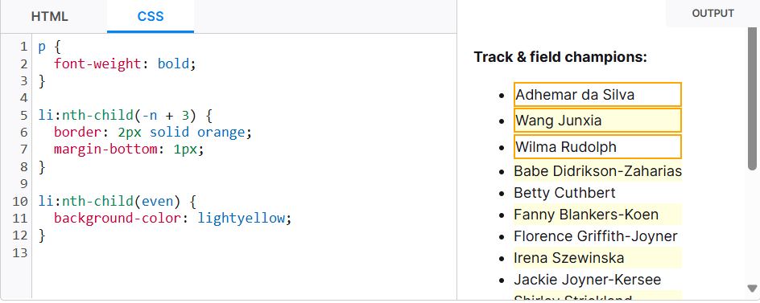
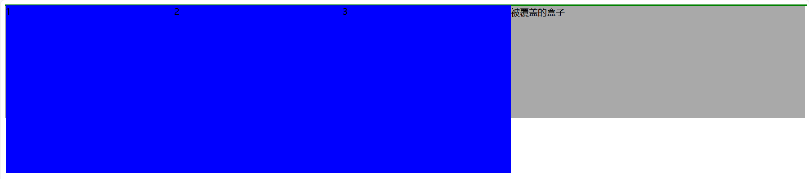

<title>This is a CSS note.</title>
<style type="text/css">
    body {
        font-family: "cascadia code", 幼圆;
    }
    code {
        color: burlywood;
    }
</style>


# 目录
- [目录](#目录)
- [CSS简单样例](#css简单样例)
  - [CSS属性命名规则](#css属性命名规则)
  - [浏览器私有前缀](#浏览器私有前缀)
- [CSS单位](#css单位)
  - [\<integer\>](#integer)
  - [\<number\>](#number)
  - [长度(length)](#长度length)
  - [percentage](#percentage)
  - [time](#time)
  - [angle](#angle)
- [CSS选择器](#css选择器)
  - [简单选择器](#简单选择器)
    - [类型选择器](#类型选择器)
    - [类选择器](#类选择器)
      - [多类名](#多类名)
    - [ID选择器](#id选择器)
    - [通配选择器](#通配选择器)
    - [属性选择器](#属性选择器)
    - [nesting selector (Available since December 2023)](#nesting-selector-available-since-december-2023)
  - [复合选择器(组合器)](#复合选择器组合器)
    - [后代选择器(包含选择器)](#后代选择器包含选择器)
    - [子选择器](#子选择器)
    - [并集选择器(选择器列表)](#并集选择器选择器列表)
  - [伪类选择器(Pseudo-classes)](#伪类选择器pseudo-classes)
    - [链接伪类选择器](#链接伪类选择器)
    - [:focus伪类选择器](#focus伪类选择器)
    - [结构伪类选择器](#结构伪类选择器)
  - [伪元素选择器(Pseudo-elements)](#伪元素选择器pseudo-elements)
    - [::before与::after](#before与after)
- [CSS属性](#css属性)
  - [属性书写顺序(建议)](#属性书写顺序建议)
  - [CSS基本属性](#css基本属性)
    - [高度(height)和宽度(width)](#高度height和宽度width)
    - [max-height min-height max-width min-width](#max-height-min-height-max-width-min-width)
  - [CSS字体属性](#css字体属性)
    - [字体系列(font-family)](#字体系列font-family)
    - [字体大小(font-size)](#字体大小font-size)
    - [字体粗细(font-weight)](#字体粗细font-weight)
    - [文字样式(font-style)](#文字样式font-style)
    - [字体的复合属性(font)](#字体的复合属性font)
  - [CSS文本属性](#css文本属性)
    - [文本颜色(color)](#文本颜色color)
    - [对齐文本(text-align)](#对齐文本text-align)
    - [文本装饰(text-decoration)](#文本装饰text-decoration)
    - [文本缩进(text-indent)](#文本缩进text-indent)
    - [行间距(line-height)](#行间距line-height)
    - [溢出文字省略号显示](#溢出文字省略号显示)
  - [CSS背景属性](#css背景属性)
    - [背景颜色(background-color)](#背景颜色background-color)
    - [背景图片(background-image)](#背景图片background-image)
    - [背景平铺(background-repeat)](#背景平铺background-repeat)
    - [背景图片位置(background-position)](#背景图片位置background-position)
    - [背景图像固定(背景附着)(background-attachment)](#背景图像固定背景附着background-attachment)
    - [背景大小(background-size)](#背景大小background-size)
    - [背景的复合属性(background)](#背景的复合属性background)
    - [背景色半透明](#背景色半透明)
  - [display](#display)
  - [元素的显示与隐藏](#元素的显示与隐藏)
    - [display显示与隐藏元素](#display显示与隐藏元素)
    - [visibility](#visibility)
    - [overflow](#overflow)
  - [垂直对齐(vertical-align)](#垂直对齐vertical-align)
    - [删除图片下方的空白间隙](#删除图片下方的空白间隙)
  - [滤镜(filter)](#滤镜filter)
  - [用户界面](#用户界面)
    - [鼠标样式(cursor)](#鼠标样式cursor)
    - [轮廓线(outline)](#轮廓线outline)
    - [阻止文本域被拖拽(resize)](#阻止文本域被拖拽resize)
  - [过渡(transition)](#过渡transition)
    - [过渡属性(transition-property)](#过渡属性transition-property)
    - [持续时间(transition-duration)](#持续时间transition-duration)
    - [过渡曲线(transition-timing-function)](#过渡曲线transition-timing-function)
    - [过渡延迟(transition-delay)](#过渡延迟transition-delay)
  - [转换(transform)](#转换transform)
    - [2D转换](#2d转换)
      - [移动(translate)(\<function\>)](#移动translatefunction)
      - [旋转(rotate)(\<function\>)](#旋转rotatefunction)
      - [转换中心点(transform-origin)](#转换中心点transform-origin)
      - [缩放(scale)](#缩放scale)
      - [书写顺序的影响](#书写顺序的影响)
    - [3D转换](#3d转换)
      - [移动(translate3d)(\<function\>)](#移动translate3dfunction)
      - [透视(perspective)](#透视perspective)
      - [消失点(perspective-origin)](#消失点perspective-origin)
      - [旋转(rotate3d)(\<function\>)](#旋转rotate3dfunction)
      - [呈现(transform-style)](#呈现transform-style)
      - [backface-visibility](#backface-visibility)
  - [动画(animation)](#动画animation)
    - [定义动画(@keyframes)](#定义动画keyframes)
    - [动画名称(animation-name)](#动画名称animation-name)
    - [动画时间(animation-duration)](#动画时间animation-duration)
    - [动画延迟(animation-delay)](#动画延迟animation-delay)
    - [动画过渡曲线(animation-timing-function)](#动画过渡曲线animation-timing-function)
    - [动画循环次数(animation-iteration-count)](#动画循环次数animation-iteration-count)
    - [动画方向(animation-direction)](#动画方向animation-direction)
    - [动画播放状态(animation-play-state)](#动画播放状态animation-play-state)
    - [动画填充模式(animation-fill-mode)](#动画填充模式animation-fill-mode)
    - [简写属性(animation)](#简写属性animation)
  - [flex相关属性](#flex相关属性)
    - [flex-direction](#flex-direction)
    - [justify-content](#justify-content)
    - [flex-wrap](#flex-wrap)
    - [align-items](#align-items)
    - [align-content](#align-content)
    - [flex-flow](#flex-flow)
    - [flex](#flex)
    - [flex-grow](#flex-grow)
    - [flex-shrink](#flex-shrink)
    - [flex-basis](#flex-basis)
    - [align-self](#align-self)
    - [order](#order)
- [CSS引入方式](#css引入方式)
  - [内部样式表](#内部样式表)
  - [行内样式表](#行内样式表)
  - [外部样式表](#外部样式表)
- [Emmet语法](#emmet语法)
  - [Emmet快速生成HTML](#emmet快速生成html)
  - [Emmet快速生成CSS](#emmet快速生成css)
- [CSS的元素显示模式](#css的元素显示模式)
  - [块元素](#块元素)
  - [内联元素](#内联元素)
  - [其他元素(行内块元素)](#其他元素行内块元素)
  - [元素显示模式的转换](#元素显示模式的转换)
- [CSS特性](#css特性)
  - [层叠性](#层叠性)
  - [继承性](#继承性)
  - [优先级](#优先级)
    - [优先级规则](#优先级规则)
    - [权重叠加](#权重叠加)
- [盒子](#盒子)
  - [盒子模型](#盒子模型)
  - [边框(border)](#边框border)
    - [边框粗细(border-width)](#边框粗细border-width)
    - [边框样式(border-style)](#边框样式border-style)
    - [边框颜色(border-color)](#边框颜色border-color)
    - [边框的复合写法(border)](#边框的复合写法border)
    - [表格的细线边框(border-collapse)](#表格的细线边框border-collapse)
  - [内边距(padding)](#内边距padding)
  - [外边距(margin)](#外边距margin)
    - [盒子的水平居中](#盒子的水平居中)
    - [垂直外边距重叠与合并](#垂直外边距重叠与合并)
    - [嵌套块元素塌陷](#嵌套块元素塌陷)
    - [清除内外边距](#清除内外边距)
    - [清除列表元素的点](#清除列表元素的点)
  - [指定盒模型(box-sizing)](#指定盒模型box-sizing)
  - [其他盒子效果](#其他盒子效果)
    - [圆角边框(border-radius)](#圆角边框border-radius)
    - [盒子阴影(box-shadow)](#盒子阴影box-shadow)
    - [文字阴影(text-shadow)](#文字阴影text-shadow)
- [CSS浮动(float)](#css浮动float)
  - [流式布局(flow)](#流式布局flow)
  - [普通流与浮动](#普通流与浮动)
  - [浮动(float)](#浮动float)
  - [浮动特性](#浮动特性)
    - [脱标](#脱标)
    - [一行显示并且元素顶部对齐](#一行显示并且元素顶部对齐)
    - [具有行内块元素特性](#具有行内块元素特性)
  - [清除浮动(clear)](#清除浮动clear)
    - [清除浮动的方法](#清除浮动的方法)
      - [额外标签法](#额外标签法)
      - [父级元素添加overflow属性](#父级元素添加overflow属性)
      - [:after伪元素法](#after伪元素法)
      - [双伪元素清除浮动](#双伪元素清除浮动)
- [CSS定位](#css定位)
  - [定位模式(position)](#定位模式position)
  - [边偏移](#边偏移)
  - [定位](#定位)
    - [静态定位(static)](#静态定位static)
    - [相对定位(relative)](#相对定位relative)
    - [绝对定位(absolute)](#绝对定位absolute)
    - [固定定位(fixed)](#固定定位fixed)
    - [粘性定位(sticky)](#粘性定位sticky)
    - [特殊特性](#特殊特性)
  - [定位的叠放次序(z-index)](#定位的叠放次序z-index)
  - [文字的覆盖](#文字的覆盖)
- [其他布局](#其他布局)
  - [百分比布局](#百分比布局)
  - [flex(弹性)布局](#flex弹性布局)
    - [flex相关属性](#flex相关属性-1)
    - [less+媒体查询+rem](#less媒体查询rem)
    - [flexible.js+rem](#flexiblejsrem)
  - [Bootstrap](#bootstrap)
- [其他技术](#其他技术)
  - [精灵技术](#精灵技术)
    - [使用](#使用)
  - [字体图标](#字体图标)
    - [使用字体图标](#使用字体图标)
  - [CSS三角](#css三角)
  - [布局技巧](#布局技巧)
    - [使用margin负值使边框重合](#使用margin负值使边框重合)
  - [CSS初始化](#css初始化)
  - [媒体查询(Media Queries)](#媒体查询media-queries)
    - [语法](#语法)
    - [引入资源](#引入资源)
  - [less](#less)
    - [注释](#注释)
    - [变量](#变量)
    - [编译](#编译)
    - [嵌套](#嵌套)
    - [基本运算](#基本运算)
    - [导入样式](#导入样式)
    - [更多](#更多)
  - [Swiper](#swiper)
- [CSS函数](#css函数)
  - [calc()](#calc)
- [at-rules](#at-rules)


# CSS简单样例
````HTML
<!DOCTYPE html>
<html lang="en">

<head>
    <meta charset="utf-8">
    <title>try CSS</title>
    <style>
        h1 {    /* 选择器(修改的元素) */
            color: red;         /* 属性: 值; */
            font-size: 25px;    /* 属性: 值; */
        }
    </style>
</head>

<body>
    <h1>
        something here.
    </h1>
</body>

</html>
````
CSS写于HTML中`<style>`元素内,而`<style>`元素放在`<head>`元素内.

每个属性都是由键值对组成的,用`;`结尾.

CSS用`/* comment */`来注释.

CSS不区分大小写,即`color: red;`可以写成`COLOR: RED;`

## CSS属性命名规则
由小写字母`a`到`z`,数字`0`到`9`,下划线`_`和破折号`-`组成,第一个非破折号字符不能是数字.同时,不能以两个破折号开头.

## 浏览器私有前缀
为了兼容老式浏览器或者老版本浏览器,可以使用含有私有前缀的属性.

私有前缀:
- `-moz-`: firebox的私有属性
- `-ms-`: IE的私有属性
- `-webkit-`: safari, chrome的私有属性
- `-o-`: Opera私有属性

# CSS单位
## &lt;integer&gt;
`<integer>`是一种特殊的`<number>`类型,它表示一个整数(无范围限制).可选择在数字前添加一个`+`或`-`符号.

`<integer>`一些有效值如下:
- `12`: 正整数(没有前导`+`号)
- `+123`: 正整数(包含前导`+`号)
- `-456`: 负整数
- `0`: 零
- `+0`: 有前导`+`号的零
- `-0`: 有前导`-`号的零


## &lt;number&gt;
`<number>`表示整数或者是带有小数部分的数字.是`<integer>`的扩展.

`<number>`一些有效值如下:
- `12`: 原始的`<integer>`,`<number>`是`<integer>`的扩展.
- `4.01`: 正分数
- `-456.8`: 负分数
- `0.0`: 零
- `+0.0`: 带+号的零
- `-0.0`: 带-号的零
- `.60`: 不带零的小数
- `10e3`:科学计数法
- `-3.4e-2`: 复杂的科学记数法

*`12.`是无效的`<number>`*


## 长度(length)
由一个`<number>`和一个长度单位构成.*有些属性支持使用负数的长度值,而有些不支持.*

可选单位:
- `ch`: 这一单位代表元素所用字体`font`中`0`这一字形的宽度(Unicode字符U+0030).若无,则假定其宽为`0.5em`,高为`1em`.
- `em`: 相对长度单位,`1em`为一个字符的宽度.这个单位表示元素的`font-size`的计算值.如果用在`font-size`属性本身,它则表示元素继承的`font-size`值.
- `ex`: 这个单位表示元素`font`的`x-height`(即小写字母`x`的高度).对于很多字体来说,`1ex ≈ 0.5em`.
- `rem`: 这个单位代表根元素(通常为`<html>`元素)的`font-size`大小.
- `vh`: 视口的初始包含块的高度的1%.
- `vw`: 视口的初始包含块的宽度的1%.
- `vmin`: 视口高度`vw`和宽度`vh`两者之间的最小值.
- `vmax`: 视口高度`vw`和宽度`vh`两者之间的最大值.
- `px`: 一CSS像素.一般来说,`1px = 1/96in`.
- `cm`: 一厘米.`1cm = 96px / 2.54`.
- `mm`: 一毫米.`1mm = 1/10 * 1cm`.
- `in`: 一英寸.`1in = 2.54cm = 96px`.
- `pc`: 一个*十二点活字(pica)*,六分之一英寸.`1pc = 12pt = 1/6 * 1in`.
- `pt`: 一磅(point),`72分之一`英寸.`1pt = 1/12 * 1pc = 1/72 * 1in`.

## percentage
`<percentage>`表述一个百分比值.

百分比值由一个`<number>`具体数值后跟着%符号构成.在数值前可加上`+`号或者`-`号,但对所有属性来说其负值都是无效的.

## time
`<time>`数据类型表达了以秒`s`或毫秒`ms`为单位的时间的值.

`<time>`数据类型由`<number>`后加下方列出的单位之一组成.前方也可选择添加一个`+`或`-`.

**注:`0`是无效的,并不代表`0s`或`0ms`**

可选单位:
- `s`: 以秒为单位的时间.
- `ms`: 以毫秒为单位的时间.

## angle
`<angle>`用于表示角的大小.

- `0`时,单位可被省略.
- 单位`deg`,度.一圈为`360deg`.
- 单位`grad`,百分度.一圈为`400grad`.
- 单位`rad`,弧度.一圈为`2πrad`.
- 单位`turn`,圈数,一圈为`1turn`.

- 正数表示`顺时针`.
- 负数表示`逆时针`.


# CSS选择器

## 简单选择器
### 类型选择器
类型选择器是指用HTML元素作为选择器,为页面中某一元素指定统一的CSS样式.

语法:
````CSS
元素 {
    属性1: 属性值1;
    属性2: 属性值2;
    ...
}
````

如:
````HTML
<head>
    <meta charset="utf-8">
    <title>try CSS</title>
    <style>
        p {
            color: red;
            font-size: 15px;
        }
        div{
            color: green;
            font-size: 12px;
        }
    </style>
</head>

<body>
    <p>one</p>
    <p>two</p>
    <p>three</p>
    <div>four</div>
    <div>five</div>
    <div>six</div>
</body>
````


### 类选择器
类选择器根据`class`属性的内容匹配元素.`class`是HTML中的全局属性.

语法:
````CSS
.类名 {
    属性1: 属性值1;
    属性2: 属性值2;
    ...
}
/* 语法上等价于: */
[class~=类名] {
    ...
}
````

如:
````HTML
<head>
    <meta charset="utf-8">
    <title>try CSS</title>
    <style>
        .make_red {
            color: red;
        }
        .make_green {
            color: green;
        }
    </style>
</head>

<body>
    <p class="make_red">one</p>
    <p>two</p>
    <p>three</p>
    <div class="make_red">four</div>
    <div class="make_green">five</div>
    <div>six</div>
</body>
````


#### 多类名
元素使用多个类名的语法为: `<元素 class="类名1 类名2 ...">`. 多个类名之间用空格分隔.

如:
````HTML
<head>
    <meta charset="utf-8">
    <title>try CSS</title>
    <style>
        .make_red {
            color: red;
        }
        .large {
            font-size: large;
        }
    </style>
</head>

<body>
    <div class="make_red large">WORD</div>
</body>
````
如果不同类指向对统一个属性名的修改,则以CSS定义时(`<style>`内)的顺序为准,显示最后定义的修改.

如两个类,前者对颜色修改,后者对字体大小修改,拥有这两个类的元素会对颜色和字体大小同时修改.

若两个类,前者对颜色修改为红色,后者对颜色修改为绿色,拥有这两个类的元素颜色为绿色.

### ID选择器
ID选择器会根据该元素的`id`属性中的内容匹配元素. `id`是HTML的全局属性且必须唯一.

语法:
````CSS
#id名 {
    属性1: 属性值1;
    属性2: 属性值2;
    ...
}
/* 语法上等价于: */
[id=id名] {
    ...
}
````

如:
````HTML
<head>
    <meta charset="utf-8">
    <title>try CSS</title>
    <style>
        #red-word {
            color: red;
        }
    </style>
</head>

<body>
    <div id="red-word">WORD</div>
</body>
````

### 通配选择器
通配选择器`*`可以匹配任意HTML元素(包括`<html>`,`<head>`,`<body>`).

如:
````HTML
<head>
    <meta charset="utf-8">
    <title>try CSS</title>
    <style>
        * {
            color: red;
        }
    </style>
</head>

<body>
    <div>WORD</div>
    <span>WORD</span>
    <ul>
        <li>WORD</li>
    </ul>
</body>
````

### 属性选择器
属性选择器匹配那些具有特定属性或属性值的元素.

语法:
````CSS
[attr]
表示带有以attr命名的属性的元素.

[attr=value]
表示带有以attr命名的属性,且属性值为value的元素.

[attr~=value]
表示带有以attr命名的属性的元素,并且该属性是一个以空格作为分隔的值列表,其中至少有一个值为value.

[attr|=value]
表示带有以attr命名的属性的元素,属性值为"value"或是以"value-"为前缀(-为连字符,Unicode编码为U+002D)开头. 典型的应用场景是用来匹配语言简写代码(如 zh-CN、zh-TW 可以用 zh 作为 value).

[attr^=value]
表示带有以attr命名的属性,且属性值是以value开头的元素.

[attr$=value]
表示带有以attr命名的属性,且属性值是以value结尾的元素.

[attr*=value]
表示带有以attr命名的属性,且属性值至少包含一个value值的元素。

[attr operator value i]
在属性选择器的右方括号前添加一个用空格隔开的字母i(或I),可以在匹配属性值时忽略大小写(支持ASCII字符范围之内的字母).
````

如:
````CSS
a {
  color: blue;
}

/* 以 "#" 开头的页面内部链接 */
a[href^="#"] {
  background-color: gold;
}

/* 包含 "example" 的链接 */
a[href*="example"] {
  background-color: silver;
}

/* 包含 "insensitive" 的链接，不区分大小写 */
a[href*="insensitive" i] {
  color: cyan;
}

/* 包含 "cAsE" 的链接，区分大小写 */
a[href*="cAsE" s] {
  color: pink;
}

/* 以 ".org" 结尾的链接 */
a[href$=".org"] {
  color: red;
}

/* 以 "https" 开始，".org" 结尾的链接 */
a[href^="https"][href$=".org"] {
  color: green;
}
````

### nesting selector (Available since December 2023)
[link of nesting selector](https://developer.mozilla.org/en-US/docs/Web/CSS/Nesting_selector)

## 复合选择器(组合器)
复合选择器是由若干个基础选择器组合而成的.除了`并集选择器`(不存在权重,相当于各个选择器分开写,权重各自计算),复合选择器权重为各个基础选择器权重叠加.

### 后代选择器(包含选择器)
后代选择器可以选择父元素里面的子元素(包括非直接子代).

语法:
````CSS
父标签 子标签 {
    ...
}
````
如:
````HTML
<head>
    <style>
        ol li {
            color: red;
        }
    </style>
</head>

<body>
    <ul>
        <li>123</li>
        <li>456</li>
        <li>789</li>
    </ul>
    <ol>
        <li>12</li>
        <li>34</li>
        <li>56</li>
        <li>78</li>
    </ol>
</body>
````

上述例子仅仅修改所有`<ol>`中的`<li>`元素.

此外,还可以跳过若干代选择:
````HTML
<head>
    <style>
        ol em {
            color: red;
        }
    </style>
</head>

<body>
    <ol>
        <li><a><em>12</em><a></li>
        <li><em>34</em></li>
    </ol>
</body>
````


### 子选择器
子选择器只能选择作为某元素的最近一级子元素(直接子元素).

语法:
````CSS
元素1 > 元素2 {
    ...
}
````

如:
````HTML
<head>
    <style>
        span {
            color: green;
        }
        div > span {
            color: red;
        }
    </style>
</head>

<body>
    <div>
        <span>123</span>
        <span>4<span>56</span></span>
        <span><span>789</span></span>
    </div>
</body>
````

注意:由于CSS的继承性,此处先将`<span>`设置为其他颜色是必要的.

### 并集选择器(选择器列表)
多个选择器结果之并.

语法:
````CSS
选择器1,
选择器2,
... {
    ...
}
````

如:
````HTML
<head>
    <style>
        p,
        div {
            color: red;
        }
    </style>
</head>

<body>
    <p>aaa</p>
    <div>bbb</div>
</body>
````

## 伪类选择器(Pseudo-classes)
伪类选择器用于向某些选择器添加特殊效果,比如给链接添加特殊效果,或选择第一个元素,第n个元素.权重为(0,0,1,0)

伪类选择器使用`:`开头.

### 链接伪类选择器
- `a:link`: 选择所有未被访问的`<a>`
- `a:visited`: 选择所有已被访问的`<a>`
- `a:hover`: 选择鼠标指针位于其上的`<a>`
- `a:active`: 选择活动的`<a>`(鼠标按下未弹起的`<a>`)

为了确保链接伪类生效,声明的顺序应该为: `:link`-`:visited`-`:hover`-`:active`

### :focus伪类选择器
`:focus`伪类原则器用于选取获取焦点的表单元素.一般情况`<input>`类元素才能获取.

如:
````HTML
<head>
    <style>
        input:focus {
            background-color: skyblue;
        }
    </style>
</head>

<body>
    <input type="text">
</body>
````

### 结构伪类选择器
结构伪类选择器主要根据文档结构来选择元素,常用于父级选择器中的子元素.

*(注:`[element]`表示可选元素)*

`[element]:first-child`: 匹配父元素中的第一个子元素且为`[element]`.

如:
````CSS
li:first-child {
  border: 2px solid orange;
}
/* 匹配同一层级中的<li>当中的第一个 */
````

`[element]:last-child`: 匹配父元素中的最后一个子元素且为`[element]`.

`[element]:nth-child(<nth> [of <complex-selector-list>]?)`: 匹配父元素中的第指定个元素且为`[element]`.其中:
`<nth>`可以是一个值,如:`3`表示第三个元素.可以是`even`,表示所有第偶数个元素.可以是`odd`,表示所有奇数个元素.可以是一个含`n`的函数表达式`An+B`,`A`是步长,`B`是偏移量,`n`是非负整数(相当于选择了`for (int i = B; i < <value> && i > 0; i += A)`).如:



关于`[of <complex-selector-list>]?`的语法,详见:[MDN伪类选择器:nth-child()](https://developer.mozilla.org/zh-CN/docs/Web/CSS/:nth-child#of_selector_%E8%AF%AD%E6%B3%95)

`[element]:first-of-type`: 匹配父元素中的第一个`[element]`子元素.

`[element]:last-of-type`: 匹配父元素中的最后一个`[element]`子元素.

`:nth-of-type(<nth> | even | odd)`: 匹配父元素中的第指定个`[element]`元素. 关于其括号内语法,详见上文`:nth-child`.

区别:`*-child`在不设置`[of <complex-selector-list>]?`情况下会将所有子元素排列序号,并选择指定的元素,若不满足选择器条件,则排除. 而`*-of-type`只给满足选择器条件的元素排上序号,并选择指定的元素. 即例如:`li:nth-of-type(1)`等价于`li:nth-child(1 of li)`而非`li:nth-child(1)`.

## 伪元素选择器(Pseudo-elements)
### ::before与::after
`::before`用于在元素内部的前面插入内容. `::after`用于在元素内部的后面插入内容.

(注意:`:before`和`:after`是兼容IE8的写法)

两者创建的是**行内元素**. 新创建的元素在HTML当中是找不到的,所以我们称为伪元素. 语法:`<element>::before {}`

`::before`和`::after`必须有`content`属性. 伪元素选择器的权重为(0,0,0,1)


# CSS属性
## 属性书写顺序(建议)
建议遵循如下顺序:
1. 布局定位属性: display(建议第一个写)/position/float/clear/visibility/overflow...
2. 自身属性: width/height/margin/padding/border/background...
3. 文本属性: color/font/text-decoration/text-align/vertical-align/white-space/break-word...
4. 其他属性: content/cursor/border-radius/box-shadow/text-shadow/background:linear-gradient...

## CSS基本属性
### 高度(height)和宽度(width)
`height`和`width`能控制CSS盒子(`内联元素`除外)的大小,HTML元素都是CSS盒子.

如果`box-sizing`属性被设置为`border-box`,就转而设置边框区域的高度和宽度.

`height`和`width`的单位满足[长度(length)](#长度length)或[percentage](#percentage).常用`px`和`百分比`.

`百分比`指的是相对于父元素的大小.

`min-height`和`max-height`属性会覆盖`height`. `min-width`和`max-width`属性的优先级高于`width`.

语法: `height: <length> | <percentage> | auto;`; `width: <length> | <percentage> | auto;`

如:
```CSS
img {
    width: 100%;
    height: 50px;
}
```

### max-height min-height max-width min-width
`max-height`设置盒子的最大高度,`min-height`设置盒子的最小高度,`max-width`设置盒子的最大宽度,`min-width`设置盒子的最小宽度.

## CSS字体属性
### 字体系列(font-family)
如:
````CSS
div {
    font-family: Arial, "Microsoft Yahei", "微软雅黑";
}
````
字体系列既可以用英文,也可以用其对应的中文.但推荐使用英文.

可以使用多个字体系列,但各个字体系列要用`,`分隔.

由多个英文单词拼成的字体名需要用`"`括出.

尽量使用系统默认的字体.

有多个字体时,会优先选择前者,若系统内不包含这种字体或者该字体不支持显示的文字,则会向后选择.

### 字体大小(font-size)
如:
````CSS
p {
    font-size: 20px;
}
````
px: 像素

不同浏览器默认的字体大小会有所不同,所以尽量给出一个明确值大小,不要默认大小.

*给`<body>`指定字体大小对标题字体的大小不影响.*


### 字体粗细(font-weight)
如:
````CSS
p {
    font-weight: bold;
}
h2 {
    font-weight: 400;
}
````
属性值:
- 介于1-1000(包含)之间的`<number>`类型值,数值越大,字体越粗.CSS中的`<number>`包含浮点数.
- `normal`: 正常粗细,与400等值.
- `bold`: 加粗,与700等值.
- `lighter`: 比从父元素继承来的值更细.
- `bolder`: 比从父元素继承来的值更粗.

CSS中`<number>`一些有效值如下:
- `12`: 原始的`<integer>`,`<number>`是`<integer>`的扩展.
- `4.01`: 正分数
- `-456.8`: 负分数
- `0.0`: 零
- `+0.0`: 带+号的零
- `-0.0`: 带-号的零
- `.60`: 不带零的小数
- `10e3`:科学计数法
- `-3.4e-2`: 复杂的科学记数法

*`12.`是无效的`<number>`*

### 文字样式(font-style)
如:
````CSS
p {
    font-style: italic;
}
````
属性值:
- `normal`: 常规字体
- `italic`: 斜体
- `oblique`: 倾斜体
- `oblique <angle>`: 给定倾斜角度的倾斜体(合法的角度值为`-90deg`到`90deg`开区间),一般大于等于`14deg`时,会应用倾斜体. 如`font-style: oblique 14deg;`

### 字体的复合属性(font)
语法:
````CSS
element {
    font: font-style font-weight font-size/line-height font-family;
}
````
上述属性的顺序是固定的.若某个值省略,则会取默认值,但必须保留`font-size`和`font-family`属性.

如:
````CSS
p {
    font: italic 700 16px/1  Arial, "Microsoft Yahei";
}
h1 {
    font: italic 1.2rem "Fira Sans", serif;
}
````

## CSS文本属性
### 文本颜色(color)
如:
````CSS
div {
    color: blue;
}
p {
    color: #5ff316;
}
li {
    color: rgb(53, 221, 34);
}
h1 {
    color: rgb(100%, 0%, 0%);
}
...

````

### 对齐文本(text-align)
如:
````CSS
p {
    text-align: left;   /*默认值*/
    text-align: right;
    text-align: center;
    ...
}
````
也可以用于图片居中.

### 文本装饰(text-decoration)
如:
````CSS
p {
    text-decoration: underline; /* 下划线,链接<a>自带 */
    text-decoration: overline;  /* 上划线 */
    text-decoration: overline red;  /* 红色上划线 */
    text-decoration: none;  /* 默认 */
    text-decoration: line-through;  /* 删除线 */
    ...
}
````

### 文本缩进(text-indent)
如:
````CSS
p {
    text-indent: -10px;
    text-indent: 20px;
    text-indent: 2em;
}
````
`em`(element)是一个相对单位,是当前元素1个文字的大小(font-size),如果当前元素没有指定大小,则会按照父元素的1个文字大小.

### 行间距(line-height)
`line-height`用于设置行间的距离(行高).行间距包含上间距和下间距和文本高度,即若文字高度为16px,则设置`line-height`为26px表示上下间距分别为5px.
````CSS
p {
    line-height: 26px;
}
````
CSS中没有让文字在盒子内垂直居中的代码,可以将`line-height`设置为盒子高度让文字垂直居中.

`line-height: 1.5;`可以将行高设置为当前文字大小的1.5倍.

### 溢出文字省略号显示
1. 单行文本溢出省略号:
    ````CSS
    .example {
        /* 强制一行内显示文本(默认normal自动换行) */
        white-space: nowrap;
        /* 超出部分隐藏 */
        overflow: hidden;
        /* 文字用省略号代替超出的部分 */
        text-overflow: ellipsis;
    }
    ````
    - `white-space`属性详见[MDN属性white-space](https://developer.mozilla.org/zh-CN/docs/Web/CSS/white-space)
    - `text-overflow`属性详见[MDN属性text-overflow](https://developer.mozilla.org/zh-CN/docs/Web/CSS/text-overflow)

2. 多行文本溢出省略号显示:
    
    兼容性较差.
    ````CSS
    .example {
        overflow: hidden;
        text-overflow: ellipsis;
        /* 弹性伸缩盒子模型 */
        display: -webkit-box;
        /* 限制在一个块元素显示的文本的行数 */
        -webkit-line-clamp: 2;
        /* 设置或检索伸缩盒对象的子元素的排列方式 */
        -webkit-box-orient: vertical;
    }
    ````


## CSS背景属性
### 背景颜色(background-color)
`background-color`可以设置背景颜色,其可能的取值为`transparent`或`<color>`.`transparent`是默认值,它能使背景颜色变为透明.

### 背景图片(background-image)
`background-image`属性描述了元素的背景图像.常见于小图标或者极大的背景图片,优点是便于控制位置.

其之为`none`或者`<url>`(URL),如:
````CSS
div {
    width: 300px;
    height: 300px;
    background-image: url(img/get_start/use_type_selector.png);
}
````
其默认为平铺效果,即:


背景图片会压住背景颜色.

### 背景平铺(background-repeat)
上面的那个效果就是背景平铺,通过`background-repeat`控制,默认值为`repeat`.

可选属性值有:`repeat`,`no-repeat`,`repeat-x`,`repeat-y`


### 背景图片位置(background-position)
使用`background-position`可以改变图片在背景中的位置.

语法: `background-position: x y;`

x坐标和y坐标可以是**方位词**或者**精确单位**.

如:
````CSS
div {
    background-position: top;   /* 允许用一个方位词指定位置 */
    background-position: right; /* 图片右边界正好在盒子右边界 */
    background-position: center;
    background-position: top left;  /* 使用两个方位词时,前后顺序无关 */
    background-position: 25%;   /* 仅指定一个值时,第二个值为center */
    background-position: 25% 75%;   /* 参数有精确坐标时,第一个必然是x坐标,第二个必然是y坐标,是图片左上角相对于盒子左上角的距离 */
    background-position: 25% top;
    background-position: bottom 50px right 100px;   /* (图片下侧)距离底部50像素,(图片右侧)距离右侧100像素 */
}
````

### 背景图像固定(背景附着)(background-attachment)
`background-attachment`属性设置背景图像是否固定或者随着页面的其余部分滚动.

可能的取值为`scroll`(背景图像是随对象内容滚动)和`fixed`(背景图像固定,默认).

### 背景大小(background-size)
`background-size`用于设定背景的大小.

语法: `background-size: 宽度 高度;`.若`高度`省略,则默认为`auto`.  
语法: `background-size: 关键字;`.

`宽度`或`高度`可用: `<length>`,`<percentage>`,`auto`.

`关键字`可用: `cover`,`contain`.
- `cover`: 等比缩放背景图片以完全覆盖背景区,可能背景图片部分看不见.
- `contain`: 等比缩放背景图片以完全装入背景区,可能背景区部分空白.

详见[MDN-CSS-背景大小](https://developer.mozilla.org/zh-CN/docs/Web/CSS/background-size)


### 背景的复合属性(background)
属性`background`没有书写的固定顺序.习惯的顺序为`background: 背景颜色 背景图片 背景平铺 背景图像滚动 背景图像位置;`

### 背景色半透明
`rgb()`允许用alpha通道参数(第4个参数)来设置背景颜色达到背景颜色半透明的效果,但是盒子的内容不受影响.

语法:`rgb(R G B [/ A])`,其中`/ A`是可选的,标准语法要求A前面加上`/`.`rgba()`为`rgb()`的别名.

如:
````HTML
<head>
    <style>
        .a {
            width: 300px;
            height: 300px;
            background-image: url(use_type_selector.png);
        }
        .b {
            width: 300px;
            height: 300px;
            background-color: rgb(0 0 0 0.5);
        }
    </style>
</head>

<body>
    <div class="a"><div class="b"></div></div>
</body>
````


## display
`display`不可继承.

`display`可以使用单关键字语法指定元素显示方式.  
如: `display: inline-block;`

`display`也允许使用多关键字的语法,一般该语法分别指定元素的`外部值`和`内部值`.  
- 外部值,即元素在显示时会对兄弟级元素产生影响,例如块级元素和内联元素.
- 内部值,即元素在显示时会对子元素产生影响,例如流式布局和弹性布局.

*多关键字语法对老式浏览器兼容性差.*

为保证布局在旧浏览器生效,使用单值`预组合`语法, 例如:`display: inline flex;`可以写成`display: inline-flex;`; `display: inline flow-root;`可以写成`display: inline-block;`.

对于单关键字语法,如果仅指明内部值,则外部值不变.如果不指明内部值,则内部值为`flow`.

可选值:
外部表现`<display-outside>`: 这些关键字规定元素的外部显示类型(外部值),实际上就是其在流式布局中的角色.
- `block`: 块级元素.
- `inline`: 行级元素.

内部表现`<display-inside>`: 这些关键字规定了元素的内部显示类型(内部值),其定义了该内容布局时的格式上下文的类型.
- `flow`: 流式布局,见[流式布局(flow)](#流式布局flow).
- `flex`: 该元素的行为类似块级元素并且根据弹性盒模型布局它的内容,见[flex(弹性)布局](#flex弹性布局)
- `grid`: 该元素的行为类似块级元素并且根据网格模型布局它的内容.
- ...

列表元素`<display-listitem>`: 该元素为内容生成一个块级盒子和一个单独的列表元素行级盒子(既不属于外部值,也不属于内部值).
- ...

内部`<display-internal>`: 一些布局模型(外部值且具有特定`style`),例如`table`和`ruby`有一个复杂的内置结构,它们的子孙后代可以扮演几个不同的角色.
- ...

盒`<display-box>`: 这些关键词定义一个元素到底是否产生`display`盒.
- `none`: 使元素不再显示,其对布局不会有影响(不保留位置).

预组合`<display-legacy>`: `CSS2`为`display`属性使用单关键字的预组合的语法,对相同布局模式的块级和行级变体需要单独的关键字.
- `inline-block`: 它等同于`inline flow-root`.该元素生成块级元素盒,如果它是一个单独的行级盒,它将和周围的内容一起流动(行为类似于替换元素).
- `inline-table`: 它等同于`inline table`.`inline-table`值在HTML中没有直接的映射.它行为类似于HTML的`<table>`元素,但实际是一个行级盒,而不是一个块级盒子.`table`盒内部是一个块级上下文.
- `inline-flex`: 它等同于`inline flex`.元素的行为类似于行级元素并且它的内容根据弹性盒模型布局.
- `inline-grid`: 它等同于`inline grid`.元素的行为类似于行级元素并且它的内容根据网格盒模型布局.


详见:[MDN-CSS-display](https://developer.mozilla.org/zh-CN/docs/Web/CSS/display)


## 元素的显示与隐藏
### display显示与隐藏元素
`display`属性用于设置一个元素应如何显示.

可选值:
- `block`: 块元素
- `inline`: 内联元素
- `inline-block`: 行内块元素
- `none`: 隐藏元素(不保留位置)
- ...

### visibility
`visibility`设置元素的可见性,且保留隐藏元素的位置.

可选值:
- `inherit`: 继承父级的`visibility`属性(默认值)
- `visible`: 对象可见
- `hidden`: 对象不可见
- `collapse`: 对于表格,将隐藏表格的行或列,并且不占用任何空间; 对于其他,等价于`hidden`

### overflow
`overflow`对溢出的部分执行显示或隐藏.

可选值:
- `visible`: 不裁剪也不添加滚动条.(默认值)
- `hidden`: 裁剪且不添加滚动条.
- `clip`: 类似`hidden`,但拒绝以任何形式添加滚动条.
- `scroll`: 总是显示滚动条.
- `auto`: 溢出时添加滚动条.(此为`<body>`和`<textarea>`的默认值)

## 垂直对齐(vertical-align)
`vertical-align`用来指定行内元素(inline)或表格单元格(table-cell)元素的垂直对齐方式。

可选值:
- `baseline`: 默认值,使元素的基线与父元素的基线对齐.
- `sub`: 使元素的基线与父元素的下标基线对齐.
- `super`: 使元素的基线与父元素的上标基线对齐.
- `middle`: 使元素的中部与父元素的基线加上父元素x-height的一半对齐.
- `<length>`: 使元素的基线对齐到父元素的基线之上的给定长度.可以是负数.
- `<percentage>`: 使元素的基线对齐到父元素的基线之上的给定百分比,该百分比是`line-height`属性的百分比.可以是负数.
- `top`: 使元素及其后代元素的顶部与整行的顶部对齐.
- `bottom`: 使元素及其后代元素的底部与整行的底部对齐.
- ...

基线,就是书写英文字母时,四线三格的第三条线. 底线,就是四线三格的第四条线. 顶线,就是四线三格的第一条线.

### 删除图片下方的空白间隙
当给图片外的盒子加上边框时,图片下方会与边框产生一定的空隙,产生原因是图片是基线对其的,所以这个空隙是基线和底线的距离.

解决方法是(任选其一):
- 给图片添加`vertical-align: middle | top | bottom`等(只要不是基线对其).
- 把图片转换为块元素.(块元素不包含`vertical-align`属性)

## 滤镜(filter)
`filter`属性将模糊或颜色偏移等图形效果应用于元素. 语法:`filter: <func>(<pram>);`.

如:
````CSS
.example {
    filter: url(shadow.svg);
    filter: blur(5px);  /* 模糊 */
    ...
}
````


## 用户界面
### 鼠标样式(cursor)
`cursor`用于控制用户鼠标的样式.

可选值:
- `<url>`: 一个url,指向指针的图片.如`url(img/cursor.png)`
- `<url> <x> <y>`: *实验性的*,x和y用于设置指针的热点的位置.
- `auto`: 默认值,浏览器根据内容自动选择鼠标.
- 其他,详见[MDN属性cursor](https://developer.mozilla.org/zh-CN/docs/Web/CSS/cursor#%E5%85%B3%E9%94%AE%E5%AD%97%E5%80%BC)

### 轮廓线(outline)
`outline`可以给元素设置轮廓线.`<input type="text">`等元素默认有轮廓线.

- `outline`属性是在一条声明中设置多个轮廓属性的简写属性,包括`outline-style`,`outline-width`和`outline-color`.
- `outline-style`可选值详见:[边框样式(border-style)](#边框样式border-style).
- `outline-width`用于设置一个元素的轮廓的厚度.
- `outline-color`用于设置一个元素轮廓的颜色.
- `outline-offset`属性设置轮廓与元素边缘或边框之间的间距.

### 阻止文本域被拖拽(resize)
`resize`用于控制用户是否可以调整元素大小.

可选值:
- `none`: 元素不提供用户可控的调整其尺寸的方法。
- `both`: 元素显示可让用户调整其尺寸的机制，可沿水平和竖直方向调整尺寸。
- `horizontal`: 元素显示可让用户沿*水平方向*调整其尺寸的机制。
- `vertical`: 元素显示可让用户沿*竖直方向*调整其尺寸的机制。

## 过渡(transition)
`transition`属性是`transition-property`,`transition-duration`,`transition-timing-function`和`transition-delay`的一个简写属性.

当多个属性变化时,可以用`,`分隔. 如:`transition: width .5s ease 1s, height .5s ease 1s;`

### 过渡属性(transition-property)
`transition-property`指明想要过渡的CSS属性有哪些.可以写多值.

可选值:
- `none`: 没有过渡动画.
- `all`: 默认值,所有可被动画的属性都表现出过渡动画.
- `<IDENT>`: 一个CSS属性名称.指明要过渡的属性.

### 持续时间(transition-duration)
`transition-duration`属性以秒`s`或毫秒`ms`为单位指定过渡动画所需的时间. 默认值为`0s`(注意,`0`是无效的,必需加单位,且没有空格)

可以指定多个时长,每个时长会被应用到由`transition-property`指定的对应属性上.如果指定的时长个数小于属性个数,那么时长列表会重复.如果时长列表更长,那么该列表会被裁减.

语法:`transition-duration: <time>`,其中`<time>`详见:[MDN CSS时间](https://developer.mozilla.org/zh-CN/docs/Web/CSS/time)

### 过渡曲线(transition-timing-function)
`transition-timing-function`属性用来描述过渡时元素样式的中间值是怎样计算的.默认值为:`ease`

规定多个`<timing-function>`可以给每个`transition-property`应用相应的`<timing-function>`.如果`<timing-function>`的个数比主列表中数量少,缺少的值被设置为初始值(`ease`).如果`<timing-function>`比主列表要多,`<timing-function>`函数列表会被截断至合适的大小.

语法: `transition-timing-function: <timing-function>;`. 每个`<timing-function>`的语法见:[MDN easing-function](https://developer.mozilla.org/en-US/docs/Web/CSS/easing-function)

`<timing-function>`预定义的值包括:
- `ease`
- `ease-in`
- `ease-out`
- `ease-in-out`
- `linear`
- `step-start`
- `step-end`


### 过渡延迟(transition-delay)
`transition-delay`属性规定了在过渡效果开始作用之前需要等待的时间.值以秒`s`或毫秒`ms`为单位.默认值为`0s`

语法: `transition-delay: <time>;`. 其中`<time>`详见:[MDN CSS时间](https://developer.mozilla.org/zh-CN/docs/Web/CSS/time)

## 转换(transform)
### 2D转换
#### 移动(translate)(\<function\>)
`translate`可以改变元素在页面中(相对于原位置)的位置. 语法:`transform: translate(x,y);`或者`transform: translateX(n);`或`transform: translateY(n);`.

`translate`不会影响其他元素的位置. `translate`中的百分比单位是相对于自身元素的translate. 对行内元素没有效果.

#### 旋转(rotate)(\<function\>)
`rotate`可以让元素在平面内顺时针或者逆时针旋转. 语法:`transform: rotate(<angle>)`.

其中`<angle>`表示度数:
- `0`时,单位可被省略.
- 单位`deg`,度.一圈为`360deg`.
- 单位`grad`,百分度.一圈为`400grad`.
- 单位`rad`,弧度.一圈为`2πrad`.
- 单位`turn`,圈数,一圈为`1turn`.

- 正数表示`顺时针`.
- 负数表示`逆时针`.

默认旋转中心为元素的中心点.

#### 转换中心点(transform-origin)
`transform-origin`可以设置元素转换的中心点.默认值为`center`.

语法: `transform-origin: x y;`.

更多可选值,见[背景图片位置(background-position)](#背景图片位置background-position)的示例.

#### 缩放(scale)
`scale`可以控制元素放大和缩小.

语法: `transform: scale(x,y);`

如: `transform: scale(2);`相当于`transform: scale(2,2);`.
(允许使用负值)

#### 书写顺序的影响
`transform`可使用多个转换函数. 如: `transform: translate(10px,10px) rotate(50grad) scale(1.2) rotate(50grad) rotate(50grad);`

其顺序会影响转换效果,例如先旋转会导致坐标轴方向改变,导致后移动时,移动方向改变.

示例代码:
````HTML
<head>
    <style>
        * {
            margin: 0;
            padding: 0;
        }
        .box {
            margin-left: 10px;
            margin-top: 10px;
            width: 0;
            height: 0;
            border-width: 50px;
            border-style: solid;
            border-color: black transparent transparent transparent;
            transition-property: border-color transform;
            transition-duration: .5s;
            transition-timing-function: ease;
            transition-delay: .1s;
        }
        .box:hover {
            border-color: black;
            transform-origin: left bottom;
            transform: translate(10px,10px) rotate(50grad) scale(1.2) translate(50px,0px);
        }
    </style>
</head>

<body>
    <div class="box"></div>
</body>
````

### 3D转换
z轴是垂直于屏幕的,往外面是正值,往里面是负值.

#### 移动(translate3d)(\<function\>)
`translate3d()`函数在3D空间内移动一个元素的位置.

语法:`transform: translate3d(x,y,z);`或者`transform: translateX(n);`或`transform: translateY(n);`或`transform: translateZ(n);`.

z坐标不能是`<percentage>`值.

#### 透视(perspective)
`perspective`透视写于被观察物体的(可以非直接)父盒子上面.指定了观察者与`z=0`平面的距离,使具有三维位置变换的元素产生透视效果.默认为`none`.

默认情况下,*消失点*位于元素的中心,但是可以通过设置`perspective-origin`属性来改变其位置.

- `none`: 没有应用`perspective`样式时的默认值.
- `<length>`: 指定观察者距离`z=0`平面的距离,为元素及其内容应用透视变换.当值为0或负值时,无透视变换.

#### 消失点(perspective-origin)
`perspective-origin`指定了观察者的位置(结果为透视的消失点的位置),用作`perspective`属性的消失点.写于被观察物体的(可以非直接)父盒子上面.

语法: `perspective-origin: x-position y-position;`

更多可选值,见[背景图片位置(background-position)](#背景图片位置background-position)的示例.

#### 旋转(rotate3d)(\<function\>)
`rotate3d()`函数定义一个变换,它将元素围绕固定轴移动而不使其变形.

*语法:*

`rotate3d(x, y, z, a)`. 其中`[x, y, z]`矢量定义旋转轴,旋转轴经过由`transform-origin`属性定义的变换原点.如果这些矢量被赋予非标准值,即3个坐标值的平方和不等于1时,它将会被内部隐式标准化.非标准矢量,例如空值和`[0, 0, 0]`,将会使旋转不起作用.

- `x`: `<number>`类型,可以是`0`到`1`之间的数值,表示旋转轴X坐标方向的矢量.
- `y`: `<number>`类型,可以是`0`到`1`之间的数值,表示旋转轴Y坐标方向的矢量.
- `z`: `<number>`类型,可以是`0`到`1`之间的数值,表示旋转轴Z坐标方向的矢量.
- `a`: `<angle>`类型,表示旋转角度.正的角度值表示顺时针旋转,负值表示逆时针旋转.(满足左手定则)

- `rotateX(a)`相当于`rotate3d(1, 0, 0, a)`.
- `rotateY(a)`相当于`rotate3d(0, 1, 0, a)`.
- `rotateZ(a)`相当于`rotate(a)`或`rotate3d(0, 0, 1, a)`.

有关变换原点,见[转换中心点(transform-origin)](#转换中心点transform-origin).

#### 呈现(transform-style)
`transform-style`设置元素的子元素是位于3D空间中还是平面中.(注解:默认情况下,元素的3D效果仍然是以2D的方式呈现的,即在任何情况下,标准流中后定义的盒子总是压住先定义的盒子.3D呈现效果下,将会表现出遮挡关系.)

可选值:
- `flat`: 默认值,设置元素的子元素位于该元素的平面中.
- `preserve-3d`: 指示元素的子元素应位于3D空间中.

#### backface-visibility
`backface-visibility`指定当元素背面朝向观察者时是否可见.默认值为`visible`.

可选值:
- `visible`: 背面朝向用户时可见.
- `hidden`: 背面朝向用户时不可见.


## 动画(animation)
动画可以设置多个节点来精确控制一个或一组动画,常用来实现复杂的动画效果.

相比过渡,动画可以实现更多变化,更多控制,连续自动播放等.

制作动画分为两步:
1. 先定义动画
2. 再使用(调用)动画

### 定义动画(@keyframes)
`@keyframes`通过在动画序列中定义关键帧(或waypoints)的样式来控制CSS动画序列中的中间步骤.

JavaScript可以通过CSS对象模型的`CSSKeyframesRule`接口来访问`@keyframes`.

语法:
````CSS
@keyframes identifier { /* @keyframes 自定义动画名 */
  0% {  /* 0%可以写成from */
    top: 0; /* 起始位置 */
  }
  50% { /* 触发关键帧的时间点 */
    top: 30px;
    left: 20px;
  }
  50% { /* 满足层叠性,关键帧中的!important会被忽略 */
    top: 10px;
  }
  100% {    /* 100%可以写成to */
    top: 0;
  }
}
````

### 动画名称(animation-name)
`animation-name`属性指定一个或多个`@keyframes`的名称来指定应用的动画.默认为`none`,即禁用动画.

语法: `animation-name: 动画名称;`.

*注:当你在`animation-*`属性上指定多个以逗号分隔的值时,它们将根据值的数量以不同的方式分配给`animation-name`属性中指定的动画.*

### 动画时间(animation-duration)
`animation-duration`属性设置动画完成一个动画周期所需的时间.默认为`0s`,即立刻完成动画.

语法: `animation-duration: <time>;`

### 动画延迟(animation-delay)
`animation-delay`属性指定从应用动画到元素开始执行动画之前等待的时间量.默认为`0s`,表示动画应立即开始.

语法: `animation-delay: <time>;`

负值会导致动画立即开始,但是从动画循环的某个时间点开始.例如,如果你将`-1s`作为动画延迟时间,则动画将立即开始,但是将在动画序列的第1秒开始.

### 动画过渡曲线(animation-timing-function)
`animation-timing-function`属性设置动画在每个周期的持续时间内如何进行.默认值:`ease`.

语法: `animation-timing-function: <easing-function>;`

可选值(详见[过渡曲线(transition-timing-function)](#过渡曲线transition-timing-function)):
- `ease`
- `linear`
- `ease-in`
- `ease-out`
- `ease-in-out`
- `cubic-bezier(p1, p2, p3, p4)`
- `steps(n, <jumpterm>)`
  - `jump-start`(`<jumpterm>`默认值?)
  - `jump-end`
  - `jump-none`
  - `jump-both`
  - `start`
  - `end`
  - `step-start`
  - `step-end`

如: `transition-timing-function: steps(5);`.


详见[MDN属性animation-timing-function](https://developer.mozilla.org/zh-CN/docs/Web/CSS/animation-timing-function)

### 动画循环次数(animation-iteration-count)
`animation-iteration-count`属性设置动画序列在停止前应播放的次数.默认值为`1`.

可选值:
- `infinite`: 无限循环播放动画.
- `<number>`: 动画重复的次数.指定非整数值以播放动画循环的一部分.例如,`0.5`将播放动画循环的一半.

### 动画方向(animation-direction)
`animation-direction`属性设置动画是应正向播放,反向播放还是在正向和反向之间交替播放.默认值为`normal`.

- `normal`: 动画在每个循环中正向播放.
- `reverse`: 动画在每个循环中反向播放.并且时间函数也将被反转(确保是完全的倒放).
- `alternate`: 动画在每个循环中正反交替播放,第一次迭代是正向播放.
- `alternate-reverse`: 动画在每个循环中正反交替播放,第一次迭代是反向播放.

### 动画播放状态(animation-play-state)
`animation-play-state`属性设置动画是运行还是暂停.默认值为`running`.

- `running`: 当前动画正在运行.
- `paused`: 当前动画已被停止.

`animation-delay`都可以暂停.

### 动画填充模式(animation-fill-mode)
`animation-fill-mode`设置动画在执行之前和之后如何将样式应用于其目标.默认值为`none`.

- `none`: 当动画未执行时,动画将不会将任何样式应用于目标,而是已经赋予给该元素的CSS规则来显示该元素.
- `forwards`: 目标将保留由执行期间遇到的最后一个关键帧计算值.最后一个关键帧取决于`animation-direction`和`animation-iteration-count`的值.
- `backwards`: 动画将在应用于目标时立即应用第一个关键帧中定义的值,并在`animation-delay`期间保留此值.第一个关键帧取决于`animation-direction`的值.
- `both`: 动画将遵循`forwards`和`backwards`的规则,从而在两个方向上扩展动画属性.

### 简写属性(animation)
`animation`属性是`animation-name`,`animation-duration`,`animation-timing-function`,`animation-delay`,`animation-iteration-count`,`animation-direction`,`animation-fill-mode`和`animation-play-state`属性的一个简写属性形式.

每个动画定义中的属性值的顺序很重要:可以被解析为`<time>`的第一个值被分配给`animation-duration`,第二个分配给`animation-delay`.

动画示例:
````HTML
<head>
    <style>
        @keyframes move {
            33.3% {
                transform: translate(1000px, 0);
                animation-timing-function: steps(2,jump-start);
            }
            50% {
                transform: translate(1000px, 500px);
                animation-timing-function: steps(4,jump-start);
            }
            83.3% {
                transform: translate(0px, 500px);
                animation-timing-function: steps(2,jump-start);
            }
            to {
                transform: translate(0,0);
                animation-timing-function: steps(4,jump-start);
            }
        }
        * {
            margin: 0;
            padding: 0;
        }
        .box {
            margin: 10px;
            width: 50px;
            height: 50px;
            background-color: black;
            animation-name: move;
            animation-duration: 10s;
            animation-delay: 3s;
            animation-iteration-count: infinite;
            animation-timing-function: steps(4,jump-start);
        }
        .box:hover {
            animation-play-state: paused;
        }
    </style>
</head>
````

## flex相关属性
### flex-direction
`flex-direction`属性指定了内部元素是如何在弹性容器中布局的,定义了主轴的方向.默认值:`row`.

默认主轴是x轴正方向,默认侧轴是y轴正方向.元素顺着主轴方向排列.

`flex-direction`设定了主轴是谁,剩下的就是侧轴.  
可选值:
- `row`: x轴正方向.
- `row-reverse`: x轴负方向.
- `column`: y轴正方向.
- `column-reverse`: y轴负方向.

### justify-content
`justify-content`属性定义浏览器如何沿着弹性容器的主轴和网格容器的行向轴分配内容元素之间和周围的空间. 默认值:`normal`.

- `start`: 从行首开始排列.每行第一个元素与行首对齐,同时所有后续的元素与前一个对齐.
- `end`: 从行尾开始排列.每行最后一个元素与行尾对齐,同时所有前面的元素与后一个对齐.
- `flex-start`: 元素紧密地排列在弹性容器的主轴起始侧.仅应用于弹性布局的项目.对于不是弹性容器里的元素,此值将被视为`start`.
- `flex-end`: 元素紧密地排列在弹性容器的主轴结束侧.仅应用于弹性布局的元素.对于不是弹性容器里的元素,此值将被视为`end`.
- `center`: 伸缩元素向每行中点排列.每行第一个元素到行首的距离将与每行最后一个元素到行尾的距离相同.
- `left`: 伸缩元素一个挨一个在对齐容器得左边缘,如果属性的轴与内联轴不平行,则`left`的行为类似于`start`.
- `right`: 元素以容器右边缘为基准,一个挨着一个对齐,如果属性轴与内联轴不平行,则`right`的行为类似于`end`.
- `space-between`: 在每行上均匀分配`flex item`.相邻元素间距离相同.每行第一个元素与行首对齐,每行最后一个元素与行尾对齐.
- `space-around`: 在每行上均匀分配`flex item`.相邻元素间距离相同.每行第一个元素到行首的距离和每行最后一个元素到行尾的距离将会是相邻元素之间距离的一半.
- `space-evenly`: `flex item`都沿着主轴均匀分布在指定的对齐容器中.相邻`flex item`之间的间距,主轴起始位置到第一个`flex item`的间距,主轴结束位置到最后一个`flex item`的间距,都完全一样.
- `stretch`: 如果元素沿主轴的组合尺寸小于对齐容器的尺寸,任何尺寸设置为`auto`的元素都会等值(非等比例)地增加其尺寸.以便沿主轴完全填充对齐容器的组合尺寸.
- `normal`: 类似`stretch`,但多行且非`auto`列高的元素不会被拉伸.
- `safe`: 如果元素溢出对齐容器,则元素将按照对齐模式为`start`进行对齐,所期望的对齐将不会被实现.
- `unsafe`: 即使元素溢出对齐容器,也会实现所需的对齐方式.与`safe`不同,`safe`会忽略所要求的对齐方式以防止溢出.

允许在`safe`或`unsafe`后添加`center`或`start`或`end`或`flex-start`或`flex-end`或`left`或`right`. 如`justify-content: safe center;`.

### flex-wrap
若在一行内,`flex item`放不下,会强制修改元素宽度以适应盒子的大小.若无法再缩小元素宽度,则会溢出排列.

使用`flex-wrap`来设置`flex元素`单行显示还是多行显示.如果允许换行,这个属性允许你控制行的堆叠方向.默认值:`nowrap`.

可选值:
- `nowrap`: `flex`的元素被摆放到到一行,这可能导致`flex`容器溢出.
- `wrap`: 换行.`flex元素`被打断到多个行中.
- `wrap-reverse`: 和`wrap`的行为一样,但是`cross-start`和`cross-end`互换,即沿着侧轴负方向排列换行元素.

### align-items
`align-items`属性设置了所有直接子元素的`align-self`值作为一个组.即沿侧轴设置对齐属性.默认值:`normal`.

`align-items`与`align-content`不同之处在于`align-items`将盒子的y轴分成与行数相等份数,每行占据一份,针对每一行设置类似`align-content`的属性.即`align-items: center;`的表现类似于`align-content: space-around;`.

可选值:
- `normal`: 这个关键字的效果取决于我们处在什么布局模式中.对于`flex`元素而言,行为与`stretch`类似.
- `flex-start`: 只在`flex`布局中使用,将元素与`flex`容器的主轴起点或交叉轴起点对齐.
- `flex-end`: 只在`flex`布局中使用,将元素与`flex`容器的主轴末端或交叉轴末端对齐.
- `center`: `flex`元素的外边距框在交叉轴上居中对齐.如果元素的交叉轴尺寸大于`flex`容器,它将在两个方向上等距溢出.
- `stretch`: 如果(多个)元素的组合大小小于容器的大小,其中自动调整大小的元素将等量增大,以填满容器,同时这些元素仍然保持其宽高比例的约束.
- `safe`: 与其它对齐值一起使用.如果所选对齐值导致元素溢出容器,则将元素按`start`方式对齐.
- `unsafe`: 与其它对齐值一起使用.不管元素和容器的相对尺寸以及是否会发生溢出,都会采用给定的对齐值.
- ...

详见: [MDN-CSS-align-items](https://developer.mozilla.org/zh-CN/docs/Web/CSS/align-items)

### align-content
`align-content`属性设置了浏览器如何沿着弹性盒子布局的纵轴(侧轴)和网格布局的主轴在内容项之间和周围分配空间.默认值:`normal`.

该属性与`align-items`的不同之处详见[此文章-align-items](#align-items)

可选值:
- `start`: 所有行从容器的起始边缘开始填充.
- `end`: 所有行从容器的结束边缘开始填充.
- `flex-start`: 所有行从垂直轴起点开始填充.第一行的垂直轴起点边和容器的垂直轴起点边对齐.接下来的每一行紧跟前一行.
- `flex-end`: 所有行从垂直轴末尾开始填充.最后一行的垂直轴终点和容器的垂直轴终点对齐.同时所有后续行与前一个对齐.
- `center`: 所有行朝向容器的中心填充.每行互相紧挨,相对于容器居中对齐.容器的垂直轴起点边和第一行的距离相等于容器的垂直轴终点边和最后一行的距离.
- `space-between`: 所有行在容器中平均分布.相邻两行间距相等.容器的垂直轴起点边和终点边分别与第一行和最后一行的边对齐.
- `space-around`: 所有行在容器中平均分布,相邻两行间距相等.容器的垂直轴起点边和终点边分别与第一行和最后一行的距离是相邻两行间距的一半.
- `space-evenly`: 所有行沿垂直轴均匀分布在对齐容器内.每对相邻的项之间的间距,主开始边和第一项,以及主结束边和最后一项,都是完全相同的.
- `stretch`: 拉伸所有行来填满剩余空间.剩余空间平均地分配给每一行.
- `safe`: 与对齐关键字一起使用.如果所选的关键字意味着项溢出对齐容器(data loss),则将采用备用策略对项进行对齐,就像启动了`start`对齐模式一样.
- `unsafe`: 与对齐关键字一起使用.无论元素和对齐容器的相对大小如何,是否会导致一些元素溢出可见范围(data loss),都使用给定的对齐值.
- `normal`: 这些项按默认位置填充,就像没有设置对齐内容值一样.

### flex-flow
`flex-flow`属性是`flex-direction`和`flex-wrap`的简写.默认值:`row nowrap`.

### flex
`flex`简写属性设置了弹性项目(flex item)如何增大或缩小以适应其弹性容器中可用的空间.

此属性是以下 CSS 属性的简写：
- `flex-grow`.[见下文](#flex-grow)
- `flex-shrink`.[见下文](#flex-shrink)
- `flex-basis`.[见下文](#flex-basis)

单值语法: `flex-grow`或`flex-basis`.  
双值语法: 第一个值必须为`flex-grow`,第二个值为`flex-shrink`或`flex-basis`.  
三值语法：值必须按照`flex-grow`,`flex-shrink`,`flex-basis`顺序.

### flex-grow
`flex-grow`设置`flex项`主尺寸的flex增长系数.即在主轴上占据剩余空间的比例.默认值:`0`.

可选值: `<number>`.负值无效,可使用小数.

例如: 同一主轴上的两个盒子,一个值为`1`,一个值为`2`,则两者在主轴方向占据`1:2`的比例.

### flex-shrink
`flex-shrink`属性指定了`flex项`的收缩规则.`flex项`仅在默认宽度之和大于容器的时候才会发生收缩,其收缩的大小是依据`flex-shrink`的值.即当元素过宽需要收缩时,某一元素收缩的宽度取决于同一主轴上该元素`flex-shrink`的大小.默认值:`1`.

可选值: `<number>`.负值无效,可使用小数.

例如: 同一主轴上的两个盒子,一个值为`1`,一个值为`2`,则当需要收缩时,前者收缩的宽度为后者的一半.

### flex-basis
`flex-basis`指定了flex项在主轴方向上的初始大小.如果不使用`box-sizing`改变盒模型的话,那么这个属性就决定了`flex项`的内容盒(`content-box`)的尺寸.默认值:`auto`.

可选值:
- `<width>`: `width`值可以是`<length>`;该值也可以是一个相对于其父弹性盒容器主轴尺寸的百分数.负值是不被允许的.
- `content`: 基于`flex`的元素的内容自动调整大小.(可能会不兼容早期浏览器)
- `auto`

例如: 同一主轴上的两个盒子,两者的`flex-grow`都为`1`,而第一个盒子的`flex-basis`为`20px`,则第一个盒子比第二个盒子大`20px`.

### align-self
`align-self`允许设置单个项目在侧轴的对齐方式.并覆盖已有的`align-items`的值.是类似于`align-items`在单个项目上的呈现.默认值:`auto`.

可选值:
- `auto`: 设置为父元素的`align-items`值.
- 其他值: 同`align-items`.

### order
`order`属性规定了弹性容器中的可伸缩项目在布局时的顺序.元素按照`order`属性的值的增序进行布局.拥有相同`order`属性值的元素按照它们在源代码中出现的顺序进行布局.默认值:`0`.

*备注:`order`仅仅对元素的视觉顺序(visual order)产生作用,并不会影响元素的逻辑或tab顺序.`order`不可以用于非视觉媒体,例如`speech`.*

可选值: `<integer>`.包含负数.


# CSS引入方式
CSS可分为三种样式表:
1. 行内样式表(行内式)
2. 内部样式表(嵌入式)
3. 外部样式表(链接式)

## 内部样式表
内部样式表是将CSS写到html页面内部,是将所有CSS代码抽取出来,单独放到一个`<style>`元素中.
如:
````HTML
<style>
    div {
        color: red;
    }
</style>
````
理论上`<style>`元素可以放在HTML文档的任何地方,但一般会放在文档的`<head>`元素中.

## 行内样式表
行内样式表(内联样式表)是在元素标签内部的style全局属性中设定的CSS样式.适合于修改简单样式.

如: `<div style="color: red; font-size: 12px;">WORD</div>`

## 外部样式表
外部样式表即把样式单独写到CSS文件中,之后把CSS文件引入到HTML页面中使用.

引入方法:
1. 新建一个后缀为`.css`的样式文件,里面写入样式(不写HTML标签).
2. 在HTML页面中,使用`<link>`标签引入这个文件. 语法为: `<link rel="stylesheet" href="css文件路径">`

例如: <br>
**try.html文件:**
````HTML
<!DOCTYPE html>
<html lang="en">

<head>
    <meta charset="utf-8">
    <title>try CSS</title>
    <link rel="stylesheet" href="try.css">
</head>

<body>
    <div>WORD</div>
    <p>WORD</p>
</body>

</html>
````
**try.css文件:**
````CSS
div {
    color: red;
}
````
有关`<link>`元素的`rel`属性,详见:
[HTML 属性：rel](https://developer.mozilla.org/zh-CN/docs/Web/HTML/Attributes/rel)

# Emmet语法
Emment语法的前身是Zen coding,它使用缩写,来提高html/css的编写速度,VSCode内部已经集成了该语法.

## Emmet快速生成HTML
- 生成元素: 标签名并按下`tab`. 如:输入`div`并按下`tab`键后生成`<div></div>`.
- 生成多个元素: 标签名并加上`*`与个数,并按下`tab`键. 如:输入`div*10`并按下`tab`键后生成10个`<div></div>`.
- 生成含父子级关系的元素: 标签名`>`标签名. 如:输入`ul>li*5`就会生成`<ul></ul>`,并在其中带上5个`<li></li>`.
- 生成兄弟级关系的元素: 标签名`+`标签名. 如:输入`div*5+p*4`就会生成5个`<div></div>`和4个`<p></p>`.
- 生成带class属性的元素: 标签名(不写默认为div)`.`类名. 如:输入`p.nav`就会生成`<p class="nav"></p>`.输入`.nav`就会生成`<div class="nav"></div>`
- 生成带id属性的元素: 标签名(不写默认为div)`#`类名. 如:输入`p#nav.type`就会生成`<p id="nav" class="type"></p>`.
- 生成带顺序的类名: `$`. 如:输入`.value$*5`就会生成`<div class="value1"></div>`到`<div class="value5"></div>`
- 生成带内容的元素: `{}`. 如:输入`div{123}*5`就会生成5个`<div>123</div>`.

## Emmet快速生成CSS
对于属性,大部分可以用其首字母表示:
````CSS
p {
    color: rgb(0, 0, 0);    /* cr */
    width: 100px;           /* w100 */
}
````

# CSS的元素显示模式
HTML中元素可以分为`块元素`和`内联元素(行内元素)`.

## 块元素
块元素: `<h1>`,`<h6>`,`<p>`,`<div>`,`<ul>`,`<ol>`,`<li>`...

特点:
- 占一行.
- 高度,宽度,外边距以及内边距都可以控制.
- 宽度默认是容器(父级宽度)的100%.
- 是一个容器及盒子,里面可以放内联或者块元素.*但文字类元素,如`<p>`和`<h1>`里面不能放块元素*

## 内联元素
内联元素: `<a>`,`<strong>`,`<b>`,`<em>`,`<i>`,`<del>`,`<s>`,`<ins>`,`<u>`,`<span>`...

特点:
- 相邻的内联元素在一行上,一行可以显示多个.
- 高,宽直接设置时无效的.
- 默认宽度就是它本身内容的宽度.
- 内联元素只能容纳文本或其他内联元素.

注意: 链接元素内不能再放链接元素.`<a>`内可以放块元素,但是给`<a>`转换一下块级模式最安全.

## 其他元素(行内块元素)
有些元素比较特殊,它们同时拥有块元素和内联元素的特点: ``,`<input />`,`<td>`...

特点:
- 和相邻内联元素(或这些特殊元素)在一行上,但是他们之间会有空白缝隙.一行可以显示多个.
- 默认宽度就是它本身内容的宽度.
- 高度,行高,外边距以及内边距都可以控制.

## 元素显示模式的转换
在CSS中使用`display: block;`,将元素转换为块元素.
使用`display: inline;`,将元素转换为内联元素.
使用`display: inline-block;`,将元素转换为行内块元素.

# CSS特性
CSS的特性有: 层叠性,继承性,优先级.

## 层叠性
层叠性主要解决样式冲突的问题.当相同选择器设置相同的样式时,后定义的样式会覆盖先定义的样式.内联样式表比内部样式表后定义.

## 继承性
CSS中子标记会继承父标签的某些样式,如文本的颜色和字号.

关于继承性的描述,见: [MDN继承性](https://developer.mozilla.org/zh-CN/docs/Web/CSS/Inheritance)

MDN中每个属性都会在其形式定义中给出是否能够继承.

## 优先级

### 优先级规则
当有多个选择器作用于同一个元素:
- 选择器相同,则执行层叠性.
- 选择器不同,则根据选择器的权值执行.权重高者属性可以覆盖权重低者的重复属性.

选择器的权重格式为(num,num,num,num)

`继承(无论父元素属性权重多高)`或者`*(通配符选择器)`: (0,0,0,0)
`类型(元素)选择器`或者`伪元素选择器`: (0,0,0,1)
`类选择器`或者`伪类选择器`或者`属性选择器`或者`伪类选择器`: (0,0,1,0)
`ID选择器`: (0,1,0,0)
`内联样式(style="")`: (1,0,0,0)     // 注:准确来说权重只有三位,内联样式的权重不算在内.
`!important`: 最大

使用`!important`:
````HTML
<head>
    <meta charset="utf-8">
    <title>try CSS</title>
    <style>
        div {
            color: red!important;   /* 写在属性值的后方 */
        }
        .blue {
            color: blue;
        }
    </style>
</head>

<body>
    <div class="blue">aaa</div>
</body>
````
上面例子显示红色.

`!important`尽量少用,详见:[MDN优先级之!important例外规则](https://developer.mozilla.org/zh-CN/docs/Web/CSS/Specificity#!important_例外规则)

权值的每一组数字不会向前进位.

权值4组数字从左向右读,某一组数值相同,则判断下一组数值.同位数值大者优先级大.4组数字相同(权重相同),则执行层叠性.

如:
````HTML
<head>
    <style>
        li {        /* 对<li>权重为(0,0,0,1) */
            color: blue;
        }
        .nav {      /* 对<li>权重为(0,0,0,0),继承 */
            color: red;
        }
    </style>
</head>

<body>
    <ul class="nav">
        <li>aaa</li>
    </ul>
</body>
````
上例显示为蓝色.

### 权重叠加
复合选择器权重叠加但不进位.

如:
````CSS
ul li {     /* 权重: (0,0,0,2) */
    color: red;
}
li {        /* 权重: (0,0,0,1) */
    color: green;
}
.nav li {   /* 权重: (0,0,1,1) */
    color: yellow;
}

ul[class="nav"] {   /* 权重: (0,0,1,1) */
    color: blue;
}

ul.nav {    /* 权重: (0,0,1,1) */
    color: skyblue;
}

a:link {    /* 权重: (0,0,1,1) */
    color: black;
}
````

# 盒子
## 盒子模型
盒子模型就是把HTML元素看作时一个矩形的盒子,也就是盛装内容的容器.
CSS盒子模型包括:边框(border),外边距(margin),内边距(padding),内容(content).

内边距指的是盒子中的内容到边框的距离. 外边距指的是盒子与其他盒子的距离.


子元素宽(高)度超过父元素,会导致子元素向右(下)溢出.

## 边框(border)
边框会影响盒子的实际大小.

### 边框粗细(border-width)
`border-width`定义了盒子边框的粗细.

如:
````CSS
div {
    width: 300px;   /* 使用border-width时需要优先设定width和height */
    height: 300px;
    border-width: 5px;
}
````

可以用多个参数设置4条边,见[边框样式(border-style)](#边框样式border-style).

### 边框样式(border-style)
`border-style`定义了盒子边框的样式.

如:
````CSS
div {
    width: 300px;   /* 使用border-style时需要优先设定width和height */
    height: 300px;
    border-style: solid;
}
````
其可能取值为:
- `none`: 不显示边框,`border-width`为0. 不会遮盖其他边框.
- `hidden`: 不显示边框,`border-width`为0. 会遮盖其他边框.
- `dotted`: 显示为一系列圆点.圆点半径为`border-width`一半.
- `dashed`: 短的方形虚线.
- `solid`: 实线.
- `double`: 双实线.
- `groove`: 有雕刻效果的边框,与`ridge`相反.
- `ridge`: 有浮雕效果的边框,与`groove`相反.
- `inset`: 有陷入效果的边框,与`outset`相反.
- `outset`: 有突出效果的边框,与`inset`相反.

- 提供一个参数时: 应用于4条边
- 提供两个参数时: 第一个应用于上下,第二个应用于左右.
- 提供三个参数时: 第一个应用于上,第二个应用于左右,第三个应用于下.
- 提供四个参数时: 按照上-右-下-左的顺序依次应用.

如:
````CSS
div {
    border-style: dashed groove none dotted;    /* 上:dashed 右:groove 下:none 左:dotted */
}
````

### 边框颜色(border-color)
`border-color`定义了边框的颜色.

如:
````CSS
div {
    border-color: red;
}
````

可以用多个参数设置4条边,见[边框样式(border-style)](#边框样式border-style).

### 边框的复合写法(border)
`border`可以用来设置:`border-width`,`border-style`,`border-color`.不分先后顺序,皆可选.

`border`不能用于设置`border-image`,但会将其改为`none`.

`border`不能用多个参数的方法来设置不同的边.

例如: `border: 1px solid red;`

`border-top`设置上边框.
`border-bottom`设置下边框
`border-left`设置左边框
`border-right`设置右边框

### 表格的细线边框(border-collapse)
当盒子挤在一起时,边框会叠加导致边框加粗.

使用`border-collapse`能让挤在一起的边框合并.

可能的值:
- `collapse`: 相邻的单元格共用同一条边框.
- `separate`: 默认值.每个单元格拥有独立的边框.

## 内边距(padding)
`padding`属性用于设置内边距,即边框与内容之间的距离.

`padding`会影响盒子的实际大小.如果盒子拥有了`width`和`height`,`padding`值会撑大盒子.若没有指定`width`,则`padding`不会影响盒子的宽(`width`不会继承);若没有指定`height`,则`padding`不会影响盒子的高(`height`不会继承).

- `padding-left`: 设置左内边距.
- `padding-right`: 设置右内边距.
- `padding-top`: 设置上内边距.
- `padding-bottom`: 设置下内边距.
- `padding`: 接受1-4个值,用于设置内容到4条边的距离,设置规则符合[边框样式(border-style)](#边框样式border-style).

## 外边距(margin)
`margin`属性用于设置外边距,即控制盒子和盒子之间的距离.

- `margin-left`: 设置左外边距.
- `margin-right`: 设置右外边距.
- `margin-top`: 设置上外边距.
- `margin-bottom`: 设置下外边距.
- `margin`: 接受1-4个值,同[内边距(padding)](#内边距padding).

### 盒子的水平居中
使用外边距让块级盒子水平居中的添加:
- 盒子必须指定了宽度(width)
- 盒子的左右外边距都设置为`auto`.

**在现代浏览器中实现水平居中,可以使用`display: flex;`,`justify-content: center;`.**详见:[MDN margin 水平居中](https://developer.mozilla.org/zh-CN/docs/Web/CSS/margin#水平居中)

对于内联元素或者行内块元素居中,可以给其加上`text-align: center;`,该属性可以继承.

### 垂直外边距重叠与合并
**上下**元素的**下上**外边距有时会重叠,实际空出的空间长度变为两外边距中的较长值.例如对于上下两个盒子A,B.A盒子的下外边距为100,B盒子的上外边距为200.则两盒子的距离为200.

### 嵌套块元素塌陷
关于嵌套块元素塌陷,MDN上的描述如下:

<blockquote>
如果没有设定边框（border）、内边距（padding）、行级（inline）内容，也没有创建区块格式化上下文或间隙来分隔块级元素的上边距（margin-top）与其内一个或多个子代块级元素的上边距（margin-top）；或者没有设定边框、内边距、行级内容、高度（height）或最小高度（min-height）来分隔块级元素的下边距（margin-bottom）与其内部的一个或多个后代后代块元素的下边距（margin-bottom），则会出现这些外边距的折叠，重叠部分最终会溢出到父代元素的外面。
</blockquote>

此外,还提到: `注意：有设定浮动和绝对定位的元素不会发生外边距折叠。`

也就是说,如果父元素没有设定border,padding,inline或者其display等属性,则父元素margin-top(或margin-bottom)与其子元素的margin-top(或margin-bottom)为其较大者.

解决方案(任选其一):
- 设定父元素border.
- 设定父元素padding.
- 为父元素设定`overflow: hidden;`.
- 使用浮动和定位.

### 清除内外边距
任何元素都存在默认内外边距(包括`<body>`).

清除内外边距可以使用:
````CSS
* {
    padding: 0;
    margin: 0;
}
````

内联元素尽量只设置左右内外边距(转换为块元素或行内块元素除外).

上、下外边框的设置对*不可替换*内联元素,如`<span>`和`<code>`,无效.

### 清除列表元素的点
使用`list-style: none;`

## 指定盒模型(box-sizing)
`box-sizing`用于指定了浏览器计算盒子大小的方法.

可选值:
- `content-box`:默认值,标准模型,即`height`和`width`属性不包括`padding`和`border`的大小.
- `border-box`:`height`和`width`属性包括`padding`和`border`的大小,不包括`margin`的大小.(注意:非法的盒子大小会导致盒子消失)

## 其他盒子效果
### 圆角边框(border-radius)
使用`border-radius`属性来设置元素外边框圆角.

语法: `border-radius: <length>{1-4};`或`border-radius: <percentage>{1-4};`,length或percentage指定圆角的半径(长度或百分比).

length或percentage使用`<num> / <num>`语法可以指定椭圆的半长轴和半短轴.

`<length>{1-4}`处可以指定1-4个length值
- 指定一个值时,4个角的圆角半径都设置为该值.
- 两个值时,前者左上,右下;后者右上,左下.
- 三值时,依次为右上和左下,左上,右下.
- 四值时,依次为左上,右上,右下,左下.

分开写: `border-bottom-left-radius`,`border-bottom-right-radius`,`border-top-left-radius`,`border-top-right-radius`.

可用的值为`<length>`或`<percentage>`.此外,若给出两个值,分别表示长半轴和短半轴.

### 盒子阴影(box-shadow)
`box-shadow`属性为盒子添加阴影.

语法: `box-shadow: h-shadow v-shadow blur spread color inset;`.
- `h-shadow`: 必需.水平阴影的位置.允许负数.
- `v-shadow`: 必需.垂直阴影的位置.允许负值.
- `blur`: 可选.模糊距离.
- `spread`: 可选.阴影的尺寸.
- `color`: 可选.阴影的颜色.
- `inset`: 可选.将外部阴影(outset)改为内部阴影.

盒子阴影不占用空间.

### 文字阴影(text-shadow)
`text-shadow`属性将阴影应用于文本.

语法: `text-shadow: h-shadow v-shadow blur color;`.
- `h-shadow`: 必需.水平阴影的位置.允许负值.
- `v-shadow`: 必需.垂直阴影的位置.允许负值.
- `blur`: 可选.模糊的距离.
- `color`: 可选.阴影的颜色.

# CSS浮动(float)
传统网页的布局方式: `普通流(标准流)`,`浮动`,`定位`.

这三种布局方式的统一特点是其中的元素要么处于`标准流`,要么`脱标`,因此,这三种布局称为`流式布局`.

## 流式布局(flow)
`流式布局`中,元素要么处于`标准流`,要么`脱标`.

使用`display: flow;`来设置元素为流式布局,其中,`flow`为`内部表现`.

详见:  
[本文档-display](#display)  
[MDN-CSS-流式布局](https://developer.mozilla.org/zh-CN/docs/Web/CSS/CSS_flow_layout)  
[MDN-CSS-display](https://developer.mozilla.org/zh-CN/docs/Web/CSS/display#%E5%86%85%E9%83%A8%E8%A1%A8%E7%8E%B0)

## 普通流与浮动
`普通流`: 标签按照规定好的默认方式排列.

浮动可以改变元素的默认排序方式. 盒子纵向排序可以使用标准流,盒子横向排序可以使用浮动.

`浮动`: 用于创建浮动框,将其移动到一边,直到左边缘或右边缘触及包含块或另一个浮动框的边缘.(使用`float`属性)

## 浮动(float)
使用`float`设置浮动属性, 语法`float: <属性值>;`.

可选值: `none`(默认,不浮动), `left`(元素向左浮动), `right`(元素向右浮动).

## 浮动特性
浮动元素的特性包括:
- 脱离标准(脱标)
- 一行显示并且元素顶部对其
- 具有行内块元素的特性
- ...

### 脱标
脱标,即脱离标准普通流的控制,移动到指定位置.**浮动的盒子不再保留原先的位置**,其原先位置被其它标准流所占有.

浮动盒子会盖住标准流的盒子.标准流盒子被盖住区域不再有效(例如其中的文字不会显示在被浮动盒子盖住的区域).

若标准流盒子先于浮动盒子定义,则浮动盒子不会置于标准流盒子所处位置.

### 一行显示并且元素顶部对齐
浮动的盒子即使是块元素也会在一行显示(会自动换行),对齐时遵循上边界对其.

如:
````HTML
<head>
    <style>
        div {
            background-color: skyblue;
            height: 300px;
            width: 300px;
        }
        .left {
            float: left;
        }
        .right {
            float: right;
        }
    </style>
</head>

<body>
    <div class="left">1</div>
    <div class="left">2</div>
    <div class="left">3</div>
    <div class="right">4</div>
    <div class="right">5</div>
    <div class="right">6</div>
</body>
````


### 具有行内块元素特性
任何元素设置浮动后都具有行内块元素的特性,例如含有非none的float属性的内联元素也可以设置宽和高.

非浮动块元素宽默认为父元素宽度,而浮动块元素宽度默认为其内容宽度.

浮动盒子中间没有空隙,是紧挨着的.

内联元素同理.

## 清除浮动(clear)
当父元素的高度未知或者不方便给出,希望通过子元素的高度自动调节高度.

但由于子元素拥有浮动属性,标准流父元素不会依据浮动元素的高度来计算,此时就需要清除浮动.

如以下需要清除浮动的场景:
````HTML
<head>
    <style>
        .box {
            width: 100%;
            background-color: skyblue;
            border: 2px solid green;
        }
        .float {
            width: 300px;
            height: 300px;
            float: left;
            background-color: blue;
        }
        .covered {
            width: 100%;
            height: 200px;
            background-color: darkgrey;
        }
    </style>
</head>

<body>
    <div class="box">
        <div class="float">1</div>
        <div class="float">2</div>
        <div class="float">3</div>
    </div>
    <div class="covered">被覆盖的盒子</div>
</body>
````


清除浮动本质是清除浮动元素造成的影响.如果父元素本身有高度,则不需要清除浮动.清除浮动后,父级元素就会根据浮动的子盒子自动检测高度.

使用`clear`属性, 语法:`clear: <属性值>;`

可用值为: `left`(不允许左侧有浮动元素),`right`(不允许右侧有浮动元素),`both`(同时清除左右两侧浮动元素,几乎只用这个).

清除浮动的策略是:闭合浮动.

### 清除浮动的方法
清除浮动的方法(任选其一):
- 额外标签法(隔离法)
- 给父级元素添加overflow属性
- 给父级元素添加after伪元素
- 给父级元素添加双伪元素

#### 额外标签法
在浮动元素的最后加上一个空的盒子(块元素和`<br />`都是可以的),设置属性`clear`.

如对于上面的[案例](#清除浮动clear):
````HTML
<head>
    <style>
        .box {
            width: 100%;
            background-color: skyblue;
            border: 2px solid green;
        }
        .float {
            width: 300px;
            height: 300px;
            float: left;
            background-color: blue;
        }
        .covered {
            width: 100%;
            height: 200px;
            background-color: darkgrey;
        }
        /* NEW CODE HERE */
        .clear {
            clear: both;
        }
    </style>
</head>

<body>
    <div class="box">
        <div class="float">1</div>
        <div class="float">2</div>
        <div class="float">3</div>
        <!-- NEW CODE HERE -->
        <div class="clear"></div>
    </div>
    <div class="covered">被覆盖的盒子</div>
</body>
````


- 优点: 简单.
- 缺点: 产生无意义元素

#### 父级元素添加overflow属性
可以将父级添加`overflow`属性,并将属性值设置为`hidden`或`auto`或`scroll`.

如对于上面的[案例](#清除浮动clear):
````HTML
<head>
    <style>
        .box {
            width: 100%;
            background-color: skyblue;
            border: 2px solid green;
            /* NEW CODE HERE */
            overflow: hidden;
        }
        .float {
            width: 300px;
            height: 300px;
            float: left;
            background-color: blue;
        }
        .covered {
            width: 100%;
            height: 200px;
            background-color: darkgrey;
        }
    </style>
</head>

<body>
    <div class="box">
        <div class="float">1</div>
        <div class="float">2</div>
        <div class="float">3</div>
    </div>
    <div class="covered">被覆盖的盒子</div>
</body>
````

- 优点: 简洁
- 缺点: 无法显示溢出的部分

#### :after伪元素法
在父元素中添加的代码:
````CSS
.clearfix:after {
    content: "";
    display: block;
    height: 0;
    clear: both;
    visibility: hidden;
}

/* 下面是IE6、7的写法(兼容性) */
.clearfix {
    *zoom: 1;
}
````
该代码的原理是使用伪元素`:after`在元素内部最后添加一个内联元素.而将该新建元素设置为块元素,并且将其`clear`设置为`both`,该方法与额外标签法相似.

如对于上面的[案例](#清除浮动clear):
````HTML
<head>
    <style>
        /* NEW CODE HERE */
        .clearfix:after {
            content: "";
            display: block;
            height: 0;
            clear: both;
            visibility: hidden;
        }
        .box {
            width: 100%;
            background-color: skyblue;
            border: 2px solid green;
        }
        .float {
            width: 300px;
            height: 300px;
            float: left;
            background-color: blue;
        }
        .covered {
            width: 100%;
            height: 200px;
            background-color: darkgrey;
        }
    </style>
</head>

<body>
    <!-- NEW CODE HERE -->
    <div class="box clearfix">
        <div class="float">1</div>
        <div class="float">2</div>
        <div class="float">3</div>
    </div>
    <div class="covered">被覆盖的盒子</div>
</body>
````

- 优点: 没有增加标签,结构更加简单
- 缺点: 要照顾低版本浏览器

#### 双伪元素清除浮动
在父元素中添加如下代码:
````CSS
.clearfix:before, .clearfix:after {
    content: "";
    display: table;
}
.clearfix:after {
    clear: both;
}

/* 下面是IE6、7的写法(兼容性) */
.clearfix {
    *zoom: 1;
}
````

如对于上面的[案例](#清除浮动clear):
````HTML
<head>
    <style>
        .clearfix:before, .clearfix:after {
            content: "";
            display: table;
        }
        .clearfix:after {
            clear: both;
        }
        .box {
            width: 100%;
            background-color: skyblue;
            border: 2px solid green;
        }
        .float {
            width: 300px;
            height: 300px;
            float: left;
            background-color: blue;
        }
        .covered {
            width: 100%;
            height: 200px;
            background-color: darkgrey;
        }
    </style>
</head>

<body>
    <div class="box clearfix">
        <div class="float">1</div>
        <div class="float">2</div>
        <div class="float">3</div>
    </div>
    <div class="covered">被覆盖的盒子</div>
</body>
````

- 优点: 没有增加标签,结构更加简单
- 缺点: 要照顾低版本浏览器

# CSS定位
定位可以让盒子置于页面的特定位置或者固定在屏幕中的某个位置,并且可以压住其他盒子.

定位包含了定位模式和边偏移.

定位模式用于指定一个元素在文档中的定位方式.边偏移决定了该元素的最终位置.


## 定位模式(position)
`position`属性指定定位模式.

其可选值为:
- `static`: 静态定位
- `relative`: 相对定位
- `absolute`: 绝对定位
- `fixed`: 固定定位

## 边偏移
`top`,`bottom`,`left`,`right`指定盒子距离各个边的距离,仅可用于定位.

## 定位
### 静态定位(static)
静态定位是元素的默认定位方式,即**无定位**.语法:`position: static;`

静态定位就是标准流,不允许使用边偏移.

### 相对定位(relative)
相对定位是元素在移动位置的时候,是相对于它原来的位置来说的.即使原本元素是浮动属性的,`relative`仍然相对于浮动的位置.

语法:`position: relative;`.

- `top`指定相对于原来的上边界,向下移动的位置.
- `bottom`指定相对于原来的下边界,向上移动的位置.
- `left`指定相对于原来的左边界,向右移动的位置.
- `right`指定相对于原来的右边界,向左移动的位置.

(出现冲突时: 先左后右,先上后下)

**相对定位后,盒子仍然保留其在标准流的原来位置,即使在显示时,它已经存在于其他位置.(不脱标)**

````HTML
<head>
    <style>
        .one {
            height: 200px;
            width: 200px;
            background-color: aqua;
            position: relative;
            top: 100px;
            left: 20px;
        }
        .two {
            height: 200px;
            width: 200px;
            background-color: lightblue;
        }
    </style>
</head>

<body>
    <div class="one">BLOCK 1</div>
    <div class="two">BLOCK 2</div>
</body>
````


相对定位常用于父元素,为绝对定位的子元素作限制.

### 绝对定位(absolute)
绝对定位在移动位置的时候,是相对与它的父元素的.语法:`position: absolute;`

特点:
- 如果所有祖先元素都没有定位或没有父元素,则以浏览器为准定位.
如:
````HTML
<head>
    <meta charset="utf-8">
    <title>try CSS</title>
    <style>
        .one {
            height: 200px;
            width: 200px;
            background-color: aqua;
            position: absolute;
            top: 100px;
            left: 20px;
        }
        .two {
            height: 300px;
            width: 300px;
            background-color: lightblue;
        }
        .three {
            height: 300px;
            width: 300px;
            background-color: cadetblue;
        }
    </style>
</head>

<body>
    <div class="two"></div>
    
    <div class="three">
        <div class="one">BLOCK 1</div>
    </div>
</body>
````


- 如果祖先元素有定位,则以最近一级有定位的祖先元素为参考点移动位置.
````HTML
<head>
    <style>
        .one {
            height: 200px;
            width: 200px;
            background-color: aqua;
            position: absolute;
            top: 100px;
            left: 20px;
        }
        .two {
            overflow: hidden;
            height: 300px;
            width: 300px;
            background-color: lightblue;
            position: relative;
            top: 100px;
            left: 100px;
        }
        .three {
            margin-top: 50px;
            margin-left: 50px;
            height: 200px;
            width: 200px;
            background-color: cadetblue;
        }
    </style>
</head>

<body>
    <div class="two"><p style="float: left;">relative</p>
        <div class="three">static
            <div class="one">absolute</div>
        </div>
    </div>
</body>
````


- 绝对定位不再占有原来的位置(脱标).

绝对定位通常用于子元素.

- 技巧:
绝对定位的盒子居中: 不能使用`margin: auto;`(不起效果), 而使用:`left: 50%; margin: -<0.5×height>;`


### 固定定位(fixed)
固定定位是元素固定于浏览器可视区的位置.主要使用场景:可以在浏览器页面滚动时元素的位置不会改变.

特点:
- 以浏览器的可视窗口为参照点移动元素.
- 跟父元素没有任何关系.
- 不随滚动条滚动.
- 固定定位不再占有原来的位置(脱标).  


- 技巧:
固定在版心的右侧:
先`left: 50%;`,再`margin-left: <num>px;`

### 粘性定位(sticky)
粘性定位可以认为是相对定位和固定定位的混合.

特点:
- 以浏览器的可视窗口为参照点的移动元素.
- 粘性定位占有原先的位置.
- 必须添加`top`,`left`,`right`,`bottom`其中一个才有效,否则等价于相对定位.

这种方式对于老旧浏览器兼容性差,一般使用JavaScript代替实现.

### 特殊特性
- 行内元素添加绝对或固定定位,可以直接设置宽度和高度.
- 块元素添加绝对定位或固定定位,如果不给宽度或高度,默认大小是内容的大小.
- **脱标的盒子不会触发外边距塌陷**

## 定位的叠放次序(z-index)
在使用定位布局时,可能会出现盒子重叠的情况.此时,可以使用`z-index`来控制盒子的前后次序(z轴).

语法: `z-index: auto | <integer>;`
- `auto`: 值为0,并且不会创建新的局部层叠上下文.
- `<integer>`: 一个整数(可以为负数),表明在当前层叠上下文的层叠等级.

局部层叠上下文: 该元素的后代元素不会和该元素的外部元素比较`z-index`.

值相同时,根据书写顺序,后来者居上.

只有定位的盒子才会有`z-index`属性.

## 文字的覆盖
浮动元素只会压住它下面标准流的盒子,但不会压住下面标准流盒子里面的文字(图片).
\[原因是浮动最初产生是为了做图片的环绕效果\]

但是绝对定位(固定定位)会压住下面标准流所有内容.

# 其他布局
## 百分比布局
百分比布局是一种基于流式布局的一种布局. 关于流式布局,详见[本文档-流式布局](#流式布局flow).

盒子的宽度设置成百分比来根据屏幕的宽度来进行伸缩,不受固定像素的限制,内容向两侧填充.

流式布局方式是移动web开发使用的比较常见的布局方式.

为了限制宽度和高度变化的范围,可以使用[max-height min-height max-width min-width](#max-height-min-height-max-width-min-width).

## flex(弹性)布局
使用`display: flex;`来设置弹性布局(内部值). 有关`display`,详见[本文档-display](#display).

父元素设置为`flex`后,子元素的`float`,`clear`,`vertical-align`属性会失效.

父元素设置为`flex`布局后,子元素就会成为`flex item`(flex项目).

`flex item`即使是`inline`元素也可以设置宽度和高度. 若在一行内,`flex item`放不下,会强制修改元素宽度以适应盒子的大小. 若无法再缩小元素宽度,则会溢出排列. `flex item`即使是块级元素,也不会换行.

### flex相关属性
为`flex`元素添加的属性:
- [flex-direction](#flex-direction)
- [justify-content](#justify-content)
- [flex-wrap](#flex-wrap)
- [align-items](#align-items)
- [align-content](#align-content)
- [flex-flow](#flex-flow)

为`flex item`添加的属性:
- [flex](#flex)
- [flex-grow](#flex-grow)
- [flex-shrink](#flex-shrink)
- [flex-basis](#flex-basis)
- [align-self](#align-self)
- [order](#order)

### less+媒体查询+rem
通过`媒体查询`来根据设备不同大小,修改`<html>`标签的文字大小.由于`rem`单位在通常情况下只与`<html>`的文字大小有关,可以在网页中只使用`rem`单位来达到根据设备改变盒子大小的效果.

`less`语言方便了`CSS`代码的编写,详见:[本文档-less](#less).

### flexible.js+rem
使用`JavaScript`配合`rem`可以做到更加简单高效的完成[less+媒体查询+rem](#less媒体查询rem)所做的事.

`flexible.js`项目地址: [github-lib-flexible](https://github.com/amfe/lib-flexible)

## Bootstrap
详见: [bootstrap官网](https://getbootstrap.com/)

# 其他技术
## 精灵技术
当网页中使用大量的小型图像时,浏览器会频繁向服务器请求资源,造成服务器负荷较大.

精灵技术的核心原理: 将网页中的一些小背景图像整合到一张大图中,这样服务器只需要请求一次就可以了.

### 使用
注意事项：
- 精灵技术主要针对背景图片使用.就是把多个小背景图片整合到一张大图片中.对于需要频繁更换的图片,不需要精灵技术.
- 这个大图片也称为精灵图(sprites).
- 将背景图片设置为该精灵图,移动背景位置`background-position`,使得盒子内正好显示所要的小图片.

## 字体图标
精灵图缺点是:
1. 小图标容易失真.
2. 修改麻烦.
3. 整个精灵图文件较大.

字体图标(iconfont)展示的是图标,本质上属于字体.是矢量图.

其优点有:
1. 文字图标占用空间小.加载了字体,图标就会渲染,减少服务器的请求.
2. 本质上是文字,可以随意改变颜色,产生阴影,透明效果,旋转等.
3. 兼容性好.

但只能支持较为简单的图标.

### 使用字体图标
1. 下载字体图标:
  - [SVG Icon Libraries and Custom Icon Font Organizer -- IcoMoon](https://icomoon.io/)
  - [iconfont-阿里巴巴矢量图标库](https://www.iconfont.cn/)

    下载字体文件后,里面可能包含以下4中字体文件,用于兼容不同浏览器.

    

2. 引入字体图标:
    
    下载字体库后会自带一个CSS文件,只要将其中的代码复制到自己的CSS文件中即可.

    可能的CSS代码如下:
    ````CSS
    @font-face {
        font-family: 'icomoon';
        src:  url('fonts/icomoon.eot?afp4ou');
        src:  url('fonts/icomoon.eot?afp4ou#iefix') format('embedded-opentype'),
            url('fonts/icomoon.ttf?afp4ou') format('truetype'),
            url('fonts/icomoon.woff?afp4ou') format('woff'),
            url('fonts/icomoon.svg?afp4ou#icomoon') format('svg');
        font-weight: normal;
        font-style: normal;
        font-display: block;
    }
    ````

3. 使用字体图标

    每个字体图标都有其专属的Unicode值,可以在下载的文件中查询图标的Unicode值.其后的方块是无法显示的字体图标,也可以直接复制下来.

    使用例:
    ````HTML
    <head>
        <style>
            @font-face {
                font-family: 'icomoon';
                src: url('font/fonts/icomoon.eot?afp4ou');
                src: url('font/fonts/icomoon.eot?afp4ou#iefix') format('embedded-opentype'),
                    url('font/fonts/icomoon.ttf?afp4ou') format('truetype'),
                    url('font/fonts/icomoon.woff?afp4ou') format('woff'),
                    url('font/fonts/icomoon.svg?afp4ou#icomoon') format('svg');
                font-weight: normal;
                font-style: normal;
                font-display: block;
            }
            
            span {
                font-family: 'icomoon';
                color: blue;
            }
        </style>
    </head>

    <body>
        <span></span>
        <span>&#xe92f;</span>
    </body>
    ````
    上例中会显示两个一模一样的图标(注意,要提前准备好font/fonts/中的四个文件)

    值得说明的是,`&#xe92f;`表示使用Unicode码值为十六进制`e92f`的文字.(注意,HTML中使用`&#xe92f;`,而CSS中使用`\e92f`)

4. 追加字体图标

   1. 将下载文件中的selection.json重新上传
   2. 选择新的图标并下载新的压缩包
   3. 解压并替换原来的字体文件

## CSS三角
CSS可以直接画出三角形,不必使用图片加载.

实现原理是边框的每一条边都是矩形的,将盒子的大小设置为0后,边框就成为4个三角形.将一个设置颜色,其他的设置为透明,可以得到三角形.

如:
````HTML
<head>
    <style>
        .box {
            width: 0;
            height: 0;
            border-width: 10px;
            border-style: solid;
            border-color: black transparent transparent transparent;
        }
    </style>
</head>

<body>
    <div class="box"></div>
</body>
````


## 布局技巧
### 使用margin负值使边框重合
如:
````CSS
div {
    border: 1px solid red;
    margin-left: -1px;
    float: left;
    width: 200px;
    height: 200px;
}
````

## CSS初始化
因为不同浏览器对HTML标签默认显示不同,所以需要用CSS进行初始化,使得在不同浏览器下显示尽量一致.

部分浏览器可能会有中文乱码问题,通过在CSS中使用Unicode码值来避免浏览器解释CSS代码时出现乱码.

比如`font-family: "\5B8B\4F53";`,代表`font-family: "宋体";`.

部分初始化的例子:
````CSS
* {
    margin: 0;
    padding: 0;
}

em,
i {
    font-style: normal;
}

li {
    list-style: none;
}

img {
    border: 0;  /* IE浏览器在图片可以点击链接时会出现蓝色边框,因此消除该边框 */
    vertical-align: middle;
}

button {
    cursor: pointer;
}

a {
    color: #666;
    text-decoration: none;
}

body {
    -webkit-font-smoothing: antialiased;    /* 文字抗锯齿 */
    background-color: #fff;
    font: 12px/1.5 "Microsoft YaHei", "Heiti SC", tahoma, arial, "Hiragino Sans GB", "\5B8B\4F53", sans-serif;
    color: #666;
}

.clearfix:after {
    visibility: hidden;
    clear: both;
    display: block;
    content: "";
    height: 0;
}

.clearfix {
    *zoom: 1;
}
````

也可以使用`normalize.css`来初始化,其链接:[github-normalize.css](https://necolas.github.io/normalize.css/)

## 媒体查询(Media Queries)
媒体查询用于根据设备的大致类型(如打印设备与带屏幕的设备)或者特定的特征和设备参数(例如屏幕分辨率和浏览器视窗宽度)来修改网站或应用程序.

### 语法
语法:
````CSS
@media [media-type] [(media-feature)] {
    /* ... */
}
````

媒体类型(media type)可选值:
- `all`: 适用于所有设备.
- `print`: 适用于在打印预览模式下在屏幕上查看的分页材料和文档.
- `screen`: 主要用于屏幕.
- ...

逻辑运算符: 可以使用`not`,`and`,`only`和`or`来构造复杂的媒体查询;还可以通过用逗号`,`分隔多个媒体查询,其等价于`or`.

`only`关键字可防止不支持带有媒体功能的媒体查询的旧版浏览器应用给定的样式.*它对现代浏览器没有影响*.

媒体特性(media feature)描述了用户代理,输出设备或环境的具体特征,可选值:
- `aspect-ratio`: 视口(viewport)的宽高比.
- `width`: 定义输出设备中页面可见区域的宽度.
- `min-width`: 定义输出设备中页面最小可见区域宽度.
- `max-width`: 定义输出设备中页面最大可见区域宽度.

不存在`media-type`则默认为`all`.

例如:
````CSS
@media screen, print {
  body {
    line-height: 1.2;
  }
}

@media only screen and (min-width: 320px) and (max-width: 480px) and (resolution: 150dpi) {
  body {
    line-height: 1.4;
  }
}

/* 媒体查询第4版 */
@media (400px <= width <= 700px) {
  body {
    line-height: 1.4;
  }
}

@media not (all and (monochrome)) {
  body {
    line-height: 1.4;
  }
}
````
详见: [MDN-CSS-@media](https://developer.mozilla.org/zh-CN/docs/Web/CSS/@media)  
[MDN-CSS-媒体查询](https://developer.mozilla.org/zh-CN/docs/Web/CSS/CSS_media_queries/Using_media_queries)

### 引入资源
当不同条件下(例如屏幕大小不同)需要使用不同的样式表时,可以在link中判断,然后引用不同的CSS文件.

例如:  
HTML文件:
````HTML
<!DOCTYPE html>
<html lang="en">

<head>
    <meta charset="UTF-8">
    <meta name="viewport" content="width=device-width, initial-scale=1.0">
    <title>try CSS</title>
    <style>
        div:nth-child(1) {
            background-color: blue;
        }
        div:nth-child(2) {
            background-color: green;
        }
        div {
            float: left;
        }
    </style>
    <link rel="stylesheet" href="style2.css" media="screen and (min-width: 320px)">
    <link rel="stylesheet" href="style1.css" media="screen and (min-width: 640px)">
</head>

<body>
    <div>1</div>
    <div>2</div>
</body>

</html>
````
style1.css文件:
````CSS
div {
    width: 50%;
    height: 100px;
}
````
style2.css文件:
````CSS
div {
    width: 100%;
    height: 100px;
}
````

## less
CSS弊端在于它不是一门编程语言.代码冗余度较高.不方便维护及扩展,不利于复用.CSS没有良好的计算能力.

Less(leaner style sheet)是一门CSS扩展语言,也称为CSS预处理器.

它在CSS的语法基础上,引入了变量,混入(mixin),运算以及函数等功能,简化了CSS的编写.

### 注释
````less
// comment
/* comment */
````

### 变量
语法:
````less
@变量名: 值;
````
命名规范:
- 以`@`开头
- 不能包含特殊字符
- 不能以数字开头
- 大小写敏感

例如:
````less
@color: red;
body {
    background-color: @color;
}
div {
    background-color: @color;
}
````

### 编译
要将LESS代码转换为CSS才能被HTML引入.

可以使用VSCode的`Easy LESS`插件来编译.只需要保存一下less文件,就会自动生成一个CSS文件.

也可以使用命令行,详见: [中文LESS](https://lesscss.cn/usage/#command-line-usage)或[LESS官网](https://lesscss.org/usage/#command-line-usage)

### 嵌套
````less
.header {
    width: 200px;
    height: 200px;
    background-color: aqua;
    a {
        color: aquamarine;
    }
}
````
编译为CSS:
````CSS
.header {
  width: 200px;
  height: 200px;
  background-color: aqua;
}
.header a {
  color: aquamarine;
}
````
内层选择器的前面没有`&`符号,则被解析为父选择器的后代.如果有`&`符号,它就被解析为父元素自身或父元素的伪类.  
例如:
````less
.header {
    width: 200px;
    height: 200px;
    background-color: aqua;
    a {
        color: aquamarine;
        &:hover {
            color: cadetblue;
        }
    }
}
````

### 基本运算
less中,任何数字,颜色或者变量都可以参与运算.less提供了`+`,`-`,`*`,`/`运算.

例如:
````less
@line: 2px * 3px;
@width: 10px + 5px;
@height: 10px + 5;

div {
    border-color: #6c6c6c-#4b4b4b;  // 结果为 border-color: #212121;
    border-width: @line;
    border-style: solid;
    height: @height + 30px;
    width: @width + 30;
}
````
注意,除法`/`运算为了防止与CSS冲突,需要使用`()`,也可以使用`./`来强制使用除法(不推荐):
````less
@width: 10px + 5px + 30;
@height: 10px + 5 + 30px;
@line: 2px * 3px;
div {
    width: @width / 2;
    height: (@height / 2);
    border-width: @line ./ 2;
}
````
上述将会被解析为:
````CSS
div {
    width: 45px / 2;    /* ERROR */
    height: 22.5px;
    border-width: 3px;
}
````

参与运算的两个数,如果只有一个数有单位,以该数字的单位为准.如果两个数都有单位,则以第一个单位为准.

运算遵循先`*`,`/`后`+`,`-`.可以用`()`改变优先级.

### 导入样式
使用`@import LESS文件(不加后缀);`可以在编译时,加入另一个文件的内容.

### 更多
更多内容,详见:
- [中文LESS](https://lesscss.cn)
- [LESS官网](https://lesscss.org)

## Swiper
详见:
- [swiper官网](https://swiperjs.com/)
- [中文swiper](https://swiper.com.cn/)

# CSS函数
## calc()
calc()函数允许在声明CSS属性值时执行一些计算.

如:
````CSS
.example {
    width: calc(100% - 80px);   /* 注意空格 */
}
````

# at-rules
`at-rules(@规则)`是以`@`开头命名的属性.


