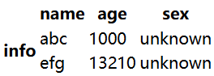
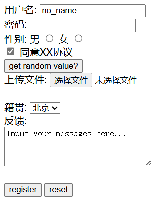

<title>This is a HTML note.</title>
<style>
    body {
        font-family: "cascadia code", 幼圆;
    }
    code {
        color: burlywood;
    }
</style>


# 目录
- [目录](#目录)
- [认识HTML(HyperText Markup Language)](#认识htmlhypertext-markup-language)
  - [一个简单的HTML](#一个简单的html)
    - [\<html\>的lang属性](#html的lang属性)
    - [要求](#要求)
    - [剖析标记](#剖析标记)
    - [利用CSS(Cascading Style Sheets)](#利用csscascading-style-sheets)
- [超文本](#超文本)
  - [使用\<a\>标签](#使用a标签)
  - [属性](#属性)
  - [路径](#路径)
- [构建模块](#构建模块)
  - [\<q\>标记(paragraph)](#q标记paragraph)
  - [\<blockquote\>标记](#blockquote标记)
  - [块元素和内联元素](#块元素和内联元素)
  - [\<br\>标签(break)](#br标签break)
  - [列表](#列表)
  - [表格](#表格)
  - [表单](#表单)
    - [\<form\>](#form)
    - [\<input\>](#input)
    - [type属性](#type属性)
    - [其他属性](#其他属性)
    - [\<label\>](#label)
    - [\<select\>和\<option\>](#select和option)
    - [\<textarea\>](#textarea)
    - [样例](#样例)
  - [字符实体](#字符实体)
  - [其他一些元素](#其他一些元素)
    - [\<video\>](#video)
      - [子元素\<source\>](#子元素source)
    - [\<audio\>](#audio)
- [发布Web](#发布web)
  - [步骤](#步骤)
  - [将文件移动到服务型](#将文件移动到服务型)
  - [使用网址](#使用网址)
  - [更多\<a\>的链接](#更多a的链接)
    - [链接其他网站](#链接其他网站)
    - [title属性](#title属性)
    - [链接到网页的其他部分(id属性)](#链接到网页的其他部分id属性)
    - [属性的位置关系并不重要](#属性的位置关系并不重要)
    - [链接时创建新窗口(target属性)](#链接时创建新窗口target属性)
- [媒体](#媒体)
  - [\](#img)
    - [图像](#图像)
    - [\及其属性](#img及其属性)
      - [src](#src)
      - [alt](#alt)
      - [width height](#width-height)
      - [用\<a\>包围](#用a包围)
- [HTML标准](#html标准)
  - [doctype](#doctype)
    - [HTML 4.01和XHTML 1.1](#html-401和xhtml-11)
    - [HTML5](#html5)
  - [W3C验证工具](#w3c验证工具)
  - [\<meta\>指定字符编码](#meta指定字符编码)
  - [viewport](#viewport)
- [HTML补充](#html补充)
  - [引入网站favicon图标](#引入网站favicon图标)
  - [SEO优化](#seo优化)
    - [TDK](#tdk)
    - [LOGO SEO优化](#logo-seo优化)
  - [浏览器私有前缀](#浏览器私有前缀)
  - [视口](#视口)
    - [meta视口标签](#meta视口标签)
  - [二倍图](#二倍图)
    - [物理像素与物理像素比](#物理像素与物理像素比)
    - [多倍图](#多倍图)
  - [移动端开发](#移动端开发)
    - [开发选择](#开发选择)
    - [技术解决方案](#技术解决方案)
    - [单独制作移动端页面](#单独制作移动端页面)
    - [响应式页面兼容移动端](#响应式页面兼容移动端)


# 认识HTML(HyperText Markup Language)
## 一个简单的HTML
````HTML
<!DOCTYPE html>
<html lang="en">
<head>
    <meta charset="utf-8">
    <title>Head First Lounge</title>    <!-- NOT GOOD <title> -->
</head>
<body>
    <h1>Welcome to the Head First Lounge</h1>
    <p>
        Join us any evening for <em>refreshing elicirs</em>...
    </p>
    <h2>Directions</h2>
    <p>
        You'll find us right in the center of downtown Webville.
    </p>
</body>
</html>
````

````HTML
- <html>表明是个HTML文档
- <head>
- <title>网页标题
- <body>页面主体
- <h1>一级标题
- <em>斜体
- <p>段落
- <h2>二级标题
(浏览器通常可以显示6级标题<h6>)
- <!-- CONTEXT -->注释(快捷键ctrl + /)
- 显示图片
````

在HTML中,文本的多个空格只会显示为1个,换行符不会显示,需要插入`<br />`.需要插入空格,需要使用字符实体`&nbsp;`


### &lt;html&gt;的lang属性

`<html>`具有属性lang,用于指定当前文档显示的语言.

`en`为英文, `zh-CN`为简体中文.

### 要求

`<html>`是必须的,必须放在且在`<!DOCTYPE html>`后,作为顶层元素.

`<html>`的`lang`属性是必须的

`<html>`元素内当且仅有两个元素`<head>`和`<body>`.

`<head>`元素内的`<title>`属性是必须的.

`<meta />`元素当中的属性`charset`**现在不是必要的**,一般用`utf-8`.

### 剖析标记
````HTML
<h1>  <!-- 这是开始标记,表示标题开始 -->
<!-- 标记包含标记号(这里是h1)和尖括号<> -->
    This is the text.
</h1>   <!-- 这是结束标记,此处</h1>结束一个<h1>标记,结束标记是用一个/放在标记号前面表示 -->
<!-- 开始标记和对应的结束标记称为匹配标记 -->
<!-- 整个称为一个元素,元素由匹配标记和其中的内容组成 -->
````

### 利用CSS(Cascading Style Sheets)
示例:
````HTML
<html>
<head>
    <title>Head First Lounge</title>
    <style type="text/css">
        body {      /*body表明{}内的样式应用于<body> </body>内*/
            background-color: #d2b48c;      /*设置背景为土黄色*/
            margin-left: 20%;
            margin-right: 20%;              /*设置左右外边距分别占页面的20%*/
            border: 2px dotted black;       /*定义页面主体周围边框是虚线,颜色为黑色*/
            padding: 10px 10px 10px 10px;   /*在页面主体周围创建一些内边距*/
            font-family: sans-serif;        /*定义文本使用的字体*/
        }
    </style>
</head>
<body>
    <h1>Welcome to the Head First Lounge</h1>
    <p>
        Join us any evening for <em>refreshing elicirs</em>...
    </p>
    <h2>Directions</h2>
    <p>
        You'll find us right in the center of downtown Webville.
    </p>
</body>
</html>
````

CSS使用的语法与HTML完全不同,是两种完全不同的语言.

`<style>`标记用于指定样式,总是放在`<head>`元素里.

`<style>`包含一个type属性,用于说明使用的样式类型,使用CSS,则`type="text/css"`.***type属性已弃用!!!!!***

style的type属性中,text/css目前为止为其默认且唯一的参数.也就是即使只写一个`<style>`,也表示使用CSS,并且没有其他的type可用.

CSS中使用`/* comment */`注释.

# 超文本
## 使用\<a\>标签
示例:
````HTML
<html>
  <head>
    <title>Head First Lounge</title>
  </head>
  <body>
    <h1>Welcome to the New and Improved Head First Lounge</h1>
    
    <p>
       Join us any evening for 
       refreshing <a href="beverages/elixir.html">elixirs</a>, 
       conversation and maybe a game or two of 
       <em>Dance Dance Revolution</em>.
       Wireless access is always provided;  
       BYOWS (Bring your own web server).
    </p>
    <h2>Directions</h2>
    <p>
      You'll find us right in the center of downtown Webville.   
      If you need help finding us, check out 
      our <a href="about/directions.html">detailed directions</a>. 
      Come join us!
    </p>
  </body>
</html>
````


`<a>`元素用于创建指向另一个页面的链接,其内容就是链接文本.在浏览器中,链接文本默认会显示有下划线,指示这是可以单击的.

通过`href`属性来指定链接的目标文件,如`<a href="beverages/elixir.html">elixirs</a>`.

浏览器遇到`<a>`元素时,会把它显示为一个可单击的链接.若将一个``元素放在`<a>`标记之间,这个图像就会像文本一样可单击.甚至可以将`<p>`放在`<a>`之间,让整个段落可以链接.

## 属性
属性可以指定一个元素的附加信息.例如上述的`href="beverages/elixir.html"`,`type="text/css"`.

属性的语法是`属性名=属性值`,属性值建议都加上引号.

HTML5允许定制数据属性,因此允许构造属性名.

## 路径
对于HTML来说,所有的路径分隔符都只能使用`/`,而不能使用`\`,无论其操作系统如何.

使用`..`表示返回上一级父文件夹


# 构建模块
## \<q\>标记(paragraph)
`<q>`用于较短文本的引用.

使用`<q>`标记,浏览器会在文本周围加上`"`.例如:`ab <q>cd</q> ef`会显示为`ab "cd" ef`.注意,不是所有的浏览器都会加上`"`.

加入`<q>`标记,让浏览器知道这是一段引用,而非含有双引号的文本.此外,可以用CSS来对引用当中的文本样式进行修改.

## \<blockquote\>标记
`<blockquote>`元素用于较长的引用,需要单独显示.

例如:
````HTML
<html>
<head>
    <title>HTML try</title>
</head>
<body>
    <h1>Welcome</h1>
    <p>
        a sentence
    </p>
    <blockquote>
        a quote
    </blockquote>
    <p>
        another sentence
    </p>
</body>
</html>
````


使用`<blockquote>`之后,引用的文本单独创建了一个文本块,并且将文字进行了缩进.但可能在不同浏览器上会有不同效果,需要指定样式.

## 块元素和内联元素
`<blockquote>`是块元素,每个块元素都单独显示,块元素将上下文的内容分离.此外,`<h1>`,`<h2>`,`<p>`,`<li>`,`<ol>`,`<ul>`等都是块元素

`<q>`是内联元素,它会显示在段落中.此外`<a>`,`<em>`,``等都是内联元素.

此外`<br>`属于内联元素和块元素之间的模糊地段.`<a>`根据上下文也可以是块元素.

## \<br\>标签(break)
使用`<br />`可以为文本加上换行符
````HTML
<html>
<head>
    <title>HTML try</title>
</head>
<body>
    <b>
        This is a te
        xt.
        br can help me<br>
        change a new line.<br>
        ...
    </p>
</body>
</html>
````


`<br>`是一个void元素(空元素),由于开始标签和结束标签内部没有内容,因此仅仅需要写一个`<br>`就可以了,而不需要写`</br>`.写上一个`</br>`可能会导致换两行.

``也是一个空元素.不应该给空元素加上结束标记.

在XHTML中会有使用`<br />`的语法.这在HTML中也适用(XHTML是语法更加严格的HTML).`<br/>`也可用,但习惯性加上空格.XHTML中void元素(单标签)都要求在后面加上` /`,如``

## 列表
列表创建有3个元素(都是块元素):`<li>`(list item), `<ul>`(unordered list), `<ol>`(ordered list).

用`<li>`和`</li>`包围每一列表内的元素,表明这是列表项.

用`<ol>`或者`<ul>`元素将这些列表项括起来,表明这是一个有序或者无序列表.

例如:
````HTML
<p>
    Well I made it 1200 miles already, and I passed
    through some interesting places on the way: 
</p>
<ol>
    <li>Walla Walla, WA</li> 
    <li>Magic City, ID</li> 
    <li>Bountiful, UT</li>
    <li>Last Chance, CO</li>
    <li>Truth or Consequences, NM</li>
    <li>Why, AZ</li> 
</ol>
````


````HTML
<p>
    My first day of the trip!  I can't believe I finally got
    everything packed and ready to go.  Because I'm on a Segway,
    I wasn't able to bring a whole lot with me:
</p>
<ul>
    <li>cellphone</li> 
    <li>iPod</li>
    <li>digital camera</li>
    <li>and a protein bar</li>
</ul>
````


`<ol>`只能包含`<li>`项.但`<ul>`可以包含其他项目符号,但是不推荐使用.

可以在`<li>`中嵌套放入其他元素,甚至是一个`<ol>`.

`<dl>`括起一个定义列表,定义列表的每一项是一个定义术语`<dt>`和若干个定义描述`<dd>`.

例如:
````HTML
<h1>定义列表</h1>
<dl>
    <dt>A</dt>
    <dd>
        The definition of A.
    </dd>
    <dd>
        Other discription.
    </dd>
    <dt>B</dt>
    <dt>C</dt>
    <dd>
        The definition of C.
    </dd>
    <dt>D</dt>
    <dd>
        The definition of D.
    </dd>
</dl>
````


## 表格
`<table>`用于定义一个表格. `<tr>`用于定义表格中的行,必须嵌套在`<table>`中. `<td>`用于定义单元格,必须嵌套在`<tr>`中. `<th>`用于定义表头单元格,表头单元格也是一种单元格,其内容会加粗居中显示. `<thead>`表示表格的头部区域, `<tbody>`表示表格的主体区域, `<tfoot>`用于定义表尾, `<caption>`用于增加表格标题.

`<td>`或`<th>`拥有属性`rowspan`,用于跨行合并,需要写在最上侧需要合并的单元格,`rowspan="合并单元格的个数"`.拥有属性`colspan`,用于跨列合并,需要写在最左侧需要合并的单元格,`colspan="合并单元格的个数"`.(这两个属性对*无障碍*支持得不好,可以使用表格嵌套代替)

````HTML
<table>
    <thead>
        <tr>
            <td></td><th>name</th><th>age</th><th>sex</th>
        </tr>
    </thead>
    <tbody>
        <tr>
            <th rowspan="2">info</th><td>abc</td><td>1000</td><td>unknown</td>
        </tr>
        <tr>
            <td>efg</td><td>13210</td><td>unknown</td>
        </tr>
    </tbody>
</table>
````


## 表单

### &lt;form&gt;
`<form>`用于定义表单域,该元素会把它范围内的表单元素信息提交给指定URL.其属性`action`用于指定接受并处理表单数据的服务器程序的url地址.属性`method`用于设置表单数据的提交方式,其取值为`get`或`post`或`dialog`.属性`name`定义一个**独一无二且非空**的表单名称(该属性不同于全局属性`id`).

### &lt;input&gt;
`<input />`元素用于收集用户信息. `type`属性指定了表单元素的外观,默认为`text`.

### type属性
`type`属性的可能取值如下:
- `button`: 定义可点击按钮(多数情况下用于通过JavaScript启动脚本)
- `checkbox`: 定义复选框.
- `file`: 定义输入字段和"浏览"按钮,供文件上传.
- `hidden`: 定义隐藏的输入字段.
- `image`: 定义图像形式的提交按钮.
- `password`: 定义密码字段,该字段中的字符被掩码.
- `radio`: 定义单选按钮.
- `reset`: 定义重置按钮,重置按钮会清除表单中的所有数据.
- `submit`: 定义提交按钮,提交按钮会把表单数据发送到服务器.
- `text`: 定义单行的输入字段,用户可在其中输入文本,默认宽度为20个字符.
- `email`: 限制用户输入Email.
- `url`: 限制用户输入URL.
- `date`: 限制用户输入日期.
- `time`: 限制用户输入时间.
- `month`: 限制用户输入月份.
- `week`: 限制用户输入周.
- `number`: 限制用户输入数字.
- `tel`: 手机号码.
- `search`: 搜索框.
- `color`: 生成一个颜色选择表单.
- ...

### 其他属性
*以下属性根据`type`的不同,表现效果会不同.*

`name`属性指定输入控件的名称.当表单数据被提交时,这个名字会和控件的值一起提交.

`value`属性指定输入控件的值.

`checked`布尔属性指定input元素在页面加载时,默认选择该复选框.

`maxlength`属性定义了用户可以输入到该字段中的最大字符数(以 UTF-16 码点为单位).

`required`布尔属性指定该控件是必填项.

`placeholder`属性指明当没有值设定时,出现在表单控件上的文字.

`autofocus`布尔属性.如果存在,表示当页面加载完毕时,该input元素应该自动拥有焦点.

`autocomplete`属性告诉浏览器可以通过曾经的填写项自动补全数据.**不是一个布尔属性**,具体可选值,详见[MDN 属性autocomplete](https://developer.mozilla.org/zh-CN/docs/Web/HTML/Attributes/autocomplete#%E5%80%BC).默认为`on`,常常需要使用`off`来关闭自动补全.

`multiple`布尔属性,用于`email`和`file`,表示允许多个值.

### &lt;label&gt;
`<label>`元素定义标签,*该元素不属于表单,但经常与表单搭配使用.*

`<label>`可以绑定一个表单元素,当点击到`<label>`内的文本时,浏览器会自动将焦点转到或者选择对应的表单元素上.

`<label>`使用for属性时,含有相应id属性的`<input>`就会被绑定,如: `<label for="unique">label</label> <input type="radio" id="unique" />`

### &lt;select&gt;和&lt;option&gt;
`<select>`元素定义下拉列表.`<option>`元素定义选项.

`option`中的`selected`布尔属性用于给出默认选择项.

### &lt;textarea&gt;
`<textarea>`元素定义一个文本域,允许多行的文本输入.

`<textarea>`不支持`value`属性,属性`rows`和`cols`用于指定文本域的精确尺寸,但一般用CSS来指定.

### 样例
上述元素的一个样例:
````HTML
<form action="demo.php" method="post" name="unique">
    <!-- 此处value给予了默认值,maxlength限制了最大长度,<label>元素的for属性给予了文字点击聚焦文本框的效果 -->
    <label for="username">用户名:</label> <input type="text" name="username" value="no_name" maxlength="6" id="username" /> <br />
    密码: <input type="password" name="pwd" /> <br />
    <!-- 此处为了实现多选一的效果,必须将复数个单选框取相同的name -->
    <!-- 单选框,复选框的value建议都写,其值在网页上不会体现,但是当用户勾选并发送到后台时,单选框发送的是勾选的框所对应的value值 -->
    性别: <label for="male">男</label> <input type="radio" name="sex" value="male" id="male"> <label for="female">女</label> <input type="radio" name="sex" value="female" id="female" /> <br />
    <!-- 包含checked属性表明默认选中 -->
    <input type="checkbox" name="agree" value="agree" checked="" /> 同意XX协议 <br/>
    <input type="button" name="get_v" value="get random value?" /> <br />
    <!-- 此处value不修改显示提示 -->
    上传文件: <input type="file" name="upload" /> <br />
    <!-- 点击之后,就会把表单元素以所给方式提交给所给URL -->
    <br />
    籍贯:
    <select name="province">
        <option>江苏</option>
        <option selected>北京</option>
        <option>上海</option>
    </select> <br />
    <label for="textarea">反馈: </label><br />
    <textarea id="textarea" name="feedback" rows="4" cols="30">Input your messages here...</textarea> <br />
    <br />
    <input type="submit" value="register" />
    <input type="reset" value="reset" />
</form>
````



## 字符实体
如果想在HTML中使用特殊字符,就需要用到字符实体(character entity).

例如,在HTML中显示字符`<`需要输入`&lt;`,显示字符`>`需要输入`&gt;`,显示`&`需要输入`&amp;`.

一些难以直接写出的符号,也可以用字符实体,例如`©`可以用`&copy;`.

同一字符的字符实体可能有多个,例如`&`还可以用`&#38;`和`&#x26;`表示

参考链接:
- [MDN-字符实体](https://developer.mozilla.org/zh-CN/docs/Glossary/Entity)
- [常用字符实体](https://www.w3schools.com/charsets/ref_html_entities_4.asp)
- [官方字符实体](https://html.spec.whatwg.org/multipage/named-characters.html#named-character-references)
- [详尽字符实体清单](http://www.unicode.org/charts)

注意:当计算机当中没有安装对应的字体时,字符实体可能不会显示.

## 其他一些元素
`<code>`用于显示计算机程序代码.

`<time>`用于告诉浏览器这个内容是一个日期或者时间,或者同时包含日期和时间.

`<strong>`或者`<b>`用于标记希望特别强调的文本,若要加粗文本推荐使用前者.

`<em>`或者`<i>`用于斜体(italic),建议使用前者

`<del>`或者`<s>`用于添加删除线,建议使用前者

`<ins>`或者`<u>`用于添加下划线,建议使用前者

`<pre>`当希望浏览器按你输入的方式原样显示文本时,使用这个元素来指定文本格式.

`<div>`和`<span>`用于盒子,主要和CSS结合使用.`<div>`一行只能放一个,`<span>`一行可以放多个

`<header>`头部标签

`<nav>`导航标签

`<article>`内容标签

`<section>`定义文档的某个区域(章节)

`<aside>`侧边栏标签

`<footer>`尾部标签

(注: IE9中`<header>`,`<nav>`,`<article>`,`<section>`,`<aside>`,`<footer>`不是块元素.)

`<audio>`音频

`<video>`视频

### &lt;video&gt;
如:`<video src="video.mp4" controls></video>`

`<video>`元素支持`.mp4`,`.WebM`,`.ogg`视频格式,所有浏览器都支持`.mp4`视频格式.

`src`属性,指定播放的文件的路径,可选.

`controls`布尔属性,在视频底部提供一个控制面板.

`width`视频显示区域的宽度,单位是CSS像素.

`height`视频显示区域的高度,单位是CSS像素.

`autoplay`布尔属性,声明该属性后,视频会尽快自动开始播放,不会停下来等待数据全部加载完成.
注:可能会破会用户体验,可以使用`muted`属性静音;或者加入开关(让用户主动打开自动播放).

`loop`布尔属性,循环播放.

`preload`该枚举属性旨在提示浏览器,在播放视频之前,加载哪些内容会达到最佳的用户体验,其可选值为:
- `none`: 表示不应该预加载视频.
- `metadata`: 表示仅预先获取视频的元数据(例如长度).
- `auto`: 表示可以下载整个视频文件,即使用户不希望使用它.
- 空字符串: 与`auto`值一致.

(每个浏览器的默认值都不相同,此外,存在`autoplay`属性则会强制使用`auto`.)

`poster`海报帧图片URL,用于在视频处于下载中的状态时显示.未指定该属性则视频的第一帧会作为海报帧来显示.

`muted`布尔属性,静音.

#### 子元素&lt;source&gt;
子元素`<source>`,指定多个路径,浏览器会自上而下搜索子元素的路径,直到找到第一个兼容的格式.
`<source />`可作为`<picture>`,`<audio>`和`<video>`的子元素,是void元素.

如:
````HTML
<video width="320" height="240" controls>
    <source src="video.mp4" type="video/mp4">
    <source src="video.ogg" type="video/ogg">
    浏览器版本过低
    <!-- 若浏览器支持MP4,则显示video.mp4,否则若支持OGG,则显示video.ogg,否则显示浏览器版本过低 -->
</video>
````

`src`属性: 指定媒体资源的URL.如果`<source>`的父节点是`<audio>`或`<video>`,则必须指定该属性.如果父元素是`<picture>`则不允许指定该属性.

`type`属性: 指定图像的MIME媒体类型或其他媒体类型.关于其参数,详见[MDN媒体容器格式](https://developer.mozilla.org/zh-CN/docs/Web/Media/Formats/Containers)

### &lt;audio&gt;
如:`<audio src="sound.mp3" controls></audio>`

`<audio>`支持`.mp3`,`.wav`,`.ogg`格式,所有浏览器都支持`.mp3`格式.

也可以使用`<source>`子元素.
````HTML
<audio controls>
    <source src="sound.mp3" type="audio/mpeg">
    <source src="sound.ogg" type="audio/ogg">
    <p>浏览器版本过低</p>
</audio>
````

`autoplay`布尔属性.声明该属性,音频会尽快自动播放,不会等待整个音频文件下载完成.
注:自动播放音频可能会破坏用户体验,因此应该加入开关(让用户主动打开自动播放).

`controls`如果声明了该属性,浏览器将提供一个包含声音,播放进度,播放暂停的控制面板.

`loop`布尔属性,循环播放.

`src`同`<video>`.

`muted`同`<video>`.

`preload`同`<video>`.


# 发布Web
## 步骤
1. 寻找一家托管公司
   - 能够及时处理技术问题
   - 数据传输
   - 对页面和数据备份
   - 托管公司给予域名(建议自己也注册一个)
   - 可靠性
   - 其他
2. 获得一个域名
   - 对于例如www.baidu.com, 其中baidu.com是域名, www是域中特定的一个服务器. 不同的结尾的域名有不同的用途, 如:`.com`表示公司.
   - 域名由集中的权威机构(ICANN)控制.要保留域名,每年需要交纳少许注册费.
3. 将文件上传到托管公司的服务器上

## 将文件移动到服务型
若你的文件全部放在根文件夹main当中,要把它放在托管公司的服务器(假设域名为`c163q.com`)里的根文件夹(假设叫root)当中.

传输文件的一种方法是FTP,步骤如下(命令行):
1. 使用FTP连接到托管服务器.
   - 要完成连接,需要托管公司提供的一个用户名和口令.
2. 使用`cd`命令把当前目录切换到文件传输的目标目录.
   - 此处将目录切换到root文件夹.
3. 使用`put`命令将文件上传到服务器.
   - 此处使用`put index.html`将`index.html`的一个副本传送到服务器的当前目录中.
4. 还可以用`mkdir`命令在服务器上创建一个新目录.
   - 此处使用`mkdir images`来在服务器上创建一个名为images的新目录.
5. 还可以使用`get`命令获取文件.

托管公司可能会使用SFTP(Secure File Transfer Protocol), 这是一种更安全的版本FTP,两者基本是一样的.

## 使用网址

在浏览器中输入的Web地址称为URL(统一资源定位符,Uniform Resource Locators). URL由一个协议,一个网站名和一个资源的绝对地址组成. 上述index.html文件的一个可能的URL为:`http://www.c163q.com/index.html`

前面部分的表示获取资源的协议,通常为http或https.
中间部分是网站名.
第三步分是从根目录到资源地址的绝对路径.

HTTP称作超文本传输协议(HyperText Transfer Protocol).用于Web当中传输文件.HTTP向服务器请求文件,服务型相应HTTP请求,返回文件.若找不到文件,服务器会返回#404错误.

HTTPS(Hypertext Transfer Protocol Secure)是以安全为目标的HTTP通道.

服务的绝对路径指的是从根目录到文件的路径.`<a>`元素当中的`href`指向的是相对路径时,浏览器能够将其转化为绝对路径并传回服务器.例如`https://www.bilibili.com/video/av170001/../..`将会传入`https://www.bilibili.com/`

此外,若向服务器请求的是目录,例如`http://www.c163q.com/`,服务器寻找该目录下的一个默认文件,通常名为`index.html`或`default.htm`或`index.php`,取决于使用的服务器的类型.

若输入的是`http://www.c163q.com`并且服务器得知该目录确实存在,则会把请求改为`http://www.c163q.com/`

## 更多&lt;a&gt;的链接
### 链接其他网站
`<a>`元素也可以链接到其他网址,如:`<a href="https://www.bilibili.com">go to bilibili</a>`.

使用file协议可以读取本地文件,例如`file:///tmp.txt`.浏览器也可以使用FTP协议来获取页面.也可以用mail协议,通过Email发送数据.

对于URL`http://www.c163q.com:8000/`中的`:8000`,是HTTP URL中可选的端口.服务器可能会有不同的端口接受请求,但多数Web服务器都是在端口80接收请求.没有指定端口则默认为80.

若链接到文件时,浏览器会自动帮助下载文件,如`<a href="test.zip">`

### title属性
`<a>`当中的title属性可以显示将要跳转的网页的表述,如:
````HTML
<p>
    Go to <a href="https://www.bilibili.com" title="To watch videos">bilibili</a>.
</p>
````
当光标对准bilibili一段时间后,会有下图的提示.


也可以为其他元素添加该属性.

### 链接到网页的其他部分(id属性)
id属性可以唯一标识元素.带id属性的元素可以被直接链接.

例如在网页`page.html`中使用`<h2 id="new">What's new?</h2>`后,就可以用`<a href="page.html#new">See new features</a>`跳转到page.html中What's new?的部分.

也可以在同文档中链接,比如`<a href="#new">Go Back</a>`.

注意,链接`href="about/index.html#pos"`不能写成`href="about#pos"`,但可以写成`href="about/#pos"`.

id应当是一个以字母开头,后面是任意字母、数字、`-`、`_`、`:`或者`.`,但不能是空白符.

### 属性的位置关系并不重要

### 链接时创建新窗口(target属性)
要在新窗口打开一个页面,需要告诉浏览器要打开的窗口名,否则就会在同一个窗口打开.(即默认值为`_self`)

为`<a>`增加target属性,可以让浏览器使用一个不同的窗口(标签页).其属性值为浏览器的目标窗口.如果其值为`"_blank"`,则浏览器总是会打开一个新窗口.

如:`<p>Go to <a href="https://www.bilibili.com" target="_blank">bilibili</a>.</p>`

当target值为非特殊值,例如`window`,则所有target为`window`的值都会在那个窗口打开.

# 媒体
## &lt;img&gt;
浏览器请求图像的流程如下:
1. 浏览器请求网页
2. 服务器返回网页
3. 浏览器根据网页,逐个请求图片
4. 服务器逐个返回图片
5. 浏览器逐个显示图片

### 图像
Web当中的图像常用的是3种格式:`jpeg`,`png`,`gif`.

`jpeg`适合连续色调的图像,可以表示多达1600万种不同颜色的图像.是"有损"压缩.不支持透明度.文件比较小.不支持动画.

`png`适合单色图像和线条构成的图像.可以表示包含上百万种不同颜色的图像.有三种:`PNG-8`,`PNG-16`,`PNG-24`,取决于需要表示多少种颜色.是"无损"压缩.支持透明度.文件比`jpeg`大.不支持动画.

`gif`适合单色图像和线条构成的图像.最多可以表示256种不同颜色.是"无损"压缩.支持透明度,但只允许设置一种颜色为"透明".文件比`jpeg`大.支持动画.

使用PNG时,蒙版将会根据背景颜色柔化图形的边缘.

### &lt;img&gt;及其属性

``元素是void元素且是内联元素,使用例: ``

#### src
src属性是必需的,指定了Web页面上显示的图像文件的位置.

src也可以使用URL,例如: ``

#### alt
alt属性可以在图像无法加载时提供必要的信息: ``

例如,使用``而不给出图像,则会显示:


**alt属性是必需的**

#### width height
width和height用于提前告诉浏览器图像的大小(单位像素).

如果没有指定,则浏览器会自动确定图像的大小.

例如,百度图标分辨率为540×258,使用``,会将图标压缩.


通过指定width和height,浏览器可以提前布局.如果没有指定,浏览器需要在知道图像大小后重新调整页面布局.浏览器也会根据提供的width和height缩放图像,但最好不要通过该途径缩放图像,因为浏览器仍会向服务器请求完整的图像.

width或height可以单独使用,此时图像会等比例缩放.

#### 用&lt;a&gt;包围
利用缩略图,可以让网站的图像快速加载,且显得紧凑,通过使用`<a>`元素,可以让图片链接到存放大图的网址或者链接到原图.如:` <a href="html/seattle_video_med.html">  </a>`.

注意,浏览器中图片可能会有下划线显示这是可以点击链接的.不希望有下划线,可以使用CSS来改变.

# HTML标准
## doctype

在文档的一开始应当使用`<!DOCTYPE html>`表示遵循最新标准.

### HTML 4.01和XHTML 1.1
在`HTML 4.01`和`XHTML1.1`里面,用于标识HTML版本的doctype如下:

**HTML 4.01**: `<!DOCTYPE html PUBLIC "-//W3C//DTD HTML 4.01//EN" "http://www.w3.org/TR/html4/strict.dtd">`

上面的不是一个HTML元素,因为在开始的`<`后面有一个`!`.

`!DOCTYPE`为浏览器指定这个页面的文档类型.

`html`表示这个`<html>`使页面中的根元素.

`PUBLIC`表示HTML 4.01标准是公共可用的.

`"-//W3C//DTD HTML 4.01//EN"`表示使用的是HTML 4.01版本,且这个HTML标记用英语编写.

`"http://www.w3.org/TR/html4/strict.dtd"`指向一个文件,标识这个特定的标准.


**XHTML 1.1**: `<!DOCTYPE html PUBLIC "-//W3C//DTD XHTML 1.1//EN" "http://www.w3.org/TR/xhtml11/DTD/xhtml11.dtd">`


### HTML5
HTML5的doctype如下: `<!DOCTYPE html>`

表示正在使用标准的HTML,并且不再区分版本号.标准会不断更新,且默认一直遵循最新标准.

**该元素是必要的**

## W3C验证工具
为了验证HTML是否符合标准,可以使用W3C验证工具.地址为:`https://validator.w3.org/`

## &lt;meta&gt;指定字符编码
使用`<meta charset="utf-8">`可以指定字符编码为utf-8.

需要放在`<head>`元素内,任意其他元素的上面.

**`<meta>`中的`charset`在现在标准下不是必要的**

## viewport
必需包含一个`<meta>`元素,其`name`属性值为`viewport`.

详见[meta视口标签](#meta视口标签).

Edge显示`<meta name="viewport">`不应该给出属性`maximum-scale`,`minimum-scale`,`user-scalable`.
解释如下:
<blockquote>
These properties can block the user from zooming on a page. With such a wide range of devices available with different display dimensions, screen resolutions, pixel densities, etc., it is difficult to choose an appropriate text size in a design. Most of the time using these properties enable users to pick a text size that is unreadable while preventing them from zooming, frustrating them, or making the web site/app inaccessible in some cases.
</blockquote><br>


# HTML补充
## 引入网站favicon图标
步骤:
1. 制作一个`.ico`后缀的文件.
2. 放入网站目录下.
3. 在`<head>`元素中写入引入代码.
````HTML
<head>
    <link rel="shortcut icon" href="favicon.ico" type="image/x-icon">
</head>
````

## SEO优化
SEO(Search Engine Optimization)意为搜索引擎优化,指利用搜索引擎的规则提高网站在有关搜索引擎内自然排名的方式.

### TDK
使用TDK三大标签实现SEO.

TDK表示title,description,keyword.

`title`: `<title>`元素是第一重要的标签,是搜索引擎了解网页的入口和对网页主题归属的最佳判断点. 如:`网站名-网页介绍(建议少于30字)`.

`description`: 使用`<meta name="description" content="...">`来对网页的整体业务和主题概括.

`keyword`: 使用`<meta name="keywords" content="...">`来说明网页的关键词.关键词最好限制为6-8个,关键词之间用英文逗号隔开,例如:`关键词1,关键词2,...`.

### LOGO SEO优化
1. logo里面首先放一个`h1`元素,目的是为了提权,但是文字不要显示出来(可以用`font-size: 0;`).
2. `h1`里再放一个*链接*,可以返回首页的,把logo的背景图片给链接即可.
3. 给链接一个`title`属性,这样鼠标放到logo上就可以看到提示文字了.

## 浏览器私有前缀
为了兼容老式浏览器或者老版本浏览器,可以使用含有私有前缀的属性.

私有前缀:
- `-moz-`: firebox的私有属性
- `-ms-`: IE的私有属性
- `-webkit-`: safari, chrome的私有属性
- `-o-`: Opera私有属性

## 视口
视口就是浏览器显示页面内容的屏幕区域. 视口可以分为布局视口,视觉视口,理想视口.

布局视口,即将整个页面都放入屏幕当中. 移动设备的浏览器一般都会默认设置一个布局视口,分辨率为980px,所以PC网页在手机上呈现时元素过小.

视觉视口,即将网页放大,仅将页面部分显示在屏幕上.

理想视口,即不需要将网页放大,仍能清晰地看见网页的全部信息.

### meta视口标签
meta视口标签的主要目的:布局视口的宽度应该与理想视口的宽度一致,即设备有多宽,布局视口就有多宽(而非默认的固定的布局视口宽度).

例如: `<meta name="viewport" content="width=device-width, user-scalable=no, initial-scale=1.0, maximum-scale=1.0, minimum-scale=1.0">`

属性解释:
- `width`: 视口的宽度,特殊值`device-width`表示用户设备的屏幕宽度.
- `initial-scale`: 初始缩放比,大于0的数字.
- `maximum-scale`: 最大缩放比,大于0的数字.
- `minimum-scale`: 最小缩放比,大于0的数字.
- `user-scalable`: 用户是否可以缩放,`yes`或`no`(`1`或`0`).

## 二倍图
### 物理像素与物理像素比
物理像素: 物理屏幕上显示的最小单元.

在CSS中,PC端1px等于1个物理像素;但是在移动端,1px不一定等于1个物理像素.

一个px显示的物理像素点的个数,称为物理像素比或屏幕像素比.

### 多倍图
不同设备拥有不同的物理像素比,但常见的是2.

当图片显示在这种设备上时,会出现边缘锯齿的状况.例如:50\*50`CSS像素`的图片,放在这种设备上,显示为100\*100`物理像素`.

解决方法: 使用100\*100像素的图片,并将该图片缩小为50\*50`CSS像素`.

上述方法,准备的图片比写成CSS像素的大小大两倍,则称该图片为二倍图.

当然也存在三倍图,四倍图,但最常见的仍是二倍图.

使用`CSS`属性`height`和`width`来控制. 见:[CSS高度(height)和宽度(width)](../CSS/get_start.md#高度height和宽度width)

对于背景,可以使用`background-size`来控制. 见:[CSS背景大小(background-size)](../CSS/get_start.md#背景大小background-size)

## 移动端开发
### 开发选择
- 单独制作移动端页面  
    通常情况下,网站域名前面加`m`可以打开移动端,例如`https://m.jd.com`.
    只要输入`jd.com`,就会根据设备自动跳转到对应的PC端或移动端网站.

- 响应式页面兼容移动端  
    通过屏幕的宽度来决定网页的样式.缺点是制作麻烦.

### 技术解决方案
移动端浏览器基本以`webkit`内核为主.

移动端浏览器的初始化,可以使用`normalize.css`,其链接:[github-normalize.css](https://necolas.github.io/normalize.css/)

此外,移动端链接在点击时,背景会变成蓝色,这时候需要用到: `-webkit-tap-highlight-color: transparent;`来删除该效果.

在iOS中,按钮会有默认的效果,可以使用`-webkit-appearance: none;`来消除.

要禁用长按页面时的弹出菜单,使用: `-webkit-touch-callout: none;`

### 单独制作移动端页面
1. 流式布局(百分比布局)  
    见:[CSS流式布局](../CSS/get_start.md#流式布局)
2. flex弹性布局
    见:[CSS-flex布局](../CSS/get_start.md#flex布局)
3. less+rem+媒体查询布局
4. 混合布局

### 响应式页面兼容移动端
1. 媒体查询
2. bootstarp